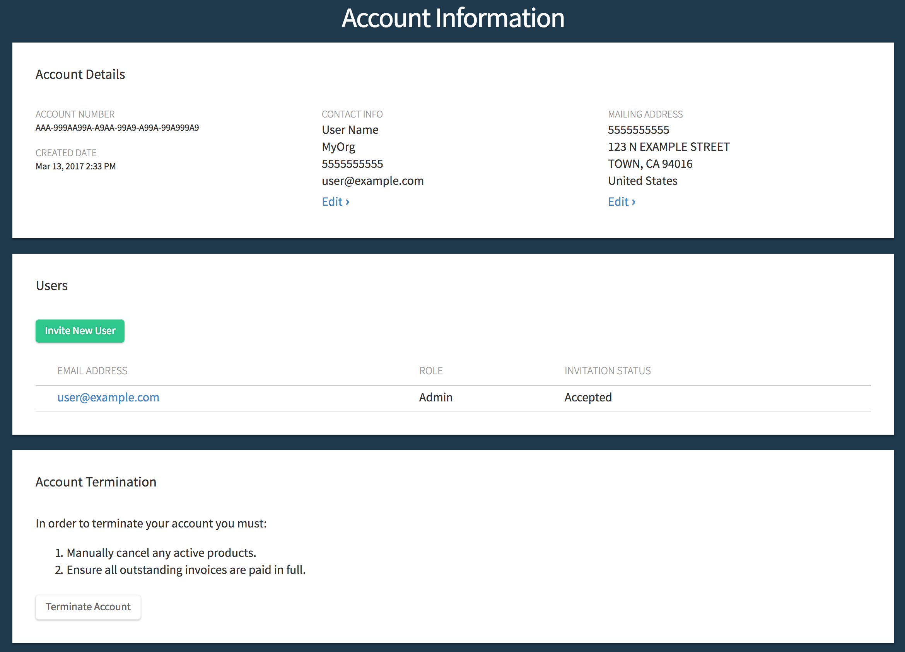

# Getting started with your CoreOS account

Once you sign up for a CoreOS account at either CoreOS.com or Tectonic.com, check your inbox and click the *Verify Email* link from Tectonic Support.

The Overview for the account is displayed after logging in.

  

    
  

After signing up for one of the *Available Products* you will be redirected to your account overview where you will find a list of your subscriptions and your *Account Assets*.

  

    
  

## Using your pull secret to download CoreOS software

Below your *Universal Software License* is the *Pull Secret* and *Kubernetes Secret* for the account. This secret provides access to the container images for CoreOS products.

  

    
  

The `config.json` file contains a pull secret granting access to CoreOS container registries.

Download `config.json` from the *Account Overview* screen and write it to the Docker configuration directory. On CoreOS Container Linux, copy the file to `/home/core/.docker/config.json`. On most other Linux distributions, copy the file to `/root/.docker/config.json` or the configured Docker configuration directory.

Docker will use the credentials in `config.json` when fetching Tectonic software.

## Inviting other users to a CoreOS account

In order for other users to be able to deploy software from CoreOS using the account, they must first be invited to join the account. Users can be added and managed through the *Account* tab.

  

    
  

  

    
  

Each user, their status and authorization are reflected on this page. To edit a user's details, click the sprocket to the left of their email address.

  

    
  

Invited users will receive an email like this one. **In order to accept the invitation, users must first create a CoreOS account by clicking the *Register* link at the bottom of the login box and completing email validation.**

Once added, the user will see the organization name to the left of their account name at the top of their *Overview* page. Their status on the *Account* page will change from *Invited* to *Accepted*.

## Changing account context

A user may be a member of several CoreOS accounts: For example, they may have a Quay Enterprise license through work and access to a trial Tectonic cluster through a personal account. In this case, it is necessary to switch account contexts to access each license separately.

  

    
  

Clicking the email on the upper right corner of the page will reveal a list of available account contexts for the user. Selecting a context will load a new *Account Overview* listing the products available to that account and its master license and pull secret.

-----------------------------------------------------------------

## Managing billing

Billing information can be accessed through the *Billing* tab.

  

    
  

Use this page to change an account's payment method and billing address.
