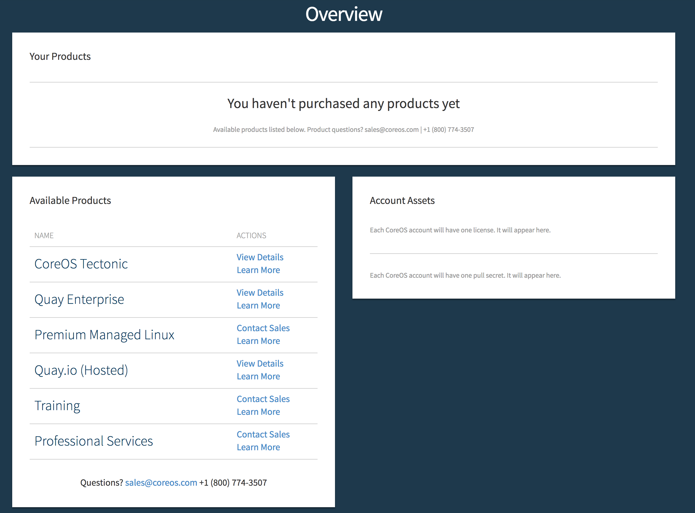
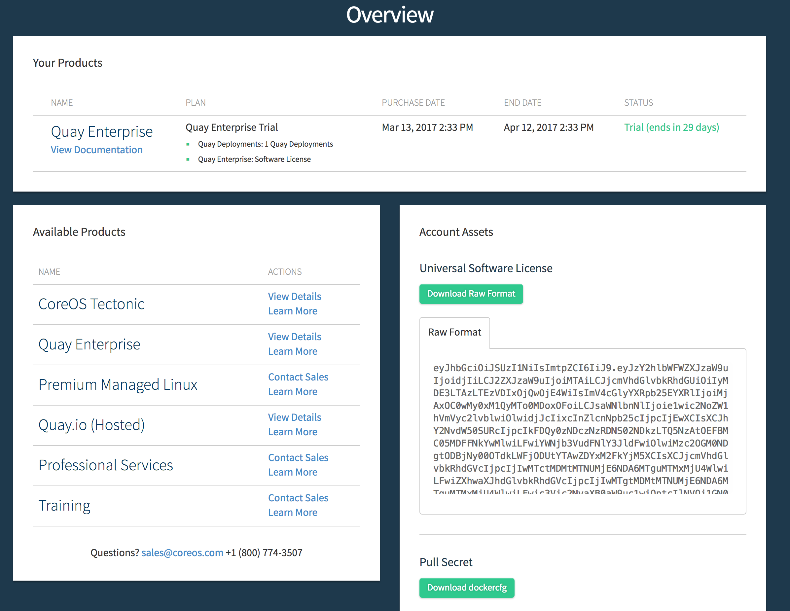
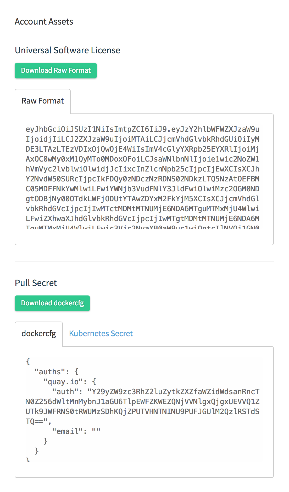
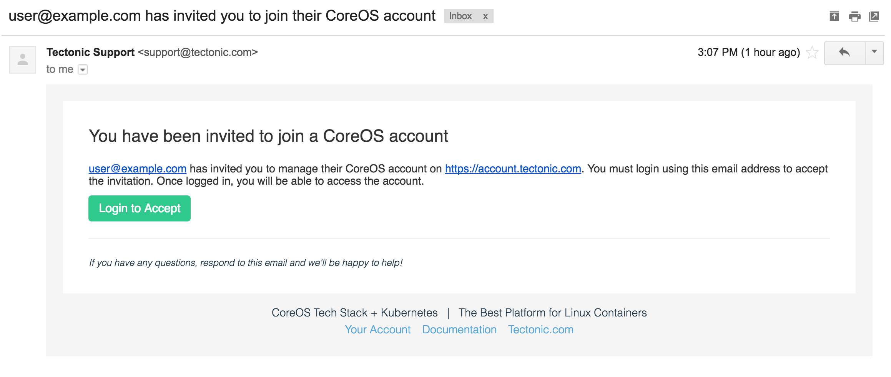
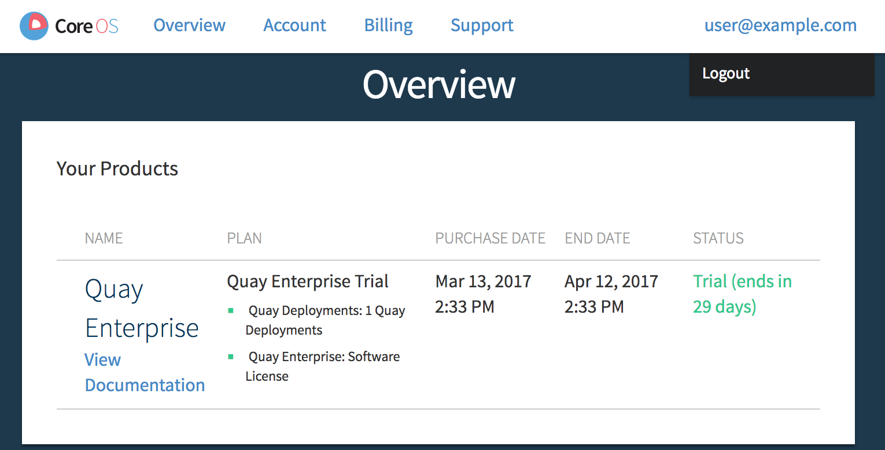
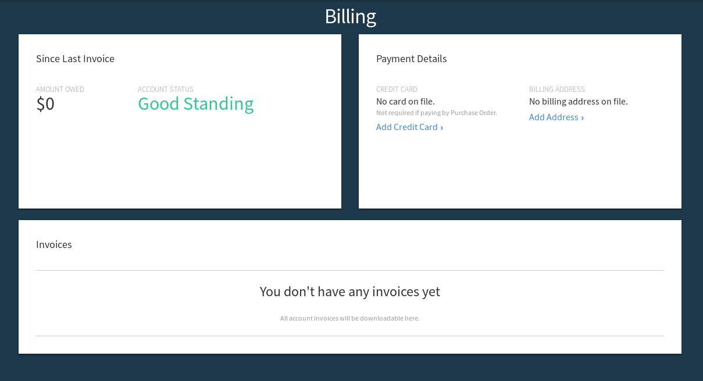

# Getting started with your CoreOS account

First, sign up for a CoreOS account from [coreos.com](https://coreos.com/). Then, check your inbox for an email from CoreOS Support, and click *Verify Email*.

Log in to complete registration and access the Account Overview page.

  

    
  

After signing up for one of the *Available Products* you will be redirected to the account Overview page with a list of subscriptions, and links to access your account's CoreOS License and Pull Secret.

  

    
  

## Using your pull secret to download CoreOS software

The *CoreOS License* and *Pull Secret* are required to access container images for CoreOS products. Click the link to copy and paste below the Download buttons to open a window from which these may be copied into the appropriate fields during the Tectonic installation process.

  

    
  

The License and Pull secret may also be entered manually. The `config.json` file contains a pull secret granting access to CoreOS container registries.

Download `config.json` from the account *Overview* screen and write it to the Docker configuration directory. On CoreOS Container Linux, copy the file to `/home/core/.docker/config.json`. On most other Linux distributions, copy the file to `/root/.docker/config.json` or the configured Docker configuration directory.

Docker will use the credentials in `config.json` when fetching Tectonic software.

## Adding users to a CoreOS account

Use the *Account* tab to invite new users to the account, and to manage existing user subscriptions. Users must be added to an account before they can deploy CoreOS software from the account.

To edit a user's details, click the sprocket to the left of their email address.

  

    
  

To invite new users to the account, click *Invite New User*. Email invitations will be sent, from which new users may activate their account. **To accept the invitation, users must first create a CoreOS account by clicking the *Register* link at the bottom of the login box and completing email validation.**

  

    
  

Once added, users will see the organization name to the left of their account name at the top of their *Overview* page. Their status on the *Account* page will change from *Invited* to *Accepted*.

## Changing account context

A user may be a member of several CoreOS accounts. For example, they may have a Quay Enterprise license through work and access to a trial Tectonic cluster through a personal account. In this case, users must switch account contexts to access each license separately.

To switch contexts, click the email address in the upper right corner of the page, and select an account to load the *Overview* page for that context.

  

    
  

-----------------------------------------------------------------

## Managing billing

Use the *Billing* tab to view billing information, or to change the account's payment method or billing address.

  

    
  

