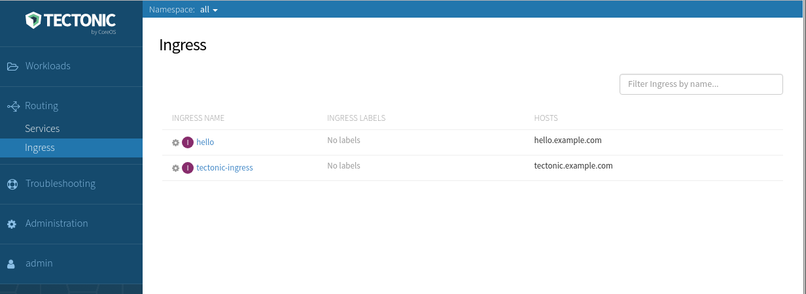

# Tectonic Ingress

Tectonic AWS and bare metal clusters include an Ingress Controller to expose the Tectonic Console and Tectonic Identity services. Ingress controllers watch the Kubernetes API for Ingress resources and update their configuration to expose Kubernetes services. When service traffic is routed through Ingress controllers, services of type LoadBalancer, NodePort, and HostPort are not required. Ingress resources can have rules which match hostnames, match paths, and perform TLS termination.

* On Tectonic bare metal, Ingress controllers are run as a daemonset on host ports across worker nodes by default.
* On Tectonic AWS, Ingress controllers are run as a deployment with node ports behind an AWS ELB by default.

## Using Tectonic Ingress

Starting with `1.5.5-tectonic.3`, the Tectonic Ingress Controller can be used for user applications as well.

Create an Ingress resource for a service `hello`, using the `kubernetes.io/ingress.class` annotation. Without the annotation, the Tectonic Ingress controller will ignore the Ingress resource.

```
apiVersion: extensions/v1beta1
kind: Ingress
metadata:
  name: hello
  annotations:
    kubernetes.io/ingress.class: "tectonic"
spec:
  rules:
    - host: hello.example.com
      http:
        paths:
          - path: /
            backend:
              serviceName: hello
              servicePort: 80
```

View Ingress resources in the Tectonic Console:

<div class="row">
  <div class="col-lg-10 col-lg-offset-1 col-md-10 col-md-offset-1 col-sm-10 col-sm-offset-1 col-xs-12 col-xs-offset-1">
    <a href="../img/tectonic-ingress.png" class="co-m-screenshot">
      
      <div class="co-m-screenshot-caption">Viewing Ingress Rules in the Tectonic Console</div>
    </a>
  </div>
</div>

Or by using `kubectl`:

```
$ kubectl get ingress
NAME      HOSTS               ADDRESS                   PORTS     AGE
hello     hello.example.com   172.18.0.22,172.18.0.23   80        1h
```

### Test your rules

Next, test that traffic to `hello.example.com` reaches the cluster's Ingress Controllers.

On Tectonic bare metal, add a DNS record on your network which resolves `hello.example.com` to any worker node(s), similar to how the Tectonic DNS entry was set up using Tectonic Installer. (To test, add an `/etc/hosts` entry.)

```
workerIP hello.example.com
```

For Tectonic AWS, add a DNS CNAME record `hello.example.com` to your Tectonic ELB. It ends in `-tec` and can be found on your AWS dashboard.

Visit the example application `http://hello.example.com`. Learn more about [Ingress][ingress-userguide] and add TLS termination for HTTPS apps.

## Running your own Ingress

Using Tectonic's built-in Ingress Controller works well for everyday HTTP workloads. However, you may run an application that requires more customized logic. For example, complex header manipulation as the routing rules are applied.

### Running an ingress controller

There are several different Ingress Controllers available. [Nginx and haproxy][controller-deployments] are the most popular. Ingress controllers are usually deployed as a Deployment/DaemonSet and a corresponding Service. For more information, see the selected Controller's documentation.

When selecting Ingress Controller options, be certain to consider the following flags:

**Class** - The flag `--ingress-class=my-custom-ingress` allows for rules to target this ingress controller.
**Namespace** - The flag `--watch-namespace=example` will ensure that only a specific namespace is watched for ingress rules. This can prevent others from using your Ingress Controller.
**Service Account** - In your Ingress Controller definition, set the `serviceAccountName` parameter equal to a Service Account with the correct RBAC policy. Tectonic provides a role `ingress-controller` for this purpose. [Read more about service accounts][service-accounts].

Here is a full example:

```yaml
apiVersion: extensions/v1beta1
kind: Deployment
metadata:
  name: production-ingress
  namespace: production
  labels:
    k8s-app: ingress
spec:
  replicas: 2
  template:
    metadata:
      labels:
        k8s-app: ingress
    spec:
      containers:
        - name: nginx-ingress-lb
          image: gcr.io/google_containers/nginx-ingress-controller:0.9.0-beta.11
          args:
          - /nginx-ingress-controller
          - --default-backend-service=$(POD_NAMESPACE)/default-http-backend
          - --configmap=$(POD_NAMESPACE)/production-ingress-conf
          - --watch-namespace=$(POD_NAMESPACE)
          - --ingress-class=my-custom-ingress
          # use downward API
          env:
            - name: POD_NAME
              valueFrom:
                fieldRef:
                  fieldPath: metadata.name
            - name: POD_NAMESPACE
              valueFrom:
                fieldRef:
                  fieldPath: metadata.namespace
          ports:
            - name: http
              containerPort: 80
            - name: https
              containerPort: 443
            - name: health
              containerPort: 10254
          readinessProbe:
           httpGet:
             path: /healthz
             port: 10254
             scheme: HTTP
          livenessProbe:
           initialDelaySeconds: 10
           timeoutSeconds: 1
           httpGet:
             path: /healthz
             port: 10254
             scheme: HTTP
      dnsPolicy: ClusterFirst
      restartPolicy: Always
      terminationGracePeriodSeconds: 60
      serviceAccountName: production-ingress-serviceaccount
```

### Writing Ingress Rules

To ensure that your rules are satisfied by _only_ your Ingress Controller, specify the Ingress class annotation on your rules:

```yaml
metadata:
  name: custom-rules
  annotations:
    kubernetes.io/ingress.class: "my-custom-ingress"
```

When rules are defined and the Ingress Controller is running, traffic to your Service will be routed appropriately.


[ingress-userguide]: https://kubernetes.io/docs/user-guide/ingress/
[service-accounts]: onboard-service-account.md
[controller-deployments]: https://github.com/kubernetes/ingress/tree/master/examples/deployment
[nginx-ingress]: https://github.com/kubernetes/ingress/tree/master/controllers/nginx
