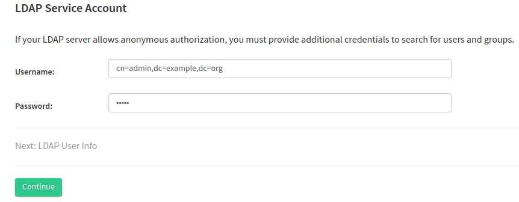
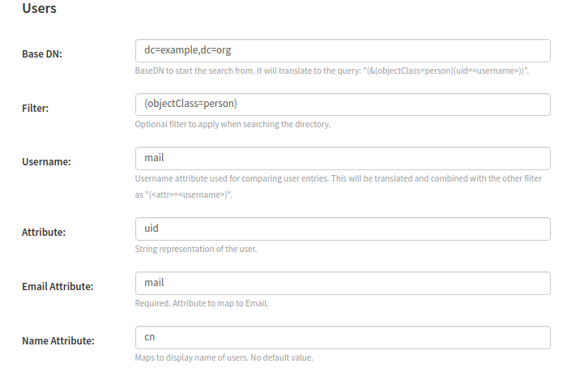
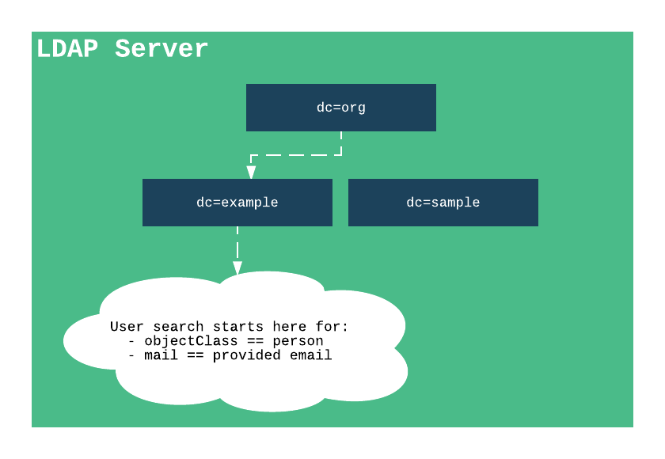
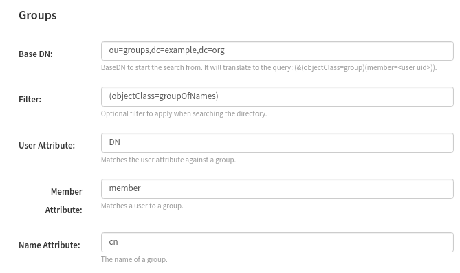
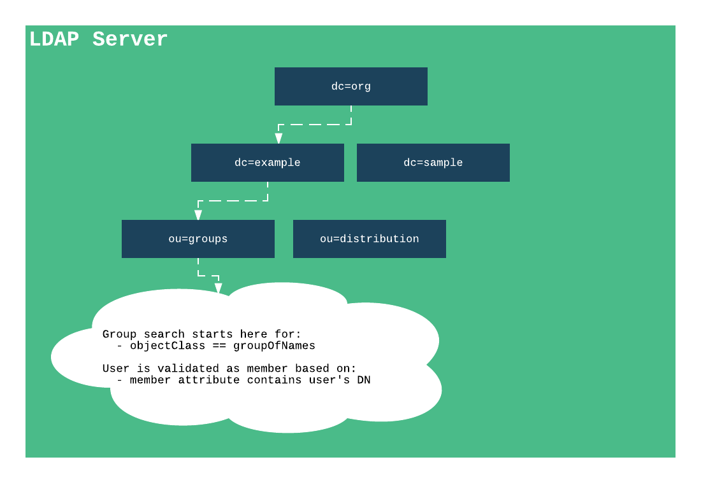
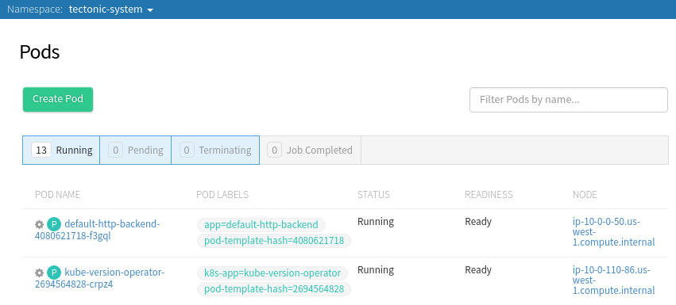
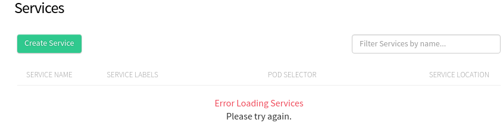

# LDAP User Management

## Overview

Tectonic Identity is an authentication service for both Tectonic Console and `kubectl`. It facilitates communication to the API server on the end user's behalf. All Tectonic clusters enable Role Based Access Control (RBAC). Tectonic Identity can be mapped to an LDAP service ensuring RBAC role bindings for groups and users map to your exiting LDAP system.

This document describes managing users and access control in Tectonic and Kubernetes using LDAP.

## Configuring Tectonic Identity for LDAP authentication

Tectonic Identity is configured through the Tectonic Console to allow for LDAP user authentication. In order to integrate with an LDAP server, you'll need the following:

* Your LDAP server host name and port
* An LDAP service account capable of querying for users and groups
* An LDAP base distinguished name (dn) representing where to start the search from for users and groups
* The attributes used to describe users and groups. For example, mail, username, and so on
* (Optional) The root CA if certificate CA verification is desired

Follow these steps in Tectonic Console to enable LDAP authentication in your cluster:

1. In Tectonic Console, navigate to *Cluster Settings* under *Administration*.
2. Click the *LDAP* link and add your LDAP host.
3. Specify whether your LDAP host uses SSL; if so, specify whether the certificate should be verified against a trusted root CA and click *Continue*.
4. Add an LDAP service account capable of querying for groups and users.

    <div class="row">
      <div class="col-lg-10 col-lg-offset-1 col-md-10 col-md-offset-1 col-sm-10 col-sm-offset-1 col-xs-10 col-xs-offset-1">
        <a href="../img/ldap-query-user.png" class="co-m-screenshot">
          
        </a>
      </div>
    </div>
5. Click *Continue*.
6. Configure the user search criteria by adding the following fields:
  <div class="row">
    <div class="col-lg-10 col-lg-offset-1 col-md-10 col-md-offset-1 col-sm-10 col-sm-offset-1 col-xs-12 col-xs-offset-1">
      <a href="../img/user-search.png" class="co-m-screenshot">
        
      </a>
    </div>
  </div>

  * **Base DN**: The root LDAP directory to begin the user search from.
  * **Filter**: Filter(s) applied to every user search to limit the results. For example, when a user search executes, object results could be limited to those with an `objectClass` of [person][person-ldap-rfc].
  * **Username**: The field used when searching for users. This is the field users will use to login. For example, a  commonName (assuming its unique) or a mail (email) address.
  * **Attribute**: The field mapping to a user's [uid][uid-ldap-rfc].
  * **Email Attribute**: The field mapping to a user's email address.
  * **Name Attribute**: The field mapping to a user's display name.

  The example configuration above translates to the following diagram:

  <div class="row">
    <div class="col-lg-10 col-lg-offset-1 col-md-10 col-md-offset-1 col-sm-10 col-sm-offset-1 col-xs-12 col-xs-offset-1">
      <a href="../img/ldap-server-user-search-diagram.png" class="co-m-screenshot">
        
      </a>
    </div>
  </div>

7. Continue to the group search configuration; add the following fields:

  * **Base DN**: The root LDAP directory to begin the group search from.
  * **Filter**: Filter(s) applied to every group search to limit the results. For example, when a group search executes, object results could be limited to those with an `objectClass` of [groupOfNames][groupOfNames-ldap-rfc].
  * **User Attribute**: The user field that a group uses to identify a user is part of a group. For example, groups that specify each member as `member: cn=john,dc=example,dc=org` in the LDAP directory, are using the [Distinguished Name (DN)][dn-ldap-rfc] attribute.
  * **Member Attribute**: The [member][member-ldap-rfc] field associating a user, using the User Attribute mentioned above, with the group.
  * **Name Attribute**: The field mapping to a group's display name.

  <div class="row">
    <div class="col-lg-10 col-lg-offset-1 col-md-10 col-md-offset-1 col-sm-10 col-sm-offset-1 col-xs-12 col-xs-offset-1">
      <a href="../img/group-search.png" class="co-m-screenshot">
        
      </a>
    </div>
  </div>

  The example configuration above translates to the following diagram:

  <div class="row">
    <div class="col-lg-10 col-lg-offset-1 col-md-10 col-md-offset-1 col-sm-10 col-sm-offset-1 col-xs-12 col-xs-offset-1">
      <a href="../img/ldap-server-group-search-diagram.png" class="co-m-screenshot">
        
      </a>
    </div>
  </div>

8. Input a valid user and click *Test Configuration* to verify that users and groups are correctly configured.
If the query does not return expected results, see the [Troubleshooting](#troubleshooting) section.

  The following is a sample LDAP directory used in the test steps.

  ```
  # john, example.org
  dn: cn=john,dc=example,dc=org
  objectClass: person
  objectClass: inetOrgPerson
  uid: john.doe
  mail: john.doe@example.org
  cn: john
  sn: doe
  userPassword:: e1NTSEF9dkltSFZkNTgzN3JBaVdEZ2xyVXFyeE9nM1FETHBkM04=

  # jane, example.org
  dn: cn=jane,dc=example,dc=org
  objectClass: person
  objectClass: inetOrgPerson
  uid: jane.doe
  mail: jane.doe@example.org
  cn: jane
  sn: doe
  userPassword:: e1NTSEF9dkltSFZkNTgzN3JBaVdEZ2xyVXFyeE9nM1FETHBkM04=

  # tstgrp, groups, example.org
  dn: cn=tstgrp,ou=groups,dc=example,dc=org
  objectClass: top
  objectClass: groupOfNames
  member: cn=john,dc=example,dc=org
  cn: tstgrp
  ```

  In this example the user `john.doe`'s `dn` is in `tstgrp`, but `jane.doe` is in no groups. You can query for these users in the *Test Configuration* page to verify this.

9. From the *Test Configuration* page, click *Continue* to see instructions on updating the given Tectonic Identity.
10. Click *My Account*.
11. From the *Profile* page, download the new configuration file.

 Keep a backup of the existing config in case something goes wrong during the update.

### Applying a new Tectonic Identity configuration

To apply a new Tectonic Identity configuration to your Kubernetes cluster:

1. On your terminal, run `kubectl apply`:

  ```bash
  $ kubectl apply -f ~/Downloads/new-tectonic-config.yaml
  ```
  If successful the following message is displayed:

  ```
  configmap "tectonic-identity" configured
  ```

2. Restart the Tectonic Identity pods for the changes to take effect. Run the following command to trigger a rolling update and attach the current date as an annotation.

  ```bash
  $ kubectl patch deployment tectonic-identity \
      --patch "{\"spec\":{\"template\":{\"metadata\":{\"annotations\":{\"date\":\"`date +'%s'`\"}}}}}" \
      --namespace tectonic-system
  ```
If successful the following message is displayed:

  ```
  "tectonic-identity" patched
  ```

3. Log out of Tectonic Console and log in again by using the LDAP authentication credentials.

> In order for an LDAP user to have any access to Kubernetes resources, both from the console and kubectl, you must setup role bindings. See [Configuring Access](#configuring-access) for more details.

### Using kubectl as an LDAP user

To use `kubectl` as an LDAP user:

1. Log in to your Tectonic Console as the desired user.
2. Navigate to *My Account*
3. Verify your identity and download `kubectl` configuration.
4. Set the KUBECONFIG environment variable to the `kubectl` configuration file. For example:

  ```
  export KUBECONFIG=~/Download/kubectl-config
  ```

Until otherwise modified, you can still use your static account for further administrative setup.

## Configuring RBAC

Access configuration requires understanding Kubernetes Roles, RoleBindings, ClusterRoles, and ClusterRoleBindings. LDAP-based users do not alter this model. LDAP usernames and groups can be used with Kubernetes bindings; visit  the following to learn how to set up these configurations:

* [Adding a user][onboard-user]
* [Adding an administrator][onboard-admin]
* [Adding a team][onboard-team]
* [Adding a service account][onboard-service-account]
* [Kubernetes authorization documentation][k8s-auth]

### An example configuration

The following shows an example of granting user `john.doe@example.org` basic access to the cluster.

1. Add a role named `support-readonly` that can run commands get, logs, list, and watch for namespaces and pods:

  ```yaml
  apiVersion: rbac.authorization.k8s.io/v1alpha1
  kind: ClusterRole
  metadata:
    name: support-readonly
  rules:
  - apiGroups:
    - ""
    attributeRestrictions: null
    resources:
    - namespaces
    - namespaces/finalize
    - namespaces/status
    - pods
    verbs:
    - get
    - logs
    - list
    - watch
  ```

2. Bind the role to `john.doe`'s group `tstgrp`:

  ```yaml
  kind: ClusterRoleBinding
  apiVersion: rbac.authorization.k8s.io/v1alpha1
  metadata:
    name: support-reader
    namespace: kube-system
  subjects:
    - kind: Group
      name: tstgrp
  roleRef:
    kind: ClusterRole
    name: support-readonly
    apiGroup: rbac.authorization.k8s.io
  ```

  Tectonic Console and `kubectl` now reflect the updated role and binding:

  <div class="row">
    <div class="col-lg-10 col-lg-offset-1 col-md-10 col-md-offset-1 col-sm-10 col-sm-offset-1 col-xs-12 col-xs-offset-1">
      <a href="../img/ui-permission-granted.png" class="co-m-screenshot">
        
      </a>
    </div>
  </div>

3. Verify all pods are up and running:

  ```bash
  $ kubectl --kubeconfig=johnDoeConfig --namespace=tectonic-system get pods

  NAME                                         READY     STATUS    RESTARTS   AGE
  default-http-backend-4080621718-f3gql        1/1       Running   0          2h
  kube-version-operator-2694564828-crpz4       1/1       Running   0          2h
  ...
  ```

### Unauthorized access

An attempt to access a resource or perform a command to which a user does not have access will be rejected by the API server:

<div class="row">
  <div class="col-lg-10 col-lg-offset-1 col-md-10 col-md-offset-1 col-sm-10 col-sm-offset-1 col-xs-12 col-xs-offset-1">
    <a href="../img/ui-permission-notallowed.png" class="co-m-screenshot">
      
    </a>
  </div>
</div>

```bash
$ kubectl --kubeconfig=johnDoeConfig --namespace=tectonic-system get services

Error from server (Forbidden): the server does not allow access to the requested resource (get services)
```

## Troubleshooting

### Authorizing users

Regardless of the identity provider being used, authorization is performed by using the email address of the user attempting to be authorized. For example, if *john.doe@example.org* is marked as an admin, admin access is given only if the user logs in by providing the same email address. If the user attempts to log in with anything other than email, role binding policies are not applied. This issue is observed due to a Kubernetes limitation when Dex is used as the OpenID Connect provider.

If a subject other than the email attribute is used to log in, Kubernetes will prefix the field with the issuer URL and considers the new string as the username. For example, logging in with the uid, *john.doe*, makes it intuitive that it's the subject in the role binding that is matched on. Kubernetes adds extra strings to *john.doe* and provide `https://john.doe-example.org/identity#(UID)`. As a result role binding fails because there is no match between the username and the value of the subject `name` in ClusterRoleBinding.

To work around, use the email attribute when mapping users to roles.
The following outlines an example LDAP configuration for the user *john.doe* and an associated ClusterRoleBinding.

    john.doe, Users, 5866a86d3187bc712e435b35, example.org
    dn: uid=john.doe,ou=Users,o=5866a86d3187bc712e435b35,dc=example,dc=org
    givenName: john
    jcLdapAdmin: TRUE
    uid: john.doe
    uidNumber: 5006
    loginShell: /bin/bash
    homeDirectory: /home/John.doe
    sn: Doe
    cn: John Doe
    objectClass: exampleUser
    gidNumber: 5006
    mail: john.doe@example.org
    memberOf: cn=tectonic_users,ou=Users,o=5866a86d3187bc712e435b35,dc=example,dc=org

In the following example, email address is provided as the name attribute to work around the Kubernetes limitation.

    apiVersion: rbac.authorization.k8s.io/v1alpha1
    kind: RoleBinding
    metadata:
      name: admin-john.doe-namespace-all-access-binding
      namespace: john.doe-namespace
    roleRef:
      apiGroup: rbac.authorization.k8s.io
      kind: Role
      name: john.doe@example.org
    subjects:
    - kind: User
      name: john.doe
      namespace: john.doe-namespace

### Troubleshooting users and groups configuration

To troubleshoot users and groups configuration, check the `tectonic-console`'s logs to see what LDAP query is being sent.

Locate the Console's pod name:

```bash
$ kubectl --namespace=tectonic-system get pods

NAME                                         READY     STATUS    RESTARTS   AGE
tectonic-console-3824021701-50j0x            1/1       Running   0          2h
tectonic-identity-3193269714-bg19p           1/1       Running   0          24m
tectonic-ingress-controller-99581103-rd0cj   1/1       Running   0          2h
```

Using `kubectl`, tail the logs for the console pod:

```bash
$ kubectl --namespace=tectonic-system logs -f tectonic-console-3824021701-50j0x

2017/01/29 22:29:47 ldap: no results returned for filter: "(&(objectClass=person)(mail=jane2.doe@example.org))"
2017/01/29 22:30:16 ldap: groups search with filter "(&(objectClass=groupOfNames)(member=john.doe@example.org))" returned no groups
```

In the above example, two issues are visible. First, `jane2.doe@example.org` was not found in the LDAP directory. Second, a group search is attempting to check if the member field contains `john.doe@example.org`. However, the original example and LDAP server output, shown earlier in this document, qualify members based on `DN` rather than `mail`.

[onboard-user]: onboard-user.md
[onboard-admin]: onboard-admin.md
[onboard-team]: onboard-team.md
[onboard-service-account]: onboard-service-account.md
[person-ldap-rfc]: https://tools.ietf.org/html/rfc4519#section-3.12
[uid-ldap-rfc]: https://tools.ietf.org/html/rfc4519#section-2.39
[groupOfNames-ldap-rfc]: https://tools.ietf.org/html/rfc4519#section-3.5
[dn-ldap-rfc]: https://tools.ietf.org/html/rfc4511#section-4.1.3
[member-ldap-rfc]: https://tools.ietf.org/html/rfc4519#section-2.17
[k8s-auth]: https://kubernetes.io/docs/admin/authorization/#roles-rolesbindings-clusterroles-and-clusterrolebindings
