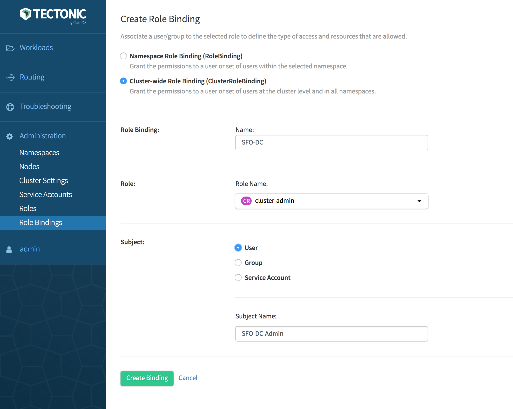
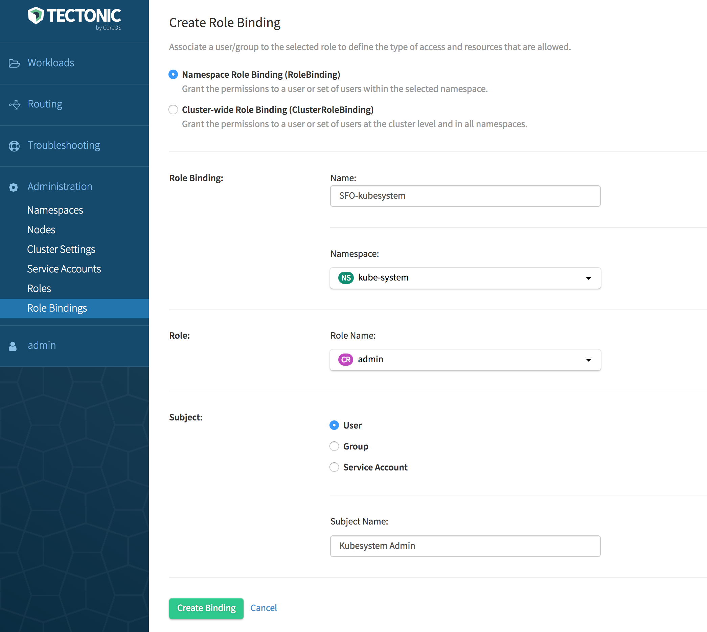

# Adding an administrator to a Tectonic cluster

An administrator can be assigned to a cluster or to a specific namespace within a cluster. Administrators have full control over all resources within their cluster or namespace.

##  Prerequisites and guidelines

Before proceeding, ensure that the prerequisites given in the respective Identity Provider (IdP) section are met. Depending on the IdP used in the deployment, see one of the following:

* [Static user management][user-management]
* [LDAP user management][ldap-user-management]
* [SAML user management][saml-user-management]

## Granting access rights

Access rights are granted to a user associated with an administrator role by using a Role Binding. Do either of the following in Tectonic Console:

* Use the *Role Bindings* option under *Administration*  Create a *Role Binding*, then select a Role.
* Use the *Roles* option under *Administration*. Create a new role by using the YAML editor. Then use the *Role Bindings* option to create a desired type of Role Binding and bind to the new role.

### Setting up a Cluster administrator

Grant access rights to an administrator by associating an appropriate Cluster Role with a Cluster Role Binding. Cluster Role Binding grants permissions to users in all namespaces across the entire cluster. Use the default `cluster-admin` role for cluster administration. `namespace` is omitted from the configuration because Cluster Roles are not namespaced.

1. Log in to the Tectonic UI.
2. Navigate to *Role Bindings* under *Administration*.
3. Click *Create Binding*.
   The *Create Role Binding* page is displayed.
4. Click *Cluster-wide Role Binding (ClusterRoleBinding)*.
5. Specify a name to identify the Cluster-wide Role Binding.
6. Select a Role Name from the drop-down.
   See [Default Roles in Tectonic][identity-management].
7. Select an appropriate subject from subject kind.
8. Specify a name to help identify the subject.
9. Click *Create Binding*.

  

    
  

In this example, a Cluster-wide Role Binding, `SFO-DC` is created for the default `cluster-admin` role that has full control over the resources in the cluster. To verify, go to the *Roles* page, click `cluster-admin`, then select *Role Bindings*. If creating this Role Binding is successful, `SFO-DC` will be listed under the Role Bindings associated with the `cluster-admin` role.

### Setting up a Namespace administrator

Tectonic configures four default namespaces:  `default`, `kube-system`, `kube-public`, and `tectonic-system`. The namespace administrator role will have full permission to the objects in a namespace. To assign a namespace administrator, use one of the default Cluster or Namespace Roles, or create a new role for the selected Namespace. Bind the role to an appropriate Role Binding.

While a Cluster Role can be bound down the hierarchy to a Namespace Role Binding, a Namespace Role can't be promoted up the hierarchy to be bound to a Cluster Role Binding.

1. Log in to the Tectonic UI.
2. Navigate to *Role Bindings* under *Administration*.
3. Click *Create Binding*.
   The *Create Role Binding* page is displayed
4. Click *Namespace Role Binding (RoleBinding)*.
5. Specify a name to identify the Role Binding.
6. Select a desired namespace from the drop-down.
7. Select a Role Name from the drop-down.
   See [Default Roles in Tectonic][identity-management].
8. Select an appropriate subject from subject kind.
9. Specify a name to help identify the subject.
10. Click *Create Binding*.

  

    
  

In this example, a Namespace Role Binding, `SFO-kubesystem` is created for the default `admin` role that has full control over the resources in the `kube-system`. To verify, go to the *Roles* page, click `cluster-admin`, then select *Role Bindings*. If creating this Role Binding is successful, `SFO-kubesystem` will be listed under the Role Bindings associated with the `admin` role.

[user-management]: user-management.md
[ldap-user-management]: ldap-user-management.md
[saml-user-management]: saml-user-management.md
[identity-management]: identity-management.md
