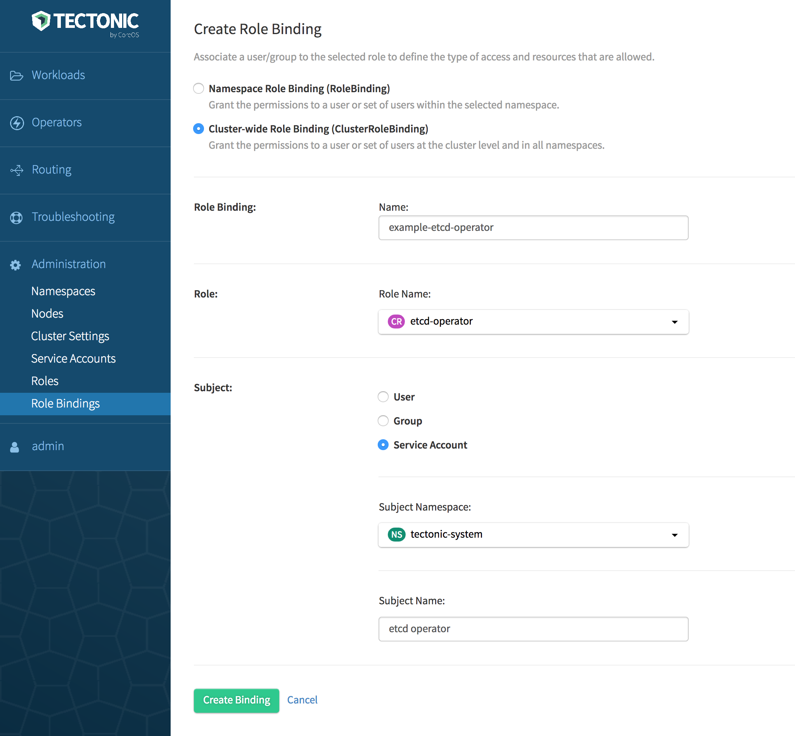
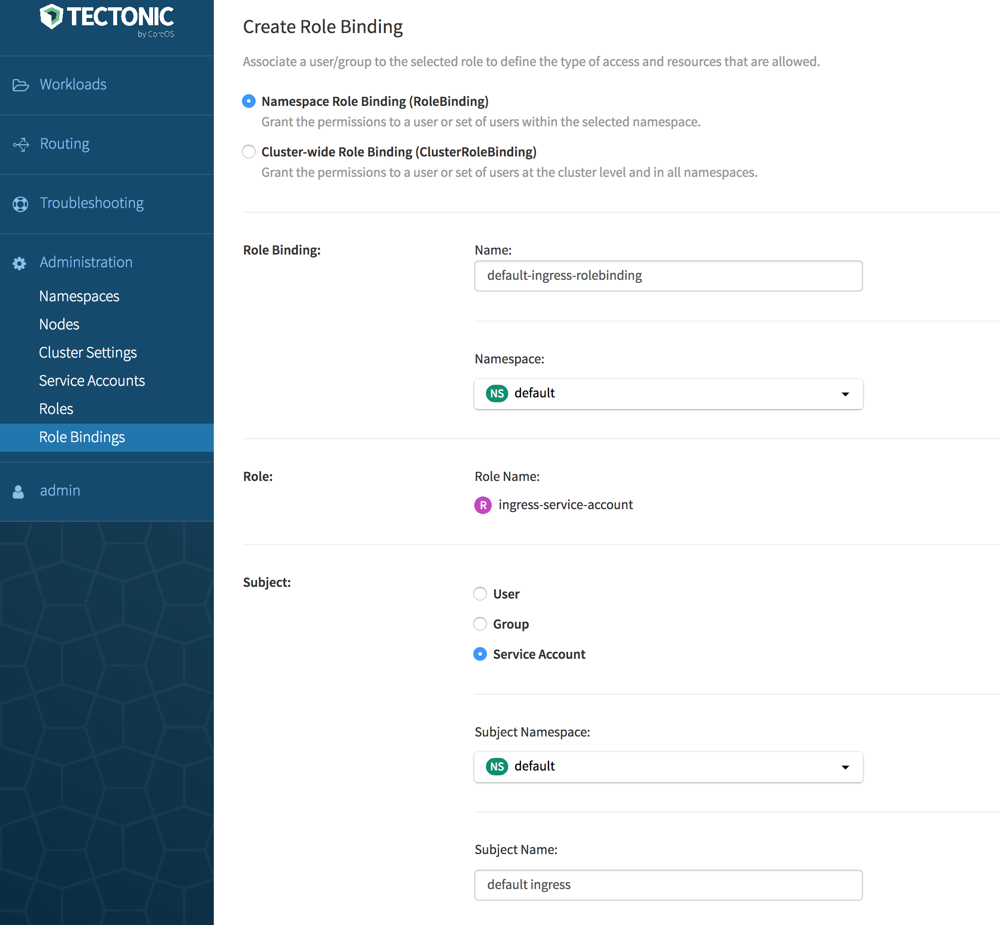

# Adding a service account to Tectonic cluster

## About service accounts

Service accounts are API credentials stored in Kubernetes APIs and mounted onto pods as files, providing access-controlled identity to the services running on pods.  In effect, any process running inside a pod uses service account to authenticate itself to Kubernetes APIs from within a cluster. For example, when an ingress controller running in cluster needs to read ingress resources, it loads service account secrets mounted into the pod at known locations to authenticate with the API server. The apps running on the clusters use the service accounts secrets as a bearer token. Kubernetes automatically creates a `default` service account with relatively limited access in every namespace. If pods don't explicitly request a service account, they are assigned to this `default` one. However, creating an additional service account is permitted.

Every service account has an associated username that can be granted RBAC roles, just like a regular user has. Service accounts are tied to namespaces and therefore their username is derived from its namespace and name: `system:serviceaccount:<namespace>:<name>`. Because RBAC denies all requests unless explicitly allowed, service accounts, and the pods that use them, must be granted access through RBAC rules.

## Creating a service account

To create a service account use `kubectl create` command or Tectonic Console.

## Granting access rights to service account

Access rights are granted to a service account associated with a role by using a Role Binding. Do either of the following in Tectonic Console:

* Use the *Role Bindings* option under *Administration*.  Create a *Role Binding*, then select a default Role. For example: `admin`.
* Use the *Roles* option under *Administration*. Create a new role by using the YAML editor. Then use the *Role Bindings* option to create a type of Role Binding and bind to the new role.

### Using Tectonic Console

#### Granting a Cluster-wide role to service account

Grant access rights to a service account by associating an appropriate Cluster Role with a Cluster Role Binding. Cluster Role Binding grants permissions to service accounts in all namespaces across the entire cluster. `namespace` is omitted from the configuration because Cluster Roles are not namespaced.

1. Log in to Tectonic Console.
2. Navigate to *Role Bindings* under *Administration*.
3. Click *Create Binding*.
   The *Create Role Binding* page is displayed.
4. Click *Cluster-wide Role Binding (ClusterRoleBinding)*.
5. Specify a name to identify the Cluster-wide Role Binding.
6. Select a Role Name from the drop-down.

   If you have navigated from the *Roles* page, the name of the selected Role will be displayed. For information on Roles, see [Default Roles in Tectonic][identity-management].
7. Select an appropriate subject from subject kind.
8. Select a namespace for the subject.
9. Specify a name to help identify the subject.
10. Click *Create Binding*.

<div class="row">
  <div class="col-lg-10 col-lg-offset-1 col-md-10 col-md-offset-1 col-sm-10 col-sm-offset-1 col-xs-12 col-xs-offset-1">
    <a href="../img/cluster-service-account.png" class="co-m-screenshot">
      
    </a>
  </div>
</div>

In this example, a Cluster Role Binding, `example-etcd-operator` is created for the `etcd-operator` role. This role has access to non-namespaced third party resources. To verify, go to the *Roles* page, click `etcd-operator`, then select *Role Bindings*. If creating this Cluster Role Binding is successful, `example-etcd-operator` will be listed under the Role Bindings associated with the `etcd-operator` role.

#### Granting a namespace role to service account

To assign a namespace service account, use one of the default Cluster or Namespace Roles, or create a new role for the selected Namespace. Bind the role to an appropriate Role Binding.

While a Cluster Role can be bound down the hierarchy to a Namespace Role Binding, a Namespace Role can't be promoted up the hierarchy to be bound to a Cluster Role Binding.

1. Log in to Tectonic Console.
2. Navigate to *Role Bindings* under *Administration*.
3. Click *Create Binding*.
   The *Create Role Binding* page is displayed.
4. Click *Namespace Role Binding (RoleBinding)*.
5. Specify a name to identify the Role Binding.
6. Select a namespace from the drop-down.
7. Select a Role Name from the drop-down.

   If you have navigated from the *Roles* page, name of the selected Role will be displayed, as given in the image below.
   For information on Roles, see [Default Roles in Tectonic][identity-management].
8. Select an appropriate subject from subject kind.
9. Select a namespace for the subject.
10. Specify a name to help identify the subject.
11. Click *Create Binding*.

<div class="row">
  <div class="col-lg-10 col-lg-offset-1 col-md-10 col-md-offset-1 col-sm-10 col-sm-offset-1 col-xs-12 col-xs-offset-1">
    <a href="../img/namespace-service-account.png" class="co-m-screenshot">
      
    </a>
  </div>
</div>

In this example, a Namespace Role Binding, `default-ingress-rolebinding` is created for the `ingress-service-account` role that has read access over the ingress resources in the `default` namespace. To verify, go to the *Roles* page, click `pod-reader`, then select *Role Bindings*. If creating this Role Binding is successful, `default-ingress-rolebinding` will be listed under the Role Bindings associated with the `ingress-service-account` role.

### Using kubectl

In this example, a Cluster Role Binding, `etcd-rolebinding` is created for the `etcd-operator` role  by using `kubectl` command. This role will have read access over the ingress resources in the `tectonic-system` namespace.

1. Define a Role, `etcd-operator.yaml`:

    ```YAML
    apiVersion: rbac.authorization.k8s.io/v1beta1
    kind: ClusterRole
    metadata:
      name: etcd-operator
    rules:
    - apiGroups:
      - etcd.coreos.com
      resources:
      - clusters
      verbs:
      - "*"
    - apiGroups:
      - extensions
      resources:
      - thirdpartyresources
      verbs:
      - "*"
    - apiGroups:
      - storage.k8s.io
      resources:
      - storageclasses
      verbs:
      - "*"
    - apiGroups:
      - ""
      resources:
      - pods
      - services
      - endpoints
      - persistentvolumeclaims
      - events
      verbs:
      - "*"
    - apiGroups:
      - apps
      resources:
      - deployments
      verbs:
      - "*"
    ```
2. Define a Cluster Role Binding, `etcdoperator.yaml`, which gives administrative privileges to the service account within the `tectonic-system` namespace:

     ``` yaml
     apiVersion: rbac.authorization.k8s.io/v1beta1
     kind: ClusterRoleBinding
     metadata:
       name: example-etcd-operator
     roleRef:
       apiGroup: rbac.authorization.k8s.io
       kind: ClusterRole
       name: admin
     subjects:
     - kind: ServiceAccount
       name: example etcd operator
       namespace: tectonic-system
      ```
3. Run the following command:

    `kubectl create -f serviceaccount etcdoperator.yaml`

   If creating the service account is successful, the following message is displayed:

    `serviceaccount "example-etcd-operator" created`

4. Verify once again by fetching the service accounts:

    `kubectl get serviceaccounts`

    Locate `example-etcd-operator` in the list of service accounts:

  ```
     NAME                     SECRETS    AGE
     default                     1          1d
     example-etcd-operator       1          5m
     .....
   ```

It's recommended to give each application its own service account and not rely on the default service account. The newly created service account can be mounted onto the pod by specifying the service account name in the pod spec. For example:

```yaml
 apiVersion: extensions/v1beta1
 kind: Deployment
 metadata:
   name: nginx-deployment
 spec:
   replicas: 3
   template:
     metadata:
       labels:
         k8s-app: nginx
     spec:
       containers:
       - name: nginx
         image: nginx:1.7.9
       serviceAccountName: public-ingress # note down the name of the service account for future reference
```

[user-management]: user-management.md
[ldap-user-management]: ldap-user-management.md
[saml-user-management]: saml-user-management.md
[identity-management]: identity-management.md#default-roles-in-tectonic
