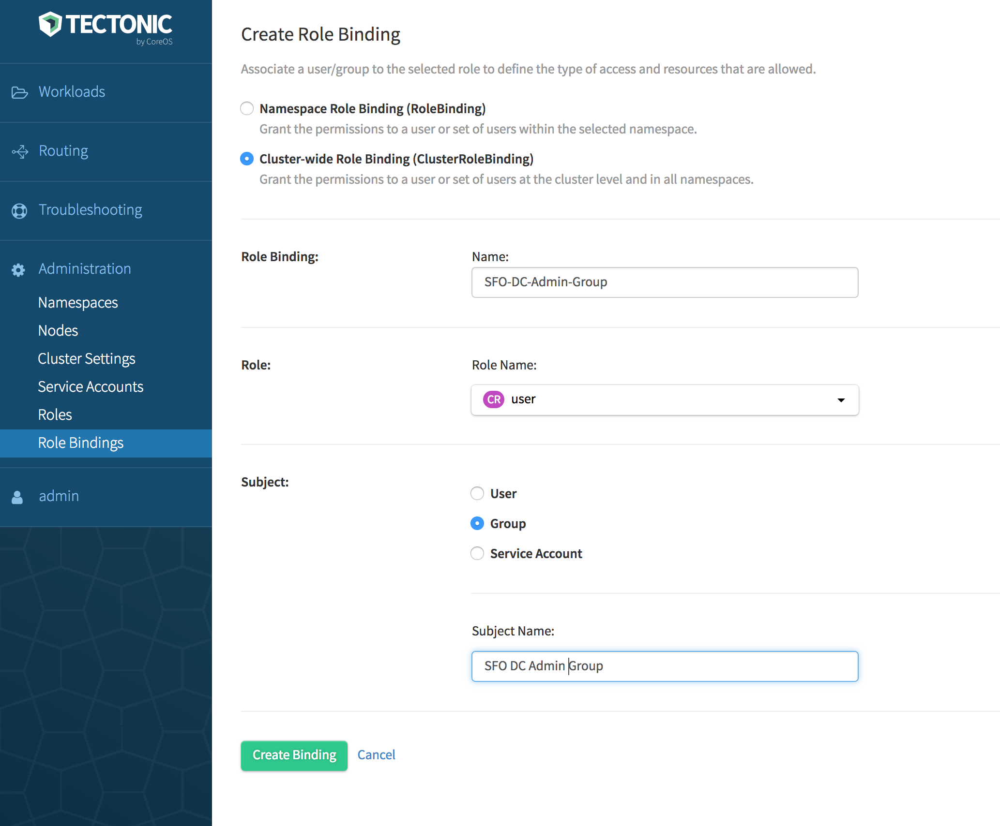
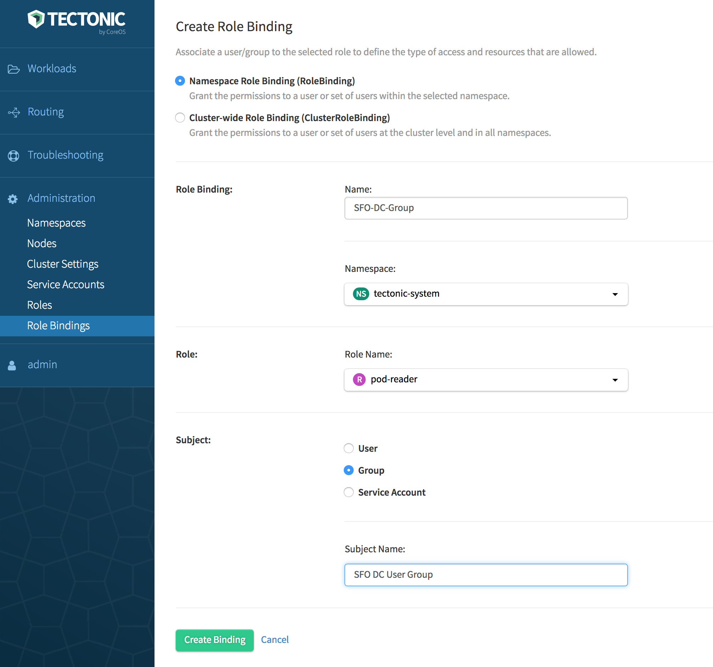

# Adding a team to a Tectonic cluster

## About Groups

Groups represent users with the same set of permissions. When users log in, their RBAC group memberships are also evaluated. The actual set of permissions that a user will have is an aggregate of all the roles assigned to the user account and the roles for all of the groups to which the user belongs to.

A group can be assigned to a cluster or a specific namespace within a cluster. Use the *Role Binding* option in the Tectonic cluster to do so.

## Users as part of multiple groups

Individual users can be part of multiple groups. The individual LDAP users or groups aren't viewable on the Tectonic console. However, the roles and role bindings attached to users and groups are displayed on the individual Roles page. Editing the YAML file associated with individual role is permitted to the role with necessary rights.  Creating a rule or role binding is allowed from the role detail page.

##  Prerequisites and guidelines

Before proceeding, ensure that the prerequisites given in the respective Identity Provider (IdP) section are met. Depending on the IdP used in the deployment, see one of the following:

* [Static user management][user-management]
* [LDAP user management][ldap-user-management]
* [SAML user management][saml-user-management]

## Granting access rights

Access rights are granted to a group associated with a role by using a Role Binding. Do either of the following in Tectonic Console:

* Use the *Role Bindings* option under *Administration*  Create a *Role Binding*, then select a Role. Select *Group* from *Subject*.
* Use the *Roles* option under *Administration*. Create a new role by using the YAML editor. Then use the *Role Bindings* option to create a desired type of Role Binding and bind to the new role.

### Giving Cluster-wide permission

Grant access rights to a user group by associating an appropriate Cluster Role with a Cluster Role Binding. Make sure that *Group* is selected under *Subject* while creating the Cluster Role Binding. Cluster Role Binding grants permissions to user group in all namespaces across the entire cluster. `namespace` is omitted from the configuration because Cluster Roles are not namespaced.

1. Log in to Tectonic Console.
2. Navigate to *Role Bindings* under *Administration*.
3. Click *Create Binding*.
   The *Create Role Binding* page is displayed.
4. Click *Cluster-wide Role Binding (ClusterRoleBinding)*.
5. Specify a name to identify the Cluster-wide Role Binding.
6. Select a Role Name from the drop-down.
   If you have navigated from the Roles page, the name of the selected Role will be displayed. For information on Roles, see [Default Roles in Tectonic][identity-management].
7. Select *Group* from subject kind.
8. Specify a a name to identify subject.
9. Click *Create Binding*.

  

    
  

In this example, a Cluster-wide Role Binding, `SFO-DC-Admin-Group` is created for the default `admin` role that has full control over the resources in the cluster. To verify, go to the *Roles* page, click `cluster-admin`, then select *Role Bindings*. If creating this Role Binding is successful, `SFO-DC-Admin-Group` will be listed under the Role Bindings associated with the `admin` role.

## Giving namespace permission

To assign a namespace user group, use one of the default Cluster or Namespace Roles, or create a new role for the selected Namespace. Bind the role to an appropriate Role Binding. Make sure that *Group* is selected under *Subject* while creating the Cluster Role Binding.

While a Cluster Role can be bound down the hierarchy to a Namespace Role Binding, a Namespace Role can't be promoted up the hierarchy to be bound to a Cluster Role Binding.

1. Log in to Tectonic Console.
2. Navigate to *Role Bindings* under *Administration*.
3. Click *Create Binding*.
   The *Create Role Binding* page is displayed.
4. Click *Namespace Role Binding*.
5. Specify a name to identify the Cluster-wide Role Binding.
6. Select a Role Name from the drop-down.
   If you have navigated from the Roles page, the name of the selected Role will be displayed. For information on Roles, see [Default Roles in Tectonic][identity-management].
7. Select *Group* from subject kind.
8. Specify a a name to identify subject.
9. Click *Create Binding*.

  

    
  

In this example, a Namespace Role Binding, `SFO-DC-Group` is created for `pod-reader` role that has the read access to the pods within `tectonic-system`. To verify, go to the *Roles* page, click `pod-reader`, then select *Role Bindings*. If creating this Role Binding is successful, `SFO-DC-Group` will be listed under the Role Bindings associated with the `pod-reader` role. The `Subject` will be `Group`, implies all the members of this group will have read access to the pods within `tectonic-system`.

## Managing removed IdP users and groups

When removed from LDAP or SAML, users and groups are cached. Those users cannot no longer access their clusters.

[user-management]: user-management.md
[ldap-user-management]: ldap-user-management.md
[saml-user-management]: saml-user-management.md
[identity-management]: identity-management.md#default-roles-in-tectonic
