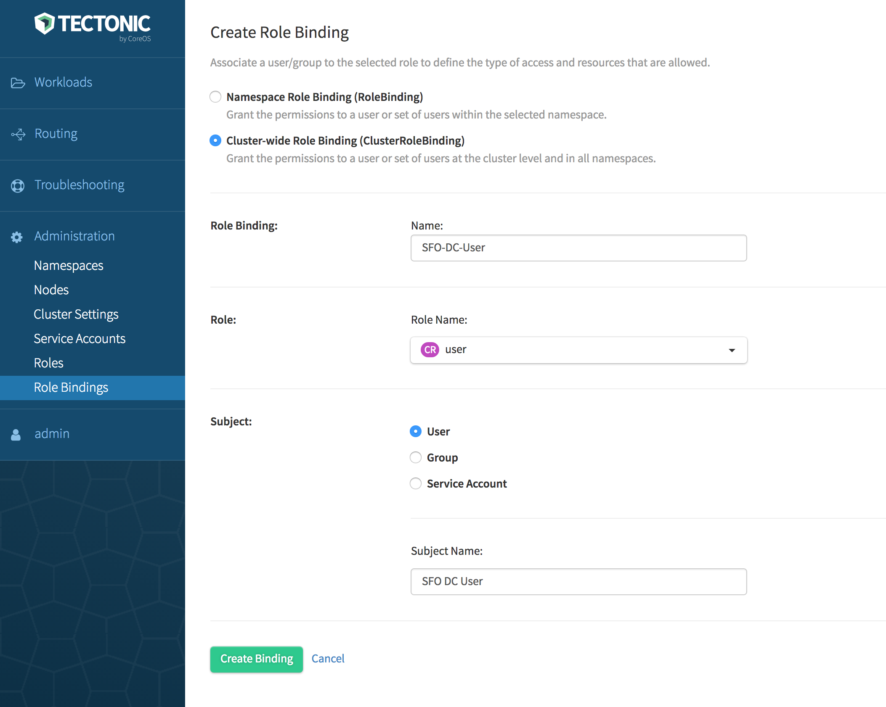
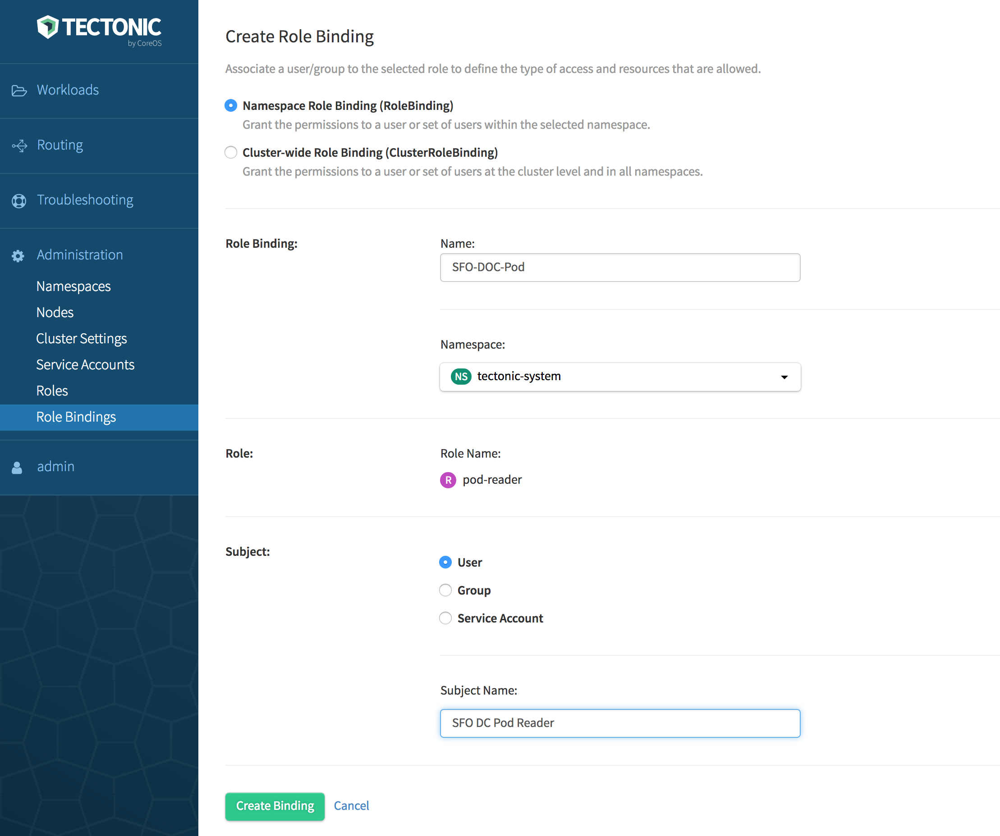

# Adding a user to a Tectonic cluster

An individual user can be assigned to a cluster or to a specific namespace within a cluster. Users have permissions on resources within their cluster or namespace as defined in the Role.

##  Prerequisites and guidelines

Before proceeding, ensure that the prerequisites given in the respective Identity Provider (IdP) section are met. Depending on the IdP used in the deployment, see one of the following:

* [Static user management][user-management]
* [LDAP user management][ldap-user-management]
* [SAML user management][saml-user-management]

## Granting access rights to a user

Access rights are granted to a user associated with a role by using a Role Binding. Do either of the following in Tectonic Console:

* Use the *Role Bindings* option under *Administration*.  Create a *Role Binding*, then select a default Role. For example: `user`.
* Use the *Roles* option under *Administration*. Create a new role by using the YAML editor. Then use the *Role Bindings* option to create a desired type of Role Binding and bind to the new role.

### Setting up a Cluster user

Grant access rights to a user by associating an appropriate Cluster Role with a Cluster Role Binding. Cluster Role Binding grants permissions to users in all namespaces across the entire cluster. `namespace` is omitted from the configuration because Cluster Roles are not namespaced.

1. Log in to Tectonic Console.
2. Navigate to *Role Bindings* under *Administration*.
3. Click *Create Binding*.
   The *Create Role Binding* page is displayed.
4. Click *Cluster-wide Role Binding (ClusterRoleBinding)*.
5. Specify a name to identify the Cluster-wide Role Binding.
6. Select a Role Name from the drop-down.

   If you have navigated from the *Roles* page, the name of the selected Role will be displayed. For information on Roles, see [Default Roles in Tectonic][identity-management].
7. Select an appropriate subject from subject kind.
8. Specify a name to help identify the subject.
9. Click *Create Binding*.

  

    
  

In this example, a Cluster Role Binding, `SFO-DC-User` is created for the default `user` role. `user` has access to all common objects within a cluster, but is prevented from changing the RBAC policies. To verify, go to the *Roles* page, click `user`, then select *Role Bindings*. If creating this Cluster Role Binding is successful, `SFO-DC-User` will be listed under the Role Bindings associated with the `user` role.

### Setting up a Namespace user

To assign a namespace user, use one of the default Cluster or Namespace Roles, or create a new role for the selected Namespace. Bind the role to an appropriate Role Binding.

While a Cluster Role can be bound down the hierarchy to a Namespace Role Binding, a Namespace Role can't be promoted up the hierarchy to be bound to a Cluster Role Binding.

1. Log in to Tectonic Console.
2. Navigate to *Role Bindings* under *Administration*.
3. Click *Create Binding*.
   The *Create Role Binding* page is displayed.
4. Click *Namespace Role Binding (RoleBinding)*.
5. Specify a name to identify the Role Binding.
6. Select a desired namespace from the drop-down.
7. Select a Role Name from the drop-down.

   If you have navigated from the *Roles* page, name of the selected Role will be displayed, as given in the image below.
   For information on Roles, see [Default Roles in Tectonic][identity-management].
8. Select an appropriate subject from subject kind.
9. Specify a name to help identify the subject.
10. Click *Create Binding*.

  

    
  

In this example, a Namespace Role Binding, `SFO-DOC-Pod` is created for the `pod-reader` role that has read access over the pods in the `tectonic-system`. To verify, go to the *Roles* page, click `pod-reader`, then select *Role Bindings*. If creating this Role Binding is successful, `SFO-DOC-Pod` will be listed under the Role Bindings associated with the `pod-reader` role.

[user-management]: user-management.md
[ldap-user-management]: ldap-user-management.md
[saml-user-management]: saml-user-management.md
[identity-management]: identity-management.md#default-roles-in-tectonic
