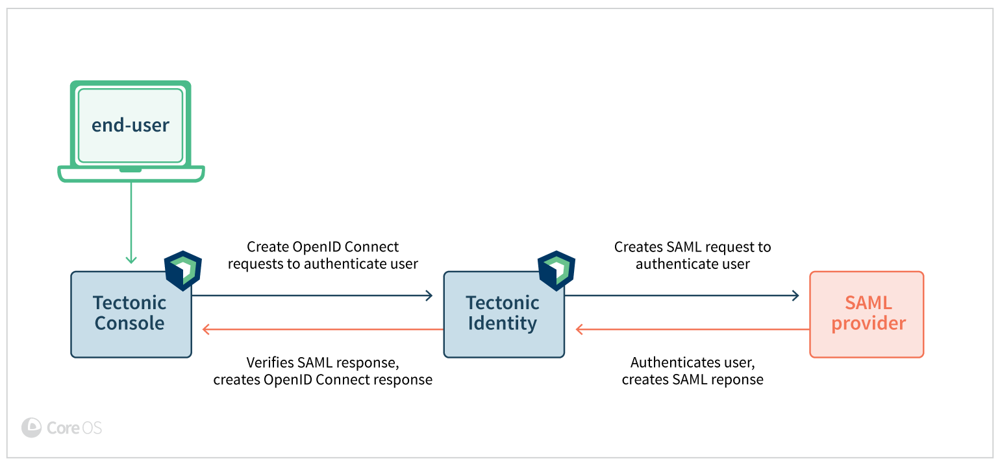

# SAML user management

## Overview

Tectonic Identity authenticates clients, such as `kubectl` and Tectonic Console, for access to the Kubernetes API and, through it, to Tectonic cluster services. All Tectonic clusters use Role Based Access Control (RBAC) to govern access to cluster services. Tectonic Identity authenticates a user's identity, and RBAC enforces authorization based on that identity. Tectonic Identity can map cluster RBAC bindings to an existing Security Assertion Markup Language (SAML) Identity Provider (IdP) over a secure channel.

This document describes managing Tectonic users, groups, and access control in concert with a SAML IdP.

## Integrating Tectonic Identity with SAML

### Authentication workflow

The message flow begins with a request to access Tectonic Console. Tectonic Identity constructs a SAML `AuthnRequest` and redirects the user to the IdP. Once the user is verified, IdP constructs an `AuthnResponse` to send to Tectonic Identity. Tectonic Identity verifies the response and retrieves various user information, such as email, username, and groups from `AuthnResponse`.

<div class="row">
  <div class="col-lg-10 col-lg-offset-1 col-md-10 col-md-offset-1 col-sm-10 col-sm-offset-1 col-xs-10 col-xs-offset-1">
    <a href="../img/ldap-query-user.png" class="co-m-screenshot">
      
    </a>
  </div>
</div>

1. The Tectonic user attempts to log in to the Tectonic Console.

2. Tectonic Identity identifies the user’s origin and redirects the user to the IdP, requesting authentication. This is the authentication request (`AuthnRequest`).

3. The IdP builds the authentication response in the form of an XML file containing the user’s username or email address (`NameID`) as agreed upon, signs it using the private key of an X.509 certificate, and posts this information to Tectonic Identity.

4. Tectonic Identity, which has already established an association with the IdP, retrieves the authentication response and validates it using the public key of the X.509 certificate.

5. If the identity is established, the user is provided access to the Tectonic cluster.

### Prerequisites and guidelines

Parameters must be configured on both Tectonic Identity and the SAML IdP to enable them to exchange user data. These parameters are defined for Tectonic Identity in the `config-dev.yaml` file, which must be mapped directly to those configured on the IdP side.

Once configured, SAML IdP exchanges security tokens with Tectonic Identity, acting as a SAML consumer, to exchange user authentication data.

The SAML IdP parameters referred to in this document are specific to Okta and are subject to change from one SAML IdP to another. See your IdP documentation for more information on SAML configuration options.

The table below describes the parameters that configure Tectonic Identity federation with IdPs:

|Tectonic Identity (`config-dev.yaml`) |SAML IdP| Description|
|:------------- |:-------------|:-----|
| Name ID Format | Name ID Format    |The unique identifier string for the user’s linked account. Tectonic Identity assumes that this value is both unique and constant. Therefore, your SAML IdP and Tectonic Identity should be in agreement with this choice. The identifier specification, called `NameIDPolicy`, determines what format should be requested in the SAML assertion. The `NameID` format indicated in the `NameIDPolicy` is included in the SAML assertion. If Tectonic Identity requests a `NameID` format unknown to the IdP or for which the IdP is not configured, the authentication flow will fail. Select the default value, `unspecified` unless you require a specific format. |
| Redirect URL      | Single Sign On URL | The callback URL from Tectonic Identity. Your SAML IdP sends the security token with SAML assertion to this location. The security token contains user information. Example: https://tectonic-domain/identity/callback. Replace `tectonic-domain` with your Tectonic domain address.|
| Single Sign-on URL      | Identity Provider Single Sign-On URL     |   Single sign-on URL received from your SAML IdP. The URL carries the SAML2 security token with user information. Example: https://coreos.com/sso/saml |
| ca | X.509 Certificate     |The path to your Certificate Authority Data. Alternatively, enter the base64 value of X.509 Certificate.It is used to validate the signature of the SAML response. CA Data is the base64 value of X.509 Certificate. |  
| usernameAttr | name    |The username attribute set in the SAML IdP. It could be name or email. The attribute in the returned assertion used to map to ID token and claims from the callback URL. Example: `name`|
| emailAttr | email    |The email attribute in the returned assertion. This maps to the ID token and claims from the callback URL. Example: `email`|
| groupsAttr | group     |The group attribute in the returned assertion. This maps to the ID token and claims from the callback URL. Example: `tstgrp`|

### Configuring identity federation

1. Ensure the IdP has been configured for access by Tectonic. Okta and some other IdPs refer to these clients as applications.
   For more information, see [Prerequisites and guidelines](#prerequisites-guidelines)

2. Ensure that users are added to the Tectonic application on the IdP side.

3. Ensure that Tectonic clusters are up and running.

4. Configure Tectonic Identity:
   Tectonic Identity pulls its configuration options from a configuration file stored in a `ConfigMap`, which admins can view and edit by using `kubectl`. To prevent misconfiguration, use kubeconfig downloaded during installation to edit Tectonic Identity's ConfigMap.

   1. Backup the existing config using kubectl:

      `kubectl get configmaps tectonic-identity --namespace=tectonic-system -o yaml > identity-config.yaml.bak`
   2. Edit the current `ConfigMap` with the desired changes:

      `kubectl edit configmaps tectonic-identity --namespace=tectonic-system`
   3. Add the `connectors` configuration.

      Replace `example.com` with your IdP domain name, and `tectonic-domain` with your Tectonic domain name.

    ```yaml
          connectors:
          - type: saml    
            id: saml        
            name: SAML
            config:
              ssoURL: https://example.com/sso/saml
              redirectURI: https://tectonic-domain/identity/callback
              usernameAttr: name
              emailAttr: email
              groupsAttr: groups # optional
              caData: /path/to/ca.pem
              entityIssuer: https://tectonic-domain/identity/callback
              ssoIssuer: https://example.com/sso/saml
              nameIDPolicyFormat: persistent             
    ```

  4. Trigger a rolling update using `kubectl`:

           kubectl patch deployment tectonic-identity \
               --patch "{\"spec\":{\"template\":{\"metadata\":{\"annotations\":{\"date\":\"`date +'%s'`\"}}}}}" \
               --namespace tectonic-system

   5. Inspect the update's success by watching the pods in the tectonic-system namespace.

      `kubectl get pods --namespace=tectonic-system`

      Identity's deployment is intended to be resilient against invalid config files, but admins should verify the new state and restore the `ConfigMap` backup if Identity enters a crash loop.

### Editing Tectonic Identity configuration

To apply a new Tectonic Identity configuration to a Kubernetes cluster:

1. Make necessary changes to the configuration file.
2. Run kubectl apply:

   `$ kubectl apply -f ~/Downloads/new-tectonic-config.yaml`

    If successful, the following message is displayed:

    `configmap "tectonic-identity" configured`
3. Restart the Tectonic Identity pods for the changes to take effect.
4. Verify the pods are patched. The following command triggers a rolling update and attaches the current date as an annotation:

   `$ kubectl patch deployment tectonic-identity \
    --patch "{\"spec\":{\"template\":{\"metadata\":{\"annotations\":{\"date\":\"`date +'%s'`\"}}}}}" \
    --namespace tectonic-system`

    if successful, the following message is displayed:

    `"tectonic-identity" patched`
5. Log out of Tectonic Console and log in again by using the SAML authentication credentials.

  Create role bindings to allow SAML users access to Kubernetes resources through both Tectonic Console and kubectl. See [Configuring RBAC](#configuring-rbac) for more details.

### Using kubectl as a SAML user

To use kubectl as a SAML user:

1. Log in to your Tectonic Console as the desired user.
2. Navigate to *My Account*.
3. Verify your identity and download kubectl configuration.
4. Set the `KUBECONFIG` environment variable to the kubectl configuration file.
   For example:

    `export KUBECONFIG=~/Download/kubectl-config`

    Until otherwise modified, you can still use your static account for further administrative setup.


### Handling SAML authentication expiration 

Every twenty four hours, access tokens for the session will expire and a user will need to enter their credentials and log in again to regain access to the cluster.

## Configuring RBAC

Access configuration requires understanding Kubernetes Roles, RoleBindings, ClusterRoles, and ClusterRoleBindings. SAML-based users do not alter this model. SAML usernames and groups can be used with Kubernetes bindings; visit [the Kubernetes authorization docs][k8s-auth] to learn how to setup these configurations.

### An example configuration

The following shows an example of granting user `jane.doe@coreos.com` admin access to the cluster.

1. Add a role binding named `jane-admin`:
      ``` yaml
              apiVersion: rbac.authorization.k8s.io/v1beta1
              kind: ClusterRoleBinding
              metadata:
                name: jane-admin
              roleRef:
                apiGroup: rbac.authorization.k8s.io
                kind: ClusterRole
                name: cluster-admin
              subjects:
              - kind: User
                name: jane.doe@coreos.com
      ```
  Tectonic Console and kubectl now reflect the updated role and binding.

2. Log in to the Tectonic Console as `jane.doe`.
3. Verify identity and download the `kubeconfig` file from the *My Account* page in the Tectonic Console.  
4. Verify all pods are up and running:

    `$ kubectl --kubeconfig=janeDoeConfig --namespace=tectonic-system get pods`

    If successful, the following is displayed:

    ```
    tectonic-console-3077630014-gw253    1/1       Running   1          2h
    tectonic-identity-2726305807-8lqkx   1/1       Running   6          1h```

## Troubleshooting SAML user management

To troubleshoot users and groups configuration, check the `tectonic-identity`'s logs to see what SAML query is being sent.

Locate the Identity's pod name:

```bash
$ kubectl --namespace=tectonic-system get pods

NAME                                         READY     STATUS    RESTARTS   AGE
tectonic-console-3077630014-gw253            1/1       Running   0          2h
tectonic-identity-2726305807-8lqkx           1/1       Running   0          1h
tectonic-ingress-controller-99581103-rd0cj   1/1       Running   0          2h
```

Using `kubectl`, tail the logs for the identity pod:

```bash
$ kubectl --namespace=tectonic-system logs -f tectonic-identity-2726305807-8lqkx

time="2017-05-08T22:37:02Z" level=error msg="Failed to authenticate: no attribute with name \"groups\": [name email]"
```

In the above example, the group attribute was not configured for `jane.doe@coreos.com` in the IdP.


[k8s-auth]: https://kubernetes.io/docs/admin/authorization/#roles-rolesbindings-clusterroles-and-clusterrolebindings
