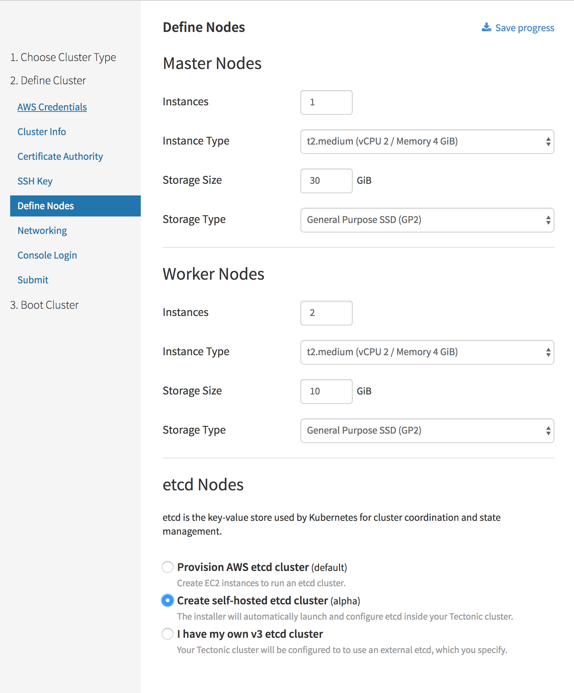

# Self-hosted etcd cluster on Tectonic

Tectonic can deploy and manage the cluster's central etcd service on Kubernetes. This configuration is referred to as "self-hosted", because the Kubernetes central key-value store, etcd, is itself deployed on Kubernetes. Tectonic deployments that enable the optional self-hosted etcd cluster during installation create an etcd cluster in the `kube-system` namespace. This document describes self-hosted etcd clusters, their benefits, limitations, operation, and installation. Within this document, the terms "etcd" and "etcd cluster" may be considered interchangeable.

## About self-hosted etcd

A self-hosted etcd is an automatically managed cluster of etcd pods running on Kubernetes. It is the primary configuration key-value store for the cluster on which it runs. Self-hosted etcd clusters operate differently than external etcd services, both those created by Tectonic Installer, or separately maintained. When self-hosted etcd is enabled during Tectonic installation, Tectonic manages deployment, upgrades, backups, and recovery of the self-hosted etcd cluster.

Self-hosted etcd joins other self-hosted Tectonic control plane components, aimed at simplified, self-contained management and upgrades throughout Tectonic Kubernetes clusters, and provides the following benefits:

* etcd is secured by TLS encryption and authentication
* etcd is highly available
* etcd can be automatically backed up to stable storage, such as S3
* etcd can be automatically upgraded
* etcd can be automatically recovered from node failures
* etcd can run on the same host as the control plane

## Using etcd operator

Tectonic deploys the [etcd operator][etcd-op], which itself is a self-hosted component, a pod running on the same cluster, to manage self-hosted etcd. The etcd operator handles bootstrapping, maintaining quorum, cluster membership, backups, recoveries, and monitoring of self-hosted etcd clusters.

### Enabling self-hosted etcd in Tectonic

To launch and configure a self-hosted etcd cluster and an etcd operator in Tectonic, select the *Create self-hosted etcd cluster (alpha)* checkbox. This option is found under *etcd Nodes* in the *Define Nodes* page of Tectonic Installer.

<div class="row">
  <div class="col-lg-8 col-lg-offset-2 col-md-10 col-md-offset-1 col-sm-12 col-xs-12 co-m-screenshot">
    <a href="../img/self-hosted-etcd.png" class="co-m-screenshot">
      
    </a>
  </div>
</div>

### Installation workflow

Tectonic uses `bootkube` to install a self-hosted Kubernetes cluster with self-hosted etcd service. `bootkube` creates an external etcd cluster member for bootstrapping the installation. This initial etcd cluster member is used only during initial setup. TThe following list summarizes the self-hosted etcd bootstrap and installation process:

1. Start a temporary external single-member etcd cluster
2. Start a temporary Kubernetes cluster using the temporary etcd cluster’s address
3. Start an etcd operator in the temporary Kubernetes cluster
4. Use the etcd operator to add one of the Kubernetes etcd pods as a cluster member
5. Create an [etcd service][etcd-service] for the etcd cluster
6. Start the permanent self-hosted Kubernetes cluster using the etcd service’s cluster address
7. Remove the temporary external single-member etcd cluster
8. Stop the temporary Kubernetes cluster

In Tectonic, the etcd operator performs this installation process.

## Maintaining self-hosted etcd

The etcd operator is responsible for the maintenance operations, such as upgrade, back up, and recovery from transient failures.

### Upgrading self-hosted etcd

Self-hosted etcd clusters can be automatically upgraded by the etcd operator. A self-hosted etcd has a corresponding [Custom Resource Definition (CRD)][CRD] object in the `kube-system` namespace. To upgrade manually, specify the desired etcd `version` in the YAML editor available in Tectonic Console.

Under *Operators*, click *etcd Clusters*, and select the desired etcd. Click *YAML* to edit the resource spec. Click *Save* for the etcd operator to automatically upgrade etcd by updating the pod image.

An example manifest for a self-hosted etcd is given below:

```yaml
apiVersion: etcd.coreos.com/v1beta1
kind: Cluster
metadata:
  name: example-etcd-cluster-with-backup
  namespace: default
spec:
  size: 3
  version: 3.1.4
  backup:
    backupIntervalInSecond: 30
    maxBackups: 5
    storageType: S3
    pv:
      volumeSizeInMB: 512
```

Most Tectonic updates include an etcd `version` update. When such an update exists, Tectonic adjusts the `version` field in the etcd CRD to trigger the etcd operator to update to that version.

### Backing up self-hosted etcd

Automatic backups can be configured for disaster recovery. Similar to the `version` field, add a `backup` policy field to the etcd resource spec on Tectonic Console. Under *Operators*, click *etcd Clusters*, and select the etcd cluster. Click *YAML* to view or edit the resource spec. A sample backup spec is given below:

```YAML
spec:
  size: 3
  backup:
    backupIntervalInSecond: 1800
    maxBackups: 5
    storageType: "S3"
    s3:
      s3Bucket: <S3-bucket-name>
      awsSecret: <aws-secret-name>
```

When a backup policy is configured, the etcd operator creates a backup pod. The process periodically takes backups from the etcd cluster, and writes the backups to the storage defined in the backup policy, in this example, Amazon S3. Backups can be saved as an S3 bucket on AWS, or as a Persistent Volume (PV) on GCE or AWS. Tectonic recommends using S3 for storing etcd backups.

For information on creating etcd backups, see [Storing etcd backups][backup].

### Recovering self-hosted etcd from a transient failure

The etcd operator monitors the health of a self-hosted etcd by querying the pod states of each member. If a pod has failed, the etcd operator deletes the corresponding member from the self-hosted etcd. It replaces the failed one with a new pod, and adds the new member to etcd. This works well for handling permanent node failures. When a node goes offline for maintenance or upgrades, the etcd operator attempts to move the etcd pod running on that node to another one.

When a node is partitioned from the API server, the pod status is changed from running to failed by the Kubernetes controller manager. As mentioned above, the etcd operator removes the etcd member on the partitioned node, as the pod status becomes failed. However, the etcd pod, which is deleted from self-hosted etcd, continues to run on the partitioned node until it reconnects to the Kubernetes API server. The self-hosted etcd handles this change gracefully.

The self-hosted etcd cannot recover from failures when the Kubernetes control plane is unavailable, because it relies on Kubernetes to check the pod health and schedule new pods. Create backups periodically to prevent data loss.

[etcd-op]: https://coreos.com/operators/
[CRD]: https://kubernetes.io/docs/concepts/api-extension/custom-resources/#customresourcedefinitions
[etcd-service]: https://kubernetes.io/docs/concepts/services-networking/service/
[backup]: https://github.com/coreos/etcd-operator/blob/master/doc/user/backup_config.md
