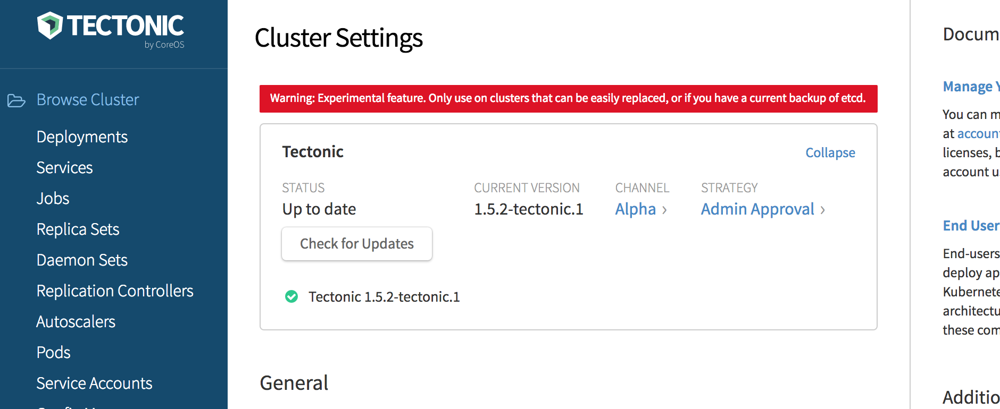

## Upgrading Tectonic &amp; Kubernetes

Tectonic and Kubernetes can be automatically updated with controls in the Tectonic Console. Clusters are attached to an update channel and are set to update either automatically, or with manual approval. This automatic update functionality is currently an experimental feature, and must be optionally enabled during Tectonic installation. Clusters installed without enabling this experimental feature will need to perform manual upgrades of Tectonic.

  

    
    
Cluster update settings in the Console

  

During an update, the latest versions of the Tectonic and Kubernetes components are downloaded. A seamless rolling update will occur to install the latest versions. A cluster admin can pause the update at any time.

To learn more about how this process is executed, read about [Operators][operators].

## Preserve &amp; Restore etcd

If you'd like to preserve and restore etcd data to the new cluster, see the etcd [disaster recovery][etcd-disaster-recovery] guide.

[operators]: ../tutorials/operators.md
[etcd-disaster-recovery]: https://coreos.com/etcd/docs/latest/admin_guide.html#disaster-recovery
