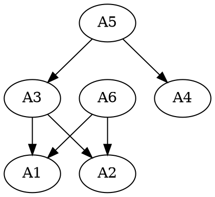

# Installer asset generation based on dependency resolution

## Goal

Define generation of assets of varied types in installer based on a dependency graph.

## Overview

The installer generates assets based on the dependency [graph](./dependency.md). To generate an asset, all its dependencies have to be generated. The installer needs to define how assets declare this dependency and how it resolves the graph when asked to generated specific targets. Targets are chosen assets that need to be generated, the installer generates all assets that the target depends on and writes to disk only the targets, consuming any inputs from disk or state from a previous run.

Each asset is individually responsible for declaring its dependencies. Each asset is also responsible resolving conflicts when combining its input from disk and its state from a previous run. The installer ensures all the dependencies for an asset is generated and provides the asset with latest state to generate its own output.

## State

State is an internal state of the installer. It stores the contents of all the assets that have been generated.

An example of the State:

```go
// State is map of assets
type State struct {
    Root string // hash for state object.

    Objects map[string]AssetState
}

// AssetState is the state of an Asset.
type AssetState struct {
    Parents maps[string]string // hashes for our each parent.
    Contents []Content{
        Name string // the path on disk for this content.
        Data []byte
    }
}
```

## Asset

An asset is the generic representation of work-item for installer that needs to be generated. Each asset defines all the other assets that are required for it to generate itself as dependencies.

The asset would usually follow these steps to generate its output:

1. Load components from disk. (If found, mark them from deletion, we consume our inputs.)

2. Load its components from State object given by installer.

3. If both the sources exist,

    * Both are same: nothing to do use the State object.

    * Both differ: maybe try to merge and mark itself **dirty** or error out.

4. If only one exists, Move the disk source to State object.

5. If none exists, Use the assets from State object to create the components and store them in the State object.

An example of the Asset:

```go
type Asset interface{
    Dependencies() []Assets
    Generate(State) error
}
```

## Target generation

The installer uses depth-first traversal on the dependency graph, starting at the target nodes, generating all the dependencies of the asset before generating the asset itself. After all the target assets have been generated, the installer outputs the contents of the components of the targets to disk.

### Dirty detection

An asset generation reports **DIRTY** when it detects that the components have been modified from previous run.

When generating dependencies of an asset, if any one of the dependencies report dirty, the installer informs the asset that its dependencies are dirty. The asset can either generate from its dependencies or exit with error.

### Example



When generating targets **A5 and A6**

```
load state;

A5: (A3, A4)
    A3: (A1, A2)
        A1:
            A1.generate(state)
            update state
        A2:
            A2.generate(state)
            update state
        set dirty if one of A1/A2 is dirty
        A3.generate(state): pass dirty if set
        update state
    A4:
        A4.generate(state)
        update state
    set dirty if one of A3/A4 is dirty
    A5.generate(state): pass dirty if set
    update state
A6: (A1, A2)
    A1:
        reuse
    A2:
        reuse
    set dirty if one of A1/A2 is dirty
    A6.generate(state): pass dirty if set
    update state
Flush A5 and A6 to disk
```
