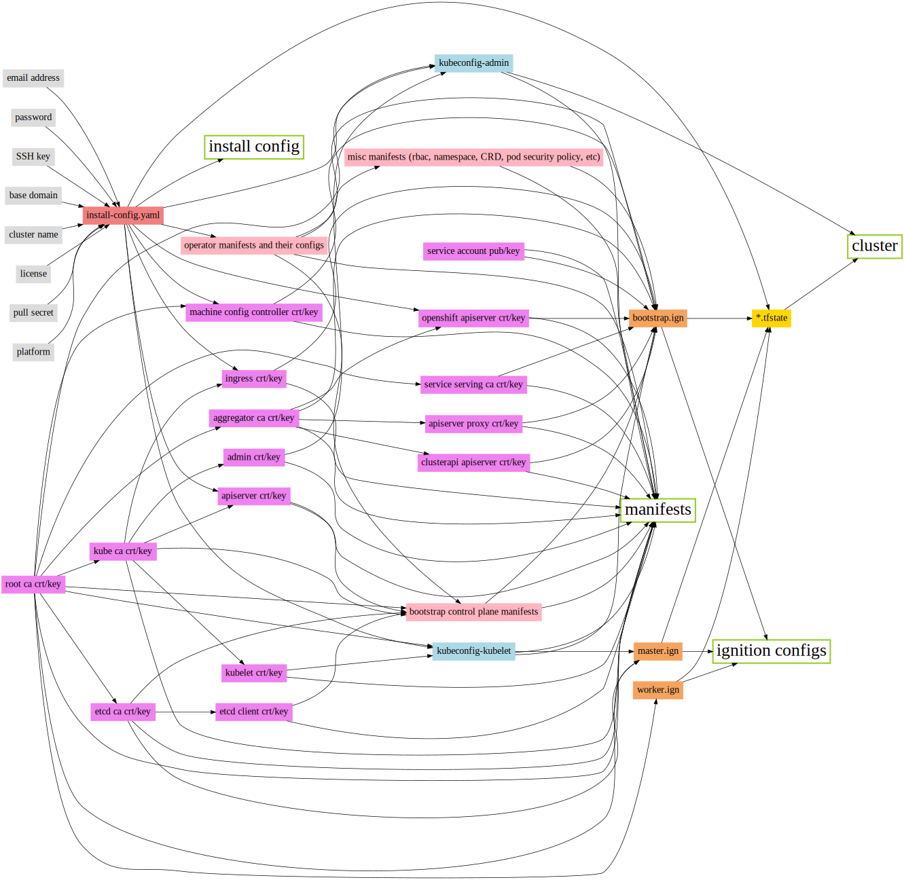

# Dependency graph

During the installation, the installer will generate a bunch of files. The dependency graph of those files is shown below. It is generated from [resource_dep.dot](./resource_dep.dot) by running:

    dot -Tsvg resource_dep.dot -o ./resource_dep.svg

.
