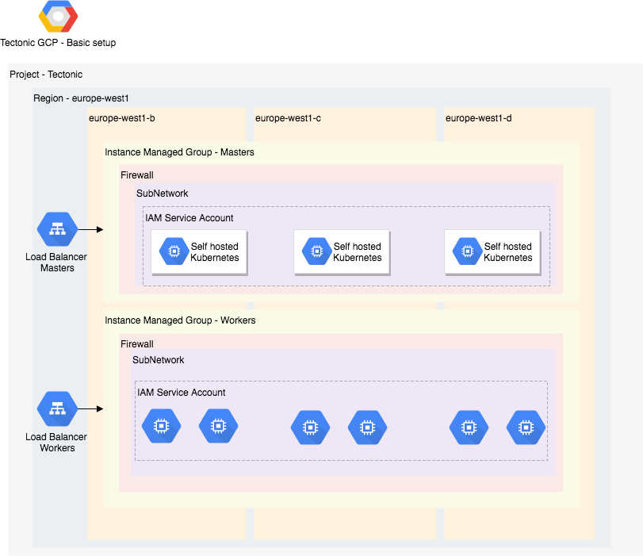

# Install Tectonic on Google Cloud Platform with Terraform

Use this guide to manually install a Tectonic cluster on a GCP account.

## Prerequsities

- **Terraform:** >= v0.10.7
- **Tectonic Account:** Register for a [Tectonic Account](https://coreos.com/tectonic), which is free for up to 10 nodes. You must provide the cluster license and pull secret during installation.
- **Google cloud:** 
  - Obtain a credentials file by [logging into the console](https://console.cloud.google.com/iam-admin/serviceaccounts)
    - Select a project.
    - Select "Compute Engine default service account" in the "Service account" dropdown, and select "JSON" as the key type.
    - Clicking "Create" will download your credentials.
  - Instead of using the default account, a dedicated [service account](https://cloud.google.com/iam/docs/service-accounts) can be created with at least the following roles:
    - Editor
    - Project IAM Admin
    - Service Account Admin
  - The [following APIs must be enabled](https://console.cloud.google.com/apis/dashboard):
    - Google Compute Engine API
    - Google Cloud DNS API
    - Google Cloud Resource Manager API
    - Google Cloud Storage
    - Google Cloud Storage JSON API
    - Google Identity and Access Management (IAM) API
    
- **DNS:** Ensure that the DNS zone for the account is already created and available in [Cloud DNS](https://console.cloud.google.com/net-services/dns). For example if the `tectonic_base_domain` is set to `kube.example.com` a Cloud DNS zone must exist with the nameservers configured for that domain.

## Getting Started

First, clone the Tectonic Installer repository:

```
$ git clone https://github.com/coreos/tectonic-installer.git
$ cd tectonic-installer
```
 
Initialise Terraform:

```
$ terraform init platforms/gcp
``` 

Configure your GCP credentials. See the [Terraform Google provider docs](https://www.terraform.io/docs/providers/google/index.html) for details.

```
$ export GOOGLE_APPLICATION_CREDENTIALS=/my-credentials.json
$ export GOOGLE_PROJECT=my-project-id
```

## Customize the deployment

Customizations to the base installation live in examples/terraform.tfvars.gcp. Export a variable that will be your cluster identifier:

```
$ export CLUSTER=my-cluster
```

Create a build directory to hold your customizations and copy the example file into it:

```
$ mkdir -p build/${CLUSTER}
$ cp examples/terraform.tfvars.gcp build/${CLUSTER}/terraform.tfvars
```

Edit the parameters with your GCP details: dns managed zone, domain name, license, etc. [View all of the GCP specific options](https://github.com/coreos/tectonic-installer/tree/master/Documentation/variables/gcp.md) and [the common Tectonic variables](https://github.com/coreos/tectonic-installer/tree/master/Documentation/variables/config.md)).

## Deploy the cluster

Test out the plan before deploying everything:

```
$ terraform plan -var-file=build/${CLUSTER}/terraform.tfvars platforms/gcp
```

Next, deploy the cluster:

```
$ terraform apply -var-file=build/${CLUSTER}/terraform.tfvars platforms/gcp
```

This should run for a little bit, and when complete, your Tectonic cluster should be ready.

### Access the cluster

The Tectonic Console should be up and running after the containers have downloaded. You can access it at the DNS name configured in your variables file prefixed by the cluster name, i.e ```https://cluster_name.tectonic_base_domain```.

Inside of the /generated folder you should find any credentials, including the CA if generated, and a kubeconfig. You can use this to control the cluster with kubectl:

```
$ export KUBECONFIG=generated/auth/kubeconfig
$ kubectl cluster-info
```
### Delete the cluster

```
$ terraform destroy -var-file=build/${CLUSTER}/terraform.tfvars platforms/gcp
```

## Design
The following diagram illustrates a 3 master and 6 worker setup deployed in the europe-west1 region:



## Demo

[](https://www.youtube.com/watch?v=jQRmR-8OIOs)

## Known issues and workarounds

- A [tcp global load balancer](https://cloud.google.com/compute/docs/load-balancing/tcp-ssl/tcp-proxy) is being used for load balancing the master machines.
This setup can be improved as cross region load balancing is not needed and might introduce latency issues.
An upstream issue (https://issuetracker.google.com/issues/67366622) related to healthchecks for external/internal regional load balancing prevents the machines not running bootkube from joinning the cluster.
Until this issue is resolved, the tcp global load balancer must be used to bootstrap an HA cluster.

- The flag `--cloud-provider=gce` is not used at the moment.
Doing so would require setting `--configure-cloud-routes` in the controller manager and `--network-plugin=Kubenet` in the Kubelet until https://github.com/kubernetes/kubernetes/issues/54187 is solved upstream.
Currently the existing networking options (flannel/canal/calico-bgp) can be used.

- This is a non stable version currently under heavy development. It is not yet covered by a deprecation policy and may be subject to backward-incompatible changes. 
