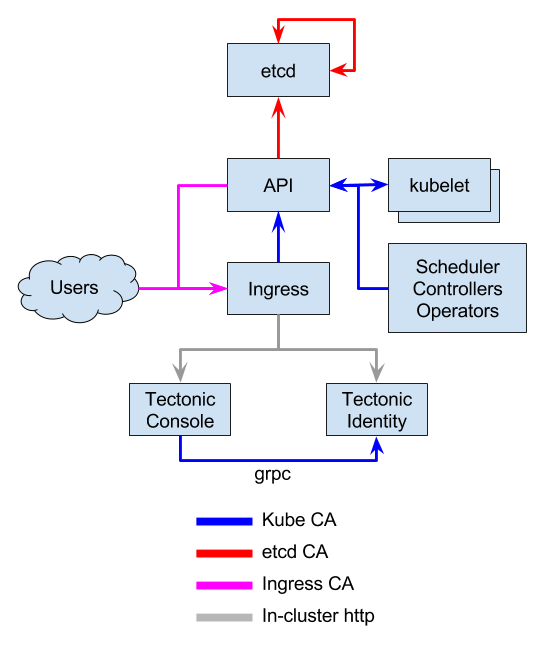

# TLS topology

This document describes the TLS topology used in Tectonic and the current implementation.

## Overview

Secure communication in Tectonic is governed by three certificate authorities (CAs) `etcd`, `kube`, and `ingress` for cluster internal and external TLS traffic.

- `etcd`: secures the communication between from the API server as well as between peer etcd nodes.
- `kube`/`identity`: secures the communication to the API server as well as the Tectonic Identity grpc communication.
- `ingress`: secures the communication to the Tectonic Ingress, effectively also securing access to the Tectonic Console as well as the Tectonic Identity OIDC endpoint.

The following diagram illustrates which CAs are responsible for which communication paths:

The above CA topology is reflected in the the corresponding terraform modules `modules/tls/etcd`, `modules/tls/identity`, `modules/tls/ingress`, and `modules/tls/kube`.

Each of the above TLS modules comes in two flavors:
- `self-signed`: All necessary certificates (potentially also including the CA certificate/key pair) are self-signed.
- `user-provided`: All necessary certificates are provided by the user pointing to file locations of the corresponding certificates and/or keys.

Note that the behavior of the above flavors is "polymorphic". That is all flavors for a given TLS module have potentially different inputs, but they share the same outputs. The goal of this invariant is to be able to swap out/swap in a flavor of a given TLS module without the necessity to change any of its dependencies.

The following overview lists outputs of all TLS modules and their corresponding function.

### etcd

Terraform module: `modules/tls/etcd`

**etcd → etcd** peer communication:

Certificate/Key     | etcd parameter      | Description
--------------------|---------------------|------------
`etcd_ca_crt_pem`   | `--peer-trusted-ca` | etcd CA cert
`etcd_peer_crt_pem` | `--etcd-certfile`   | etcd peer cert
`etcd_peer_key_pem` | `--etcd-keyfile`    | etcd peer key

**API → etcd** client/server communication:

Certificate/Key       | API server parameter | etcd parameter | Description
----------------------|----------------------|----------------|------------
`etcd_ca_crt_pem`     | `--etcd-cafile`      |                | etcd CA cert
`etcd_client_crt_pem` | `--etcd-certfile`    |                | API client cert
`etcd_client_key_pem` | `--etcd-keyfile`     |                | API client key
`etcd_server_crt_pem` |                      | `--cert-file`  | etcd server cert
`etcd_server_key_pem` |                      | `--key-file`   | etcd server key

Note: In contrast to other TLS module the `signed` flavor for the etcd TLS module doesn't have the `self-` prefix, because in contrast to all other TLS modules external an external etcd CA cert/key can be provided which are used to sign certificates and/or keys.

### Kube CA (cluster communication)

Terraform module: `modules/tls/kube`

**Control plane → API**

Certificate/Key      | API server parameter            | Description
---------------------|---------------------------------|------------
`ca_cert_pem`        | `--tls-ca-file`                 | secure access from Admission Controllers
`apiserver_cert_pem` | `--tls-cert-file`               | https server cert
`apiserver_key_pem`  | `--tls-private-key-file`        | https server key
`apiserver_cert_pem` | `--tls-cert-file`               | https server cert

**API → Kubelet**

Certificate/Key      | API server parameter            | kubelet parameter  | Description
---------------------|---------------------------------|--------------------|------------
`ca_cert_pem`        |                                 | `--client-ca-file` | client cert CA
`apiserver_cert_pem` | `--kubelect-client-certificate` |                    | kubelect client cert
`apiserver_key_pem`  | `--kubelet-client-key`          |                    | kubelet client key

### Kube CA (identity communication)

Terraform module: `modules/tls/identity`

**Tectonic Console → Tectonic Identity**

Certificate/Key      | Tectonic Console env var        | Tectonic Identity config  | Description
---------------------|---------------------------------|---------------------------|------------
`client_cert_pem`    | `BRIDGE_DEX_CLIENT_CERT_FILE`   |                           | grpc client cert
`client_key_pem`     | `BRIDGE_DEX_CLIENT_KEY_FILE`    |                           | grpc client key
`server_key_pem`     |                                 | `grpc.tlsKey`             | grpc server key
`server_cert_pem`    |                                 | `grpc.tlsCert`            | grpc server cert
`ca_cert_pem`        |                                 | `grpc.tlsClientCA`        | grpc client CA

Note: `ca_cert_pem` is sourced from `modules/tls/kube`.
The Tectonic Identity config refers to the `tectonic-identity` ConfigMap in `modules/tectonic/resources/manifests/identity/configmap.yaml`.

### Ingress CA

Terraform module: `modules/tls/ingress`

**Users -> Identity**

Certificate/Key      | Tectonic Console env var  | Tectonic Ingress Controller | Description
---------------------|---------------------------|-----------------------------|------------
`ca_cert_pem`        | `BRIDGE_CA_FILE`          |                             | ingress CA cert
`cert_pem`           |                           | `--default-ssl-certificate` | ingress server cert
`key_pem`            |                           | `--default-ssl-certificate` | ingress server key

**API -> Identity**

Certificate/Key      | Tectonic Console env var  | Description
---------------------|---------------------------|------------
`ca_cert_pem`        | `--oidc-ca-file`          | ingress CA cert
