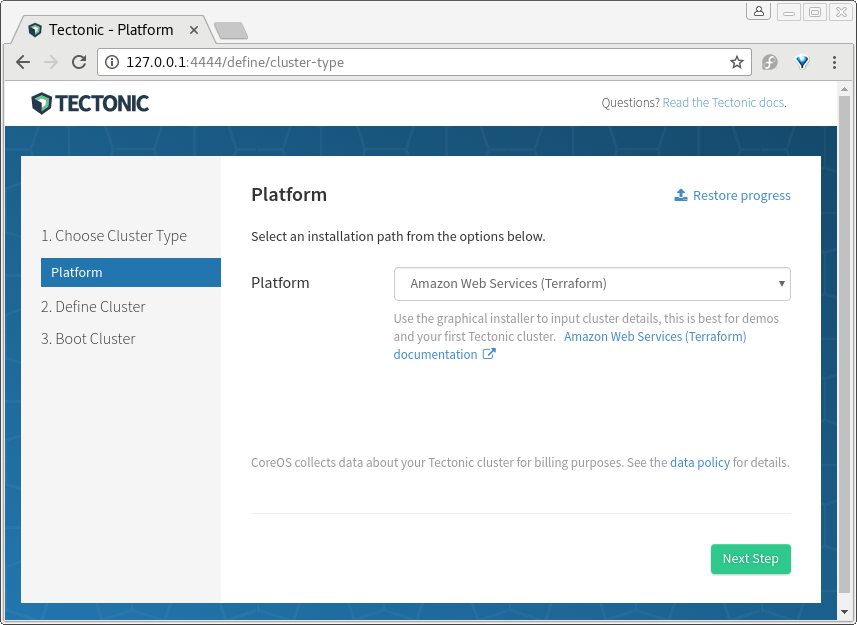
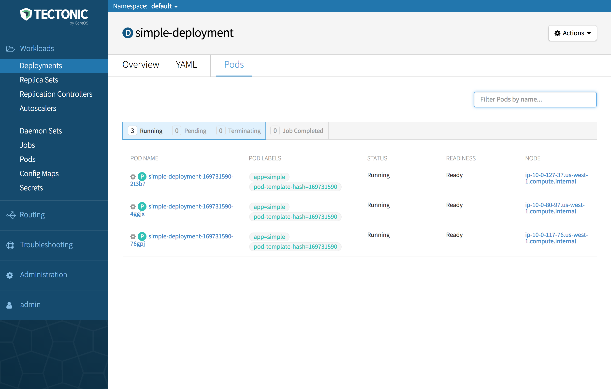

# AWS: Installation

## Preparation

Check the [requirements doc][install-aws-requirements] to see what's needed. The short version:

* an IAM account
* an [associated SSH key][ssh-key-req]
* a domain or subdomain with [DNS name service at AWS Route53][aws-r53-doc].
* Tectonic will create a new AWS Virtual Private Cloud (VPC), or you can select an existing VPC. To use an existing VPC, see the [existing VPC requirements][install-aws-requirements-evpc].

## Step 1: Download and run Tectonic Installer

Make sure a current version of either the Google Chrome or Mozilla Firefox web browser is set as the default browser on the workstation where Installer will run.

Download the [Tectonic installer][latest-tectonic-release].

```bash
wget https://releases.tectonic.com/tectonic-1.6.7-tectonic.2.tar.gz
tar xzvf tectonic-1.6.7-tectonic.2.tar.gz
cd tectonic
```

Run the Tectonic Installer for your platform:

For macOS users:

```bash
$ ./tectonic-installer/darwin/installer
```

For Linux users:

```
$ ./tectonic-installer/linux/installer
```

For Windows users, [see this guide][install-windows].

A browser window will open to begin the GUI installation process.

<div class="row">
  <div class="col-lg-8 col-lg-offset-2 col-md-10 col-md-offset-1 col-sm-12 col-xs-12 co-m-screenshot">
    
    <div class="co-m-screenshot-caption">Selecting a platform in Tectonic Installer</div>
  </div>
</div>

## Step 2: Install

Be sure to read the [installation requirements][install-aws-requirements], which include a section on [privileges for your AWS credentials][install-aws-requirements-creds], as well as the [known issues section in the Troubleshooting guide][install-aws-troubleshooting] before you install.

Follow the on-screen instructions to provision your cluster. This process should take about 10-15 minutes.

When prompted, click *Download assets* to save all assets generated during the Tectonic Installer process. These assets include configuration files that will allow you to repeat your cluster set up manually, and the [terraform.tfstate][tf-state] file, which is required to delete your cluster, when desired.

Once complete click *Go to my Tectonic Console* to launch the Console, and begin interacting with your cluster.

If you encounter any errors check the [troubleshooting][install-aws-troubleshooting] documentation.

## Step 3: Tectonic Console

<div class="row">
  <div class="col-lg-8 col-lg-offset-2 col-md-10 col-md-offset-1 col-sm-12 col-xs-12 co-m-screenshot">
    
    <div class="co-m-screenshot-caption">Viewing deployment pods in Tectonic Console</div>
  </div>
</div>

Now you are ready to access Tectonic Console, configure `kubectl`, and deploy your first application to the cluster. A `kubeconfig` with the appropriate configuration for `kubectl` is available for download in the Tectonic Console.

For those new to Tectonic and Kubernetes, the [Tectonic Tutorials][tutorials] provide walk through instructions on getting started.


[aws-r53-doc]: https://docs.aws.amazon.com/Route53/latest/DeveloperGuide/creating-migrating.html
[ssh-key-req]: requirements.md#ssh-key
[install-aws-requirements]: requirements.md
[install-aws-requirements-creds]: requirements.md#privileges
[install-aws-requirements-evpc]: requirements.md#using-an-existing-vpc
[tutorials]: ../../tutorials/index.md
[latest-tectonic-release]: https://releases.tectonic.com/tectonic-1.6.7-tectonic.2.tar.gz
[install-aws-troubleshooting]: ../../troubleshooting/faq.md
[tf-state]: https://www.terraform.io/docs/state/
[install-windows]: ../installer-windows.md
