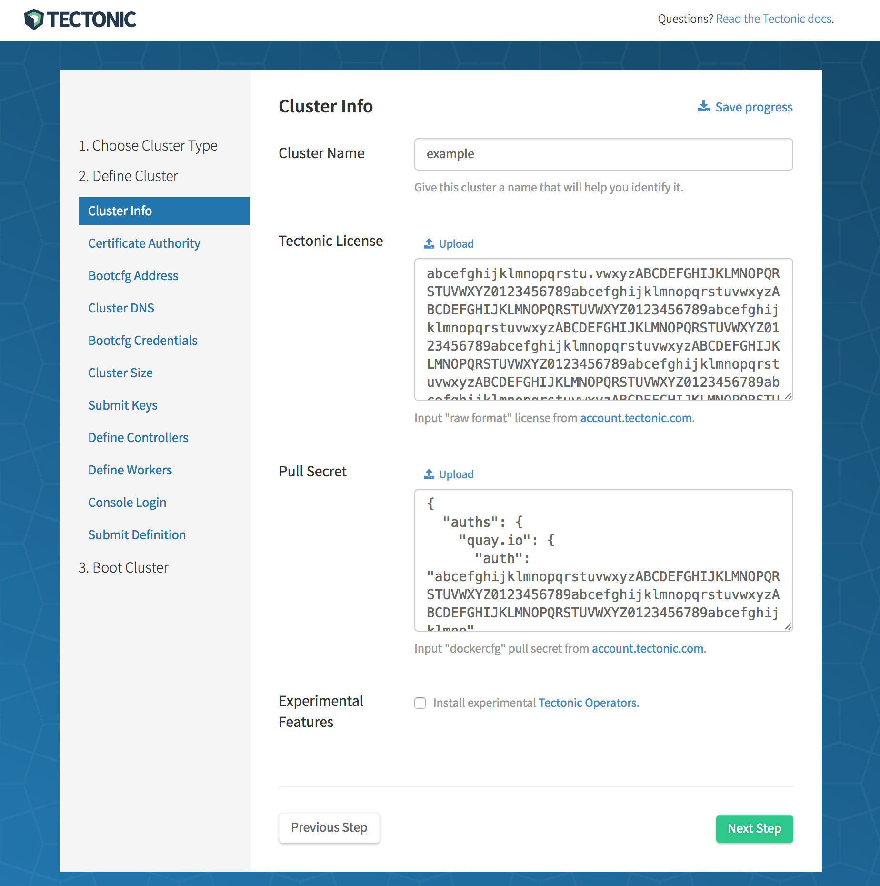

# Bare Metal: Installation

This guide walks through a bare-metal installation of Tectonic utilizing PXE-based tools. This document will cover:

| Step | Description |
|------|-------------|
| [1. Overview][step-1] | Review types of machines in the cluster<br/>Review networking requirements |
| [2. Provisioning Infrastructure][step-2] | Download and install matchbox<br/>Generate TLS assets |
| [3. Configure Networking][step-3] | Set up DHCP, TFTP, and DNS services<br/>Configure DNS for the cluster |
| [4. Tectonic Installer][step-4] | Install Kubernetes and Tectonic |
| [5. Tectonic Console][step-5] | You're done! Your cluster is ready! |

[step-1]: #1-overview
[step-2]: #2-provisioning-infrastructure
[step-3]: #3-networking
[step-4]: #4-tectonic-installer
[step-5]: #5-tectonic-console

<h2 id="1-overview"> 1. Overview </h2>

### Node types

A minimum of 3 machines are required to run Tectonic.

**Provisioner node**

A provisioner node runs the matchbox network boot and provisioning service, along with PXE services if you don't already run them elsewhere. You may use Container Linux or any Linux distribution for this node. It provisions nodes, but does not join Tectonic clusters.

A Tectonic cluster consists of two types of nodes:

**Controller nodes**

Controller nodes run `etcd` and the control plane of the cluster.

**Worker nodes**

Worker nodes run your applications. New worker nodes will join the cluster by talking to controller nodes for admission.

### Networking requirements

This guide requires familiarity with PXE booting, the ability to configure network services, and to add DNS names. These are discussed in detail below.

<h2 id="2-provisioning-infrastructure"> 2. Provisioning Infrastructure </h2>

### matchbox

`matchbox` is a service for network booting and provisioning bare-metal nodes into CoreOS Container Linux clusters. `matchbox` should be installed on a provisioner node to serve configs during boot.

The commands to set up `matchbox` should be performed on the provisioner node.

For more information about `matchbox`, reference the [`matchbox` documentation][matchbox].

### Download latest release

Download the [latest Tectonic release][latest-tectonic-release] to the provisioner node and extract it.

```sh
wget https://releases.tectonic.com/tectonic-1.5.6-tectonic.1.tar.gz
tar xzvf tectonic-1.5.6-tectonic.1.tar.gz
cd tectonic/matchbox
```

### Install

Install `matchbox` on the provisioner node. You need only choose one of the following options.

#### CoreOS Container Linux

On a CoreOS Container Linux provisioner, run `matchbox` with the provided systemd unit.

```sh
$ sudo cp contrib/systemd/matchbox-for-tectonic.service /etc/systemd/system/matchbox.service
```

#### Generic Linux

Pre-built binaries are available for generic Linux distributions. Copy the `matchbox` static binary to an appropriate location on the provisioner node.

```sh
$ cd tectonic/matchbox
$ sudo cp matchbox /usr/local/bin
$ sudo chmod +x /usr/local/bin/matchbox
```

##### Set Up User/Group

The `matchbox` service should be run by a non-root user with access to the `matchbox` data directory (`/var/lib/matchbox`). Create a `matchbox` user and group.

```sh
$ sudo useradd -U matchbox
$ sudo mkdir -p /var/lib/matchbox/assets
$ sudo chown -R matchbox:matchbox /var/lib/matchbox
```

##### Create systemd service

Copy the provided `matchbox` systemd unit file.

```sh
$ sudo cp contrib/systemd/matchbox-local.service /etc/systemd/system/matchbox.service
```

#### RPM-based distribution

On an RPM-based provisioner, install the `matchbox` RPM from the Copr [repository][copr-repo] using `dnf`.

```sh
dnf copr enable @CoreOS/matchbox
dnf install matchbox
```

### Customization

Customize `matchbox` by editing the systemd unit or adding a systemd dropin. Find the complete set of `matchbox` flags and environment variables at [config][matchbox-config].

    sudo systemctl edit matchbox

By default, the read-only HTTP machine endpoint will be exposed on port **8080**. Enable the gRPC API to allow clients with a TLS client certificate to change machine configs. The Tectonic [Installer][tectonic-installer] uses this API.

```ini
# /etc/systemd/system/matchbox.service.d/override.conf
[Service]
Environment="MATCHBOX_ADDRESS=0.0.0.0:8080"
Environment="MATCHBOX_RPC_ADDRESS=0.0.0.0:8081"
Environment="MATCHBOX_LOG_LEVEL=debug"
```

Customize `matchbox` to suit your preferences.

### Firewall

Allow your port choices on the provisioner's firewall so the clients can access the service. Here are the commands for those using `firewalld`:

```sh
$ sudo firewall-cmd --zone=MYZONE --add-port=8080/tcp --permanent
$ sudo firewall-cmd --zone=MYZONE --add-port=8081/tcp --permanent
```

### Generate TLS credentials

The `matchbox` API allows client apps such as the Tectonic Installer to manage how machines are provisioned. TLS credentials are needed for client authentication and to establish a secure communication channel.

If your organization manages public key infrastructure and a certificate authority, create a server certificate and key for the `matchbox` service and a client certificate and key.

Otherwise, generate a self-signed `ca.crt`, a server certificate  (`server.crt`, `server.key`), and client credentials (`client.crt`, `client.key`) with the `scripts/tls/cert-gen` script. Export the DNS name or IP (discouraged) of the provisioner node.

```sh
$ cd scripts/tls
# DNS or IP Subject Alt Names where matchbox can be reached
$ export SAN=DNS.1:matchbox.example.com,IP.1:192.168.1.42
$ ./cert-gen
```

Place the TLS credentials in the default location:

```sh
$ sudo mkdir -p /etc/matchbox
$ sudo cp ca.crt server.crt server.key /etc/matchbox/
```

The `client.crt`, `client.key`, and `ca.crt` generated here will be used later to authenticate Tectonic Installer with Matchbox. Tectonic installer will go on to create a second set of certificates for use in the cluster. These two distinct sets of certificates have different purposes.

### Start matchbox

Start the `matchbox` service and enable it if you'd like it to start on every boot.

```sh
$ sudo systemctl daemon-reload
$ sudo systemctl start matchbox
$ sudo systemctl enable matchbox
```

### Verify

Verify the matchbox service is running and can be reached by nodes (those being provisioned). It is recommended that you define a DNS name for this purpose (see [Networking](#3-networking)).

```sh
$ systemctl status matchbox
$ dig matchbox.example.com
```

Verify you receive a response from the HTTP and API endpoints.

```sh
$ curl http://matchbox.example.com:8080
matchbox

$ cd tectonic/matchbox
$ openssl s_client -connect matchbox.example.com:8081 -CAfile /etc/matchbox/ca.crt -cert scripts/tls/client.crt -key scripts/tls/client.key
CONNECTED(00000003)
depth=1 CN = fake-ca
verify return:1
depth=0 CN = fake-server
verify return:1
---
Certificate chain
 0 s:/CN=fake-server
   i:/CN=fake-ca
---
....
```

### Download CoreOS Container Linux

`matchbox` can serve CoreOS Container Linux images to reduce bandwidth usage and increase the speed of CoreOS Container Linux PXE boots and installs to disk. Tectonic Installer will use this feature.

Download a recent CoreOS Container Linux stable [release][coreos-release] with signatures.

```sh
$ ./scripts/get-coreos stable 1298.5.0 .     # note the "." 3rd argument
```

Move the images to `/var/lib/matchbox/assets`,

```sh
$ sudo cp -r coreos /var/lib/matchbox/assets
```

```
$ tree /var/lib/matchbox/assets
/var/lib/matchbox/assets/
├── coreos
│   └── 1235.6.0
│       ├── CoreOS_Image_Signing_Key.asc
│       ├── coreos_production_image.bin.bz2
│       ├── coreos_production_image.bin.bz2.sig
│       ├── coreos_production_pxe_image.cpio.gz
│       ├── coreos_production_pxe_image.cpio.gz.sig
│       ├── coreos_production_pxe.vmlinuz
│       └── coreos_production_pxe.vmlinuz.sig
```

and verify the images are accessible.

```
$ curl http://matchbox.example.com:8080/assets/coreos/SOME-VERSION/
<pre>...
```

<h2 id="3-networking"> 3. Networking </h2>

A bare-metal Tectonic cluster requires PXE infrastructure, which we'll setup next.

### Set up DHCP, TFTP, and DNS services

Set up DHCP, TFTP, and DNS services with your network administrator. Review [network setup][matchbox-net-setup] to find the right approach for your PXE environment. At a high level, your goals are to:

* Chainload PXE firmwares to iPXE
* Point iPXE client machines to the `matchbox` iPXE HTTP endpoint (e.g. `http://matchbox.example.com:8080/boot.ipxe`)

CoreOS provides a [dnsmasq][matchbox-dnsmasq] container, if you wish to use rkt or Docker.

### DNS

The Tectonic Installer will prompt for *Controller* and *Tectonic* DNS names.

#### Controller DNS

For the controller DNS name, add a record which resolves to the node you plan to use as a controller.

#### Tectonic DNS

By default, Tectonic Ingress runs as a [Kubernetes Daemon Set][daemonset] across all worker nodes. For the Tectonic DNS name, add a record resolving to any nodes you plan to use as workers. Tectonic console is accessible at this DNS name. Choosing a Tectonic DNS type depends on the available infrastructure. Provide either a single DNS entry, round-robin DNS records, or the name of a load balancer fronting the workers on ports 80 and 443.

For example,

* `matchbox.example.com` resolves to your `matchbox` deployment
* `controllers.example.com` resolves to any controller node
* `tectonic.example.com` resolves to any worker nodes

Providing a single entry for Tectonic DNS implies the console will be inaccessible if that node fails. For higher availability, use a load balancer over several worker nodes. [Changes to the Tectonic and Controller DNS configuration are not supported][trouble-domainchange] after installation.

<h2 id="4-tectonic-installer"> 4. Tectonic Installer </h2>

The Tectonic Installer is a graphical application run on your laptop to create Tectonic clusters. It authenticates to `matchbox` via its API.

### Requirements

Your laptop running the Tectonic installer app must be able to access your `matchbox` instance. You will need the `client.crt` and `client.key` credentials created when setting up `matchbox` to complete the flow, as well as the `ca.crt`.

The commands to run the Tectonic Installer should be performed on your laptop.

### Download latest release

Download the [latest Tectonic release][latest-tectonic-release] to your laptop and and extract it.

```sh
wget https://releases.tectonic.com/tectonic-1.5.6-tectonic.1.tar.gz
tar xzvf tectonic-1.5.6-tectonic.1.tar.gz
cd tectonic
```

### Run Tectonic Installer

Make sure a current version of either the Google Chrome or Mozilla Firefox web browser is set as the default browser on the workstation where Installer will run.

Run the Tectonic Installer that matches your platform (`linux`, `darwin`, `windows`):

```sh
$ ./tectonic-installer/linux/installer
```

<div class="row">
  <div class="col-lg-8 col-lg-offset-2 col-md-10 col-md-offset-1 col-sm-12 col-xs-12 co-m-screenshot">
    
    <div class="co-m-screenshot-caption">Starting the Tectonic Installer for bare metal</div>
  </div>
</div>

A tab should open in your browser. Follow the instructions to enter information needed for provisioning. You will need to enter machine MAC addresses, domain names, and your SSH public key.

Then, you'll be prompted to power on your machines via IPMI or by pressing the power button and guided through the rest of the bring-up. If needed, you can use the generated [assets][assets-zip] bundle kubeconfig to troubleshoot.

<h2 id="5-tectonic-console"> 5. Tectonic Console </h2>

After the installer is complete, you'll have a Tectonic cluster and be able to access the Tectonic console. You are ready to deploy your first application on to the cluster!

<div class="row">
  <div class="col-lg-8 col-lg-offset-2 col-md-10 col-md-offset-1 col-sm-12 col-xs-12 co-m-screenshot">
    
    <div class="co-m-screenshot-caption">Viewing a node in the Tectonic Console</div>
  </div>
</div>


[assets-zip]: ../../admin/assets-zip.md
[copr-repo]: https://copr.fedorainfracloud.org/coprs/g/CoreOS/matchbox/
[coreos-release]: https://coreos.com/releases/
[daemonset]: http://kubernetes.io/docs/admin/daemons/
[latest-tectonic-release]: https://releases.tectonic.com/tectonic-1.5.6-tectonic.1.tar.gz
[matchbox-config]: https://coreos.com/matchbox/docs/latest/config.html
[matchbox-dnsmasq]: https://github.com/coreos/matchbox/tree/master/contrib/dnsmasq
[matchbox]: https://coreos.com/matchbox
[matchbox-net-setup]: https://github.com/coreos/matchbox/blob/master/Documentation/network-setup.md
[tectonic-installer]: https://coreos.com/tectonic/docs/latest/install/bare-metal/index.html
[trouble-domainchange]: troubleshooting.md#domain-name-cant-be-changed
