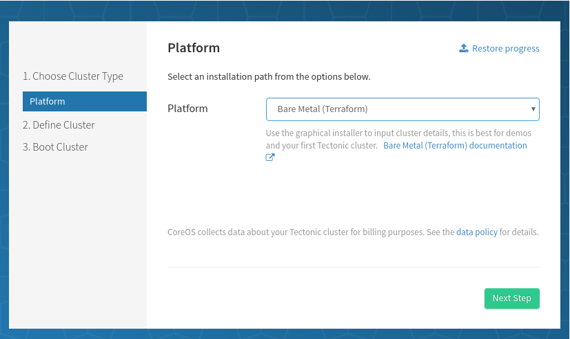
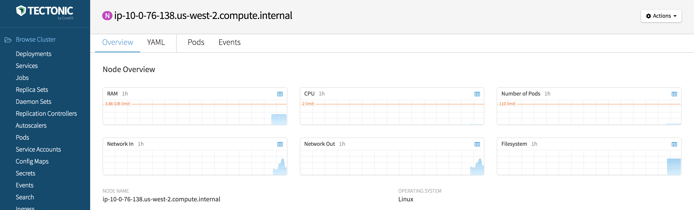

# Bare Metal: Installation

This guide walks through a bare-metal installation of Tectonic utilizing PXE-based tools. This document will cover:

| Step | Description |
|------|-------------|
| [1. Overview][step-1] | Review types of machines in the cluster<br/>Review networking requirements |
| [2. Provisioning Infrastructure][step-2] | Download and install matchbox<br/>Generate TLS assets |
| [3. Configure Networking][step-3] | Set up DHCP, TFTP, and DNS services<br/>Configure DNS for the cluster |
| [4. Tectonic Installer][step-4] | Install Kubernetes and Tectonic |
| [5. Tectonic Console][step-5] | You're done! Your cluster is ready! |

[step-1]: #1-overview
[step-2]: #2-provisioning-infrastructure
[step-3]: #3-networking
[step-4]: #4-tectonic-installer
[step-5]: #5-tectonic-console

<h2 id="1-overview"> 1. Overview </h2>

### Node types

A minimum of 3 machines are required to run Tectonic.

**Provisioner node**

A provisioner node runs the matchbox network boot and provisioning service, along with PXE services if you don't already run them elsewhere. These are long running infrastructure services. You may use Container Linux or any Linux distribution for this node. It provisions nodes, but does not join Tectonic clusters.

A Tectonic cluster consists of two types of nodes:

**Controller nodes**

Controller nodes run `etcd` and the control plane of the cluster.

**Worker nodes**

Worker nodes run your applications. New worker nodes will join the cluster by talking to controller nodes for admission.

### Networking requirements

This guide requires familiarity with PXE booting, the ability to configure network services, and to add DNS names. These are discussed in detail below.

<h2 id="2-provisioning-infrastructure"> 2. Provisioning Infrastructure </h2>

### matchbox

Matchbox is an open-source service for on-premise environments that matches bare-metal machines to profiles in order to PXE boot Container Linux clusters and automate cluster provisioning. Matchbox provides an authenticated API for clients like Tectonic Installer and Terraform. Profiles will define the kernel, initrd, iPXE config, and Container Linux config each node should use.

Download a Matchbox v0.6+ [release](https://github.com/coreos/matchbox/releases).

```sh
$ wget https://github.com/coreos/matchbox/releases/download/v0.6.0/matchbox-v0.6.0-linux-amd64.tar.gz
$ wget https://github.com/coreos/matchbox/releases/download/v0.6.0/matchbox-v0.6.0-linux-amd64.tar.gz.asc
```

Untar the release.

```sh
$ tar xzvf matchbox-v0.6.0-linux-amd64.tar.gz
$ cd matchbox-v0.6.0-linux-amd64
```

[Install Matchbox](https://github.com/coreos/matchbox/blob/master/Documentation/deployment.md) on a server or Kubernetes cluster that your bare-metal machines can reach using the guides:

* Installing on [CoreOS](https://github.com/coreos/matchbox/blob/master/Documentation/deployment.md#coreos)
* Installing on [RPM-based](https://github.com/coreos/matchbox/blob/master/Documentation/deployment.md#rpm-based-distro) distros
* Installing on generic [Linux](https://github.com/coreos/matchbox/blob/master/Documentation/deployment.md#generic-linux)
* Installing on [Kubernetes](https://github.com/coreos/matchbox/blob/master/Documentation/deployment.md#kubernetes)
* Running with [rkt](https://github.com/coreos/matchbox/blob/master/Documentation/deployment.md#rkt) or [docker](https://github.com/coreos/matchbox/blob/master/Documentation/deployment.md#docker)

Be sure to enable the gRPC API and use the TLS generation script to create server and client certificates. This can be done following the "Customization" and "Generate TLS" sections. Save the `ca.crt`, `client.crt`, and `client.key` on your local machine (e.g. `~/.matchbox`).

[Verify](https://github.com/coreos/matchbox/blob/master/Documentation/deployment.md#verify) the Matchbox service is running.

### Download CoreOS Container Linux

Matchbox can serve CoreOS Container Linux images to reduce bandwidth usage and increase the speed of CoreOS Container Linux PXE boots and installs to disk. Tectonic Installer detects the highest version number available in the Matchbox cache.

Download a recent CoreOS Container Linux stable [release][coreos-release] with signatures.

```sh
$ ./scripts/get-coreos stable 1353.7.0 .     # note the "." 3rd argument
```

Move the images to `/var/lib/matchbox/assets`,

```sh
$ sudo cp -r coreos /var/lib/matchbox/assets
```

```
$ tree /var/lib/matchbox/assets
/var/lib/matchbox/assets/
├── coreos
│   └── 1353.7.0
│       ├── CoreOS_Image_Signing_Key.asc
│       ├── coreos_production_image.bin.bz2
│       ├── coreos_production_image.bin.bz2.sig
│       ├── coreos_production_pxe_image.cpio.gz
│       ├── coreos_production_pxe_image.cpio.gz.sig
│       ├── coreos_production_pxe.vmlinuz
│       └── coreos_production_pxe.vmlinuz.sig
```

and verify the images are accessible.

```
$ curl http://matchbox.example.com:8080/assets/coreos/SOME-VERSION/
<pre>...
```

<h2 id="3-networking"> 3. Networking </h2>

A bare-metal Tectonic cluster requires PXE infrastructure, which we'll setup next.

### PXE-enabled Network

Tectonic works with many on-premise network setups. Matchbox does not seek to be the DHCP server, TFTP server, or DNS server for the network. Instead, it serves iPXE scripts as the entrypoint for provisioning network booted machines. At a high level, the goals are:

* Chainload PXE firmwares to iPXE
* Point iPXE client machines to the Matchbox iPXE endpoint (e.g. `http://matchbox.example.com:8080/boot.ipxe`)

In the simplest case, an iPXE-enabled network can chain to Matchbox,

```
# /var/www/html/ipxe/default.ipxe
chain http://matchbox.foo:8080/boot.ipxe
```

Read [network-setup](https://github.com/coreos/matchbox/blob/master/Documentation/network-setup.md) for the complete range of options. Network admins have a great amount of flexibility:

* May keep using existing DHCP, TFTP, and DNS services
* May configure subnets, architectures, or specific machines to delegate to matchbox
* May place matchbox behind a menu entry (timeout and default to matchbox)

If you've never set up a PXE-enabled network before, check out the [quay.io/coreos/dnsmasq](https://quay.io/repository/coreos/dnsmasq) container image [copy-paste examples](https://github.com/coreos/matchbox/blob/master/Documentation/network-setup.md#coreosdnsmasq) and see the section about [proxy-DHCP](https://github.com/coreos/matchbox/blob/master/Documentation/network-setup.md#proxy-dhcp).

### DNS

The Tectonic Installer will prompt for *Controller* and *Tectonic* DNS names.

#### Controller DNS

For the controller DNS name, add a record which resolves to the node you plan to use as a controller.

#### Tectonic DNS

By default, Tectonic Ingress runs as a [Kubernetes Daemon Set][daemonset] across all worker nodes. For the Tectonic DNS name, add a record resolving to any nodes you plan to use as workers. Tectonic console is accessible at this DNS name. Choosing a Tectonic DNS type depends on the available infrastructure. Provide either a single DNS entry, round-robin DNS records, or the name of a load balancer fronting the workers on ports 80 and 443.

For example,

* `matchbox.example.com` resolves to your `matchbox` deployment
* `controllers.example.com` resolves to any controller node
* `tectonic.example.com` resolves to any worker nodes

Providing a single entry for Tectonic DNS implies the console will be inaccessible if that node fails. For higher availability, use a load balancer over several worker nodes. [Changes to the Tectonic and Controller DNS configuration are not supported][trouble-domainchange] after installation.

<h2 id="4-tectonic-installer"> 4. Tectonic Installer </h2>

Make sure a current version of either the Google Chrome or Mozilla Firefox web browser is set as the default browser on the workstation where Installer will run.

Download the [Tectonic Installer][latest-tectonic-release].

```sh
wget https://releases.tectonic.com/tectonic-1.6.2-tectonic.1.tar.gz
tar xzvf tectonic-1.6.2-tectonic.1.tar.gz
cd tectonic/tectonic-installer
```

Run the Tectonic Installer that matches your platform (`linux` or `darwin`):

```sh
./$PLATFORM/installer
```

A browser window should open to begin the GUI installation process. When prompted for Matchbox credentials, insert the `client.crt`, `client.key`, and `ca.crt` created previously. You will need to enter machine MAC addresses, domain names, and your SSH public key as well.

<div class="row">
  <div class="col-lg-8 col-lg-offset-2 col-md-10 col-md-offset-1 col-sm-12 col-xs-12 co-m-screenshot">
    
    <div class="co-m-screenshot-caption">Starting the Tectonic Installer for bare metal</div>
  </div>
</div>

Once Terraform apply starts, power on your machines via IPMI or by pressing the power button.

<h2 id="5-tectonic-console"> 5. Tectonic Console </h2>

After the installer is complete, you'll have a Tectonic cluster and be able to access the Tectonic console. You are ready to deploy your first application on to the cluster!

<div class="row">
  <div class="col-lg-8 col-lg-offset-2 col-md-10 col-md-offset-1 col-sm-12 col-xs-12 co-m-screenshot">
    
    <div class="co-m-screenshot-caption">Viewing a node in the Tectonic Console</div>
  </div>
</div>


[assets-zip]: ../../admin/assets-zip.md
[copr-repo]: https://copr.fedorainfracloud.org/coprs/g/CoreOS/matchbox/
[coreos-release]: https://coreos.com/releases/
[daemonset]: http://kubernetes.io/docs/admin/daemons/
[latest-tectonic-release]: https://releases.tectonic.com/tectonic-1.6.2-tectonic.1.tar.gz
[matchbox-config]: https://coreos.com/matchbox/docs/latest/config.html
[matchbox-dnsmasq]: https://github.com/coreos/matchbox/tree/master/contrib/dnsmasq
[matchbox]: https://coreos.com/matchbox
[matchbox-net-setup]: https://github.com/coreos/matchbox/blob/master/Documentation/network-setup.md
[tectonic-installer]: https://coreos.com/tectonic/docs/latest/install/bare-metal/index.html
[trouble-domainchange]: troubleshooting.md#domain-name-cant-be-changed
