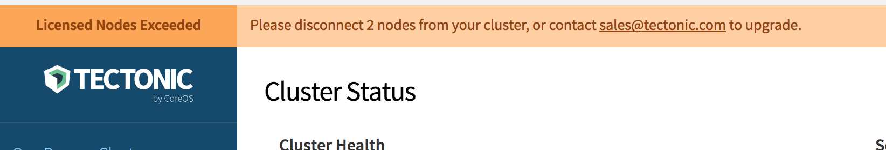

# Tectonic FAQ

## Tectonic release versioning

The version number of a Tectonic release is a string in the format `W.X.Y-tectonic.z`, where `W.X.Y` stands for the Kubernetes version included with the release, and `z` is an incrementing number, starting at 1, for successive Tectonic releases including that Kubernetes version. When the version number of the included Kubernetes release changes, the incrementing value `z` resets to 1.

For example, if the Kubernetes version is 1.5.6, the first Tectonic production release including it is labeled `1.5.6-tectonic.1`. A second release including the same 1.5.6 version of Kubernetes would be `1.5.6-tectonic.2`. When the version number of the included Kubernetes advances to 1.5.7, the associated Tectonic version number would be `1.5.7-tectonic.1`.

## Can I use my license on multiple clusters?

Yes, a single license can be used on multiple clusters, as long as the total limits on that license are not exceeded.

## What happens when I exceed my license limits?

Once your cluster is larger than your license allows, the Console will prompt you to input an updated license. Enter the new license in the dialog box that is shown. The new license limits will take a few minutes to take effect, but applications on the cluster will continue to run.

  

    
    
Console showing a cluster that has exceeded capacity

  

Visit [coreos.com/contact][contact] for an updated license.

## How can I recover from a Tectonic Identity misconfiguration?

If you have misconfigured Tectonic Identity, it is possible to be temporarily locked out of your cluster. To correct the misconfiguration, use the credentials in the [assets bundle][assets] generated during installation to revert or correct your [user and RBAC configuration][user-management].

## What Services are Installed with Tectonic?

Tectonic Services are the applications that are installed into your cluster. These include:

| Name | Description |
|------|-------------|
| Tectonic Console   | Web management console for Kubernetes and the services themselves |
| Tectonic Identity  | Centralized user management for services on your cluster |
| Prometheus         | Complete cluster monitoring: instrumentation, collection, and querying. |

---

*If you have any unanswered questions about Tectonic visit [coreos.com/contact][contact]*.

[assets]: ../admin/assets-zip.md
[user-management]: ../admin/user-management.md
[contact]: https://coreos.com/contact/
[sign-up]: https://account.coreos.com/signup/summary/tectonic-2016-12
