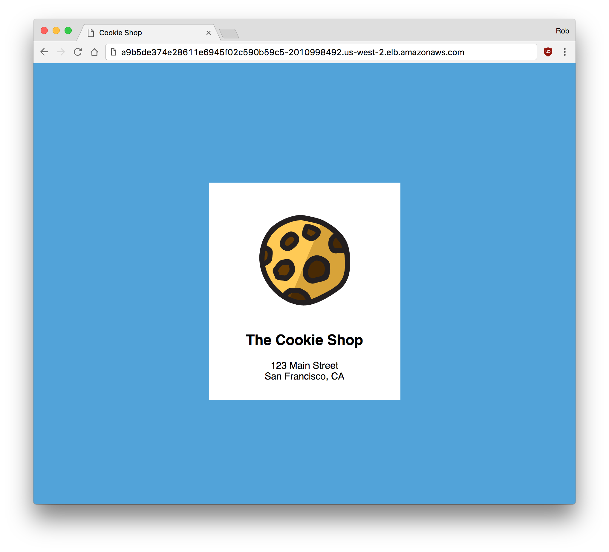

# Versioning and updating an application on Tectonic

Rolling deployments are how Kubernetes updates an application between releases. When a deployment configuration is updated, Tectonic automatically starts to execute a smooth, rolling update of the application. If the update fails it can roll back to the previous instance.

In this tutorial we will:
* Create a service
* Update the website of our example application (Cookie Shop) from v1.0 to v2.0
* Perform a health check
* Roll back to v1.0

## Creating a service

If you have the `simple-service.yaml` from the [Deploying an application tutorial][first-app] running, you may re-use the service, and update the deployment it's connected to. If not, create the service on your cluster:

```sh
$ kubectl create -f simple-service.yaml
service "simple-service" created
$ kubectl get services -o wide
NAME                    CLUSTER-IP   EXTERNAL-IP                                                               PORT(S)        AGE       SELECTOR
svc/simple-service   10.3.0.204   a9b5de374e28611e6945f02c590b59c5-2010998492.us-west-2.elb.amazonaws.com   80:32567/TCP   7m        app=simple
```
Once created, it can take a second for AWS to create the service's load balancer. Keep checking the `kubectl` command until you see an address listed under `EXTERNAL-IP`.

## Deploying v1.0

When executing a rolling update, you may specify how quickly an update should occur, and specify health checks that determine when the app has started up correctly.

First, edit the `simple-deployment.yaml` file used in [Deploying an application tutorial][first-app] to create a service which more explicitly defines how Kubernetes will run the app.
* Set the update model to be a Rolling Update,
* Add a `readiness` and `liveness` probe which instruct Kubernetes when and how to report that the pods are alive and well.
* Specify the `restartPolicy`, `dnsPolicy`, and `TerminationGracePeriod`.

`simple-deployment.yaml`:

```yaml
apiVersion: extensions/v1beta1
kind: Deployment
metadata:
  name: simple-deployment
  labels:
    k8s-app: simple
spec:
  replicas: 3
  revisionHistoryLimit: 2
  strategy:
    type: RollingUpdate
    rollingUpdate:
      maxUnavailable: 0
      maxSurge: 1
  template:
    metadata:
      labels:
        k8s-app: simple
    spec:
      containers:
        - name: nginx
          image: quay.io/coreos/example-app:v1.0
          ports:
            - name: http
              containerPort: 80
          readinessProbe:
           httpGet:
             path: /
             port: 80
             scheme: HTTP
          livenessProbe:
           initialDelaySeconds: 30
           timeoutSeconds: 1
           httpGet:
             path: /
             port: 80
             scheme: HTTP
      dnsPolicy: ClusterFirst
      restartPolicy: Always
      terminationGracePeriodSeconds: 30
```

Create the updated deployment by using `kubectl apply`, which applies changes to a resource. Kubernetes will manage the migration from the old version to the new version automatically.

```sh
$ kubectl apply -f simple-deployment.yaml
deployment "simple-deployment" configured
```

Load the Service address to see the application:

<div class="row">
  <div class="col-lg-8 col-lg-offset-2 col-md-10 col-md-offset-1 col-sm-12 col-xs-12">
    
  </div>
</div>

## Deploying v2.0

Now, update your app. Suppose that the bakery has updated its branding and we need to roll out some changes to the website. We've built a new container image, `v2.0`, with the updated logo and background color.

To update your app, change
  `image: quay.io/coreos/example-app:v1.0`
to
  `image: quay.io/coreos/example-app:v2.0`

`simple-deployment.yaml`:

```yaml
apiVersion: extensions/v1beta1
kind: Deployment
metadata:
  name: simple-deployment
  labels:
    k8s-app: simple
spec:
  replicas: 3
  revisionHistoryLimit: 2
  strategy:
    type: RollingUpdate
    rollingUpdate:
      maxUnavailable: 0
      maxSurge: 1
  template:
    metadata:
      labels:
        k8s-app: simple
    spec:
      containers:
        - name: nginx
          image: quay.io/coreos/example-app:v2.0
          ports:
            - name: http
              containerPort: 80
          readinessProbe:
           httpGet:
             path: /
             port: 80
             scheme: HTTP
          livenessProbe:
           initialDelaySeconds: 30
           timeoutSeconds: 1
           httpGet:
             path: /
             port: 80
             scheme: HTTP
      dnsPolicy: ClusterFirst
      restartPolicy: Always
      terminationGracePeriodSeconds: 30

```

Before we execute the rolling update, open the deployment in the Tectonic Console. The Console shows live updates, allowing you to watch as pods are created and destroyed by the deployment. Click the *Pods* tab to see existing pods.

<div class="row">
  <div class="col-lg-8 col-lg-offset-2 col-md-10 col-md-offset-1 col-sm-12 col-xs-12 co-m-screenshot">
    
    <div class="co-m-screenshot-caption">Viewing the pods of your deployment</div>
  </div>
</div>

Next, switch back to your terminal and apply the change:

```sh
$ kubectl apply -f simple-deployment.yaml
deployment "simple-deployment" configured
```

In the Console, you should see newer pods appear, and the corresponding older pods disappear.

<div class="row">
  <div class="col-lg-8 col-lg-offset-2 col-md-10 col-md-offset-1 col-sm-12 col-xs-12 co-m-screenshot">
    
    <div class="co-m-screenshot-caption">Pods being created and terminated by Tectonic</div>
  </div>
</div>

Reload the Cookie Shop page as the deployment updates to see the changes happen.

<div class="row">
  <div class="col-lg-8 col-lg-offset-2 col-md-10 col-md-offset-1 col-sm-12 col-xs-12">
    
  </div>
</div>

## Performing a health check

The deployment specifies a readiness probe and a liveness probe to determine when it is safe to send traffic to each instance of our application.

If the readiness probe fails, the rolling update will be halted automatically. Traffic will never be sent to this pod.

If the liveness probe fails, at any time over the life of the pod, traffic will be shifted away from the pod.

Between these two mechanisms, Tectonic is always informed of the state of the application and can act accordingly.

## Rolling back to v1.0

Use the Console to make quick changes to the deployment. Click the YAML tab for simple-deployment to edit the manifest, and change `v2.0` back to `v1.0` to roll back your change.

After saving the file, your pods will execute a rolling update back to version 1. You can do this as many times as you'd like.

<div class="row">
  <div class="col-lg-8 col-lg-offset-2 col-md-10 col-md-offset-1 col-sm-12 col-xs-12 co-m-screenshot">
    
    <div class="co-m-screenshot-caption">Using the YAML editor to edit the deployment</div>
  </div>
</div>


[**NEXT:** Deleting an application on Tectonic][deleting-deployment]

[yaml-edit-service]: img/yaml-edit-service.png
[first-app]: first-app.md#deploy-a-simple-app
[k8s-deployments]: https://kubernetes.io/docs/user-guide/deployments/
[k8s-rolling-updates]: https://kubernetes.io/docs/user-guide/rolling-updates/
[deleting-deployment]: deleting-deployment.md
