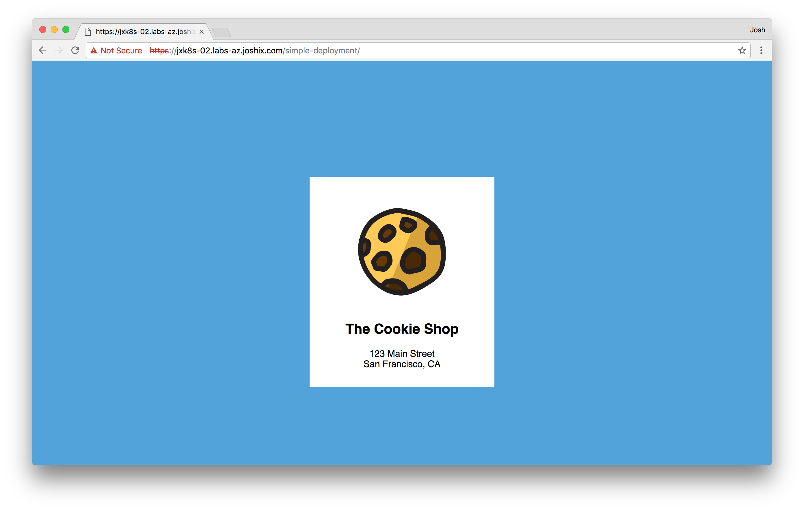
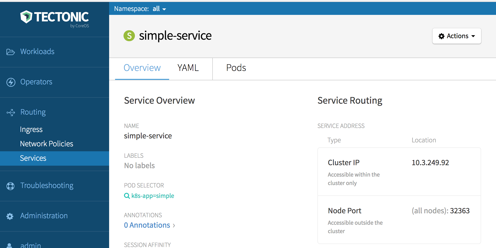

# Deploying an application on Tectonic

This tutorial will deploy a simple, stateless website for a local bakery called "The Cookie Shop" to illustrate how to:

* Deploy a simple application using `kubectl run`
* Deploy the same application using YAML manifests submitted to the cluster with `kubectl`
* Deploy the same application with Tectonic Console

Applications may be deployed on Tectonic clusters either by using Tectonic Console or with the `kubectl` CLI tool. Likewise, the application can be scaled and monitored either graphically with Console or scriptably on the command line with `kubectl`.

This tutorial explores three Kubernetes elements: *Deployments*, *Services*, and *Ingress*.

* [*Deployments*][k8s-deployment] control replication of Pods across one or more cluster nodes for scale and reliability.
* [*Services*][k8s-service] provide an abstract way to refer to a set of Pods, and a level 4 route to access them. Services outlive the individual Pods that may be cycled within a Deployment during application upgrades and other migration events, so they are a more durable way to refer to the functions provided by some group of Pods, often those governed by a Deployment. Services usually have an address that resolves only within the cluster.
* [*Ingress*][k8s-ingress] provides an external endpoint and level 7 policy to load-balance traffic through a cluster Service, and in turn to a group of Pods – usually grouped by a Deployment.

## Configuring kubectl

### Acquiring Tectonic configuration and credentials for kubectl

Begin by logging in to Tectonic Console. Console requires an extra security step of acquiring a one-time token in order to download a `kubeconfig` file containing cluster credentials:

1. Log in to Tectonic Console at `https://my-cluster.example.com`
1. From Tectonic Console, click *Tectonic Admin > My Account* on the bottom left of the page.
2. Click KUBECTL: *Download Configuration*, and follow the onscreen instructions to authenticate.
3. When the *Set Up kubectl* window opens, click *Verify Identity*.
4. Enter the username and password and click *Login*.
5. Copy the alphanumeric string on the *Login Successful* screen.
6. Switch back to Tectonic Console, enter the string in the field provided, and click *Generate Configuration* to open the *Download kubectl Configuration* window.

Download the `kubectl-config` and `kubectl` files:

1. From the *Download kubectl Configuration* window, click *Download Configuration* to download your `kubectl-config` file.
2. Click *Mac* or *Linux* to download the `kubectl` binary for your operating system.
3. Click *I’m Done* to exit the download window and return to the console.

Move the downloaded `kubectl` binary to `/usr/local/bin` or another directory on the shell's PATH, and ensure it is executable:

```sh
$ chmod +x kubectl
$ mv kubectl /usr/local/bin/kubectl
```

Make the downloaded `kubectl-config` file kubectl’s default configuration by copying it to the `~/.kube` directory:

```sh
$ mkdir -p ~/.kube/ # create the directory
$ cp path/to/file/kubectl-config $HOME/.kube/config # rename the file and copy it into the directory
```

## Deploying an application with kubectl

Use `kubectl run` with the `--expose` option set to create both a Deployment and a Service object with a single command:

```sh
$ kubectl run simple-deployment --image=quay.io/coreos/example-app:v1.0 \
--replicas=3 --labels="k8s-app=simple" --port=80 --expose
$ kubectl get svc,deploy
NAME                    CLUSTER-IP    EXTERNAL-IP   PORT(S)   AGE
svc/kubernetes          10.3.0.1      <none>        443/TCP   2h
svc/simple-deployment   10.3.105.68   <none>        80/TCP    13s

NAME                       DESIRED   CURRENT   UP-TO-DATE   AVAILABLE   AGE
deploy/simple-deployment   3         3         3            3           13s
```

Use `kubectl get svc,deploy` to review the running services and deployments just created.

The app is now deployed, but not yet available to a browser interface. To expose the service, use the YAML manifests.

First, use `kubectl get` to view the deployment above as a manifest:

```sh
$ kubectl get deployment/simple-deployment -o yaml
```

The output YAML demonstrates that the `kubectl run` command created a resource in the cluster (which may be returned as YAML or JSON). These files can be used to create new resources, and may be stored in git, making them easily versionable.

### Delete the simple Deployment and Service

Before continuing, remove the Deployment and Service using `kubectl delete`:

```sh
$ kubectl delete deployment/simple-deployment,service/simple-service
deployment "simple-deployment" deleted
service "simple-service" deleted
```

## Deploying an application from YAML

The same application may be deployed using `kubectl create` and YAML files.

First, create three YAML files to define the Deployment, Service, and Ingress objects.

### Simple Deployment

Create a file named `simple-deployment.yaml` using the YAML content listed below.

<a name="simple-deployment"></a>`simple-deployment.yaml`:

```yaml
apiVersion: extensions/v1beta1
kind: Deployment
metadata:
  name: simple-deployment
  namespace: default
  labels:
    k8s-app: simple
spec:
  replicas: 3
  template:
    metadata:
      labels:
        k8s-app: simple
    spec:
      containers:
        - name: nginx
          image: quay.io/coreos/example-app:v1.0
          ports:
            - name: http
              containerPort: 80
```

The parameter `replicas: 3`, will create 3 running copies. `Image: quay.io/coreos/example-app:v1.0` defines the container image to run, hosted on [Quay.io][quay-repo].

### Simple Service

Copy the following into a file named `simple-service.yaml`. This file will be used to deploy the service.

<a name="simple-service"></a>`simple-service.yaml`:

```yaml
kind: Service
apiVersion: v1
metadata:
  name: simple-service
  namespace: default
spec:
  selector:
    k8s-app: simple
  ports:
  - protocol: TCP
    port: 80
    targetPort: 80
  type: ClusterIP
```

To connect the Service to the containers of the `simple-deployment` Deployment, the Service `targetPort` and the Deployment `containerPort` must match. If `targetPort` is not specified, it is assumed to match the external `port`. The `targetPort` has been specified for clarity in `simple-service.yaml`.

### Simple Ingress

Copy the following into a file named `simple-ingress.yaml`. This file will be used to create an Ingress resource to act as a local load balancer.

<a name="simple-ingress"></a>`simple-ingress.yaml`:

```yaml
apiVersion: extensions/v1beta1
kind: Ingress
metadata:
  name: simple-ingress
  namespace: default
  annotations:
    kubernetes.io/ingress.class: "tectonic"
    ingress.kubernetes.io/rewrite-target: /
    ingress.kubernetes.io/ssl-redirect: "true"
    ingress.kubernetes.io/use-port-in-redirects: "true"
spec:
  rules:
    - host: my-cluster.example.com
      http:
        paths:
          - path: /simple-deployment
            backend:
              serviceName: simple-service
              servicePort: 80
```

To connect the Ingress to the Service, the Ingress's `spec.rules.http.paths.backend.serviceName` must match the Service's `metadata.name`.

### Submitting manifests to the API with kubectl

Create the cluster objects specified in the `simple-deployment.yaml`, `simple-service.yaml`, and `simple-ingress.yaml` manifests by passing each file to `kubectl create`. Check that the resources were created successfully by listing the objects afterwards:

#### Create simple Deployment

```sh
$ kubectl create -f simple-deployment.yaml
deployment "simple-deployment" created
$ kubectl get deployments
NAME                          DESIRED   CURRENT   UP-TO-DATE   AVAILABLE   AGE
deploy/simple-deployment      3         3         3            3           7m
```

#### Create simple Service

```sh
$ kubectl create -f simple-service.yaml
service "simple-service" created
$ kubectl get services -o wide
NAME              CLUSTER-IP   EXTERNAL-IP    PORT(S)        AGE    SELECTOR
simple-service    10.0.16.4    <pending>      80:30657/TCP   1d     k8s-app=simple
```

#### Create simple Ingress

```sh
$ kubectl create -f simple-ingress.yaml
ingress "simple-ingress" created
$ kubectl get ingress
NAME                HOSTS                               ADDRESS   PORTS     AGE
simple-ingress   my-cluster.example.com              10.0.16.4 80        24s
```

This deploys three replicas of the application. They'll be connected to by a Service, which is then exposed to the internet by the Ingress resource. Visit `https://my-cluster.example.com/simple-deployment/` to confirm the application is up and running.

<div class="row">
  <div class="col-lg-8 col-lg-offset-2 col-md-10 col-md-offset-1 col-sm-12 col-xs-12">
    
    <div class="co-m-screenshot-caption">Our simple Cookie Shop application up and running on Tectonic</div>
  </div>
</div>

## Deploying an app with Tectonic Console

To deploy using Tectonic Console, copy and paste YAML file content into Tectonic Console to create Deployments, Services, and Ingress.

First, deploy the sample app:
1. In the console, go to *Workloads > Deployments*, and click *Create Deployment*.
2. A pane will open, showing a default YAML deployment file.
3. Copy the contents of [simple-deployment.yaml](#simple-deployment), listed above, into the YAML pane, replacing its contents.
4. Click *Create*.

The Console will create your deployment, and display its *Overview* window.

Then, add the service:
1. Go to *Routing > Services*, and click *Create Service*.
2. Copy the contents of [simple-service.yaml](#simple-service), listed above, into the pane, replacing the default content.
3. Click *Create*.

The Console will create the service, and display its *Overview* window.

Then, add the Ingress resource:
1. Go to *Routing > Ingress*, and click *Create Ingress*.
2. Copy the contents of [simple-ingress.yaml](#simple-ingress) into the pane, replacing the default content.
3. Edit the YAML to match the cluster name and domain you chose to replace `my-cluster.example.com`.
4. Click *Create*.

The Console will create the Ingress resource, and display its *Overview* window. Copy the *Host* and *Path* and combine them into a URL. Visit `https://my-cluster.example.com/simple-deployment` to check your work.

### Observing the app in Console

Use Tectonic Console to check the app’s public IP, Service, Deployment, and running Pods.

Go to *Routing > Services* to monitor the site’s services.

<div class="row">
  <div class="col-lg-8 col-lg-offset-2 col-md-10 col-md-offset-1 col-sm-12 col-xs-12 co-m-screenshot">
    
    <div class="co-m-screenshot-caption">Viewing the Service in the Console</div>
  </div>
</div>

Go to *Routing > Ingress* and click on the Ingress name to view the Ingress resource.

<div class="row">
  <div class="col-lg-8 col-lg-offset-2 col-md-10 col-md-offset-1 col-sm-12 col-xs-12 co-m-screenshot">
    
    <div class="co-m-screenshot-caption">Viewing the Ingress resource in the Console</div>
  </div>
</div>

Go to *Workloads > Deployments* and click on the Deployment name to display the Deployment’s configuration, manifest YAML, and Pods.

<div class="row">
  <div class="col-lg-8 col-lg-offset-2 col-md-10 col-md-offset-1 col-sm-12 col-xs-12 co-m-screenshot">
    
    <div class="co-m-screenshot-caption">Viewing the Deployment in the Console</div>
  </div>
</div>

[**NEXT:** Checking application logs][check-app]


[QE]: https://coreos.com/quay-enterprise/
[check-app]: check-logs.md
[check-work]: https://my-cluster.example.com/simple-deployment/
[edit-service]: ../img/walkthrough/edit-service.png
[installing]: installing-tectonic.md
[k8s-deployment]: https://kubernetes.io/docs/user-guide/deployments/
[k8s-ingress]: https://kubernetes.io/docs/concepts/services-networking/ingress/
[k8s-service]: https://kubernetes.io/docs/user-guide/services/
[quay-io]: https://quay.io
[quay-repo]: https://quay.io/repository/coreos/example-app
[registry-auth]: https://coreos.com/os/docs/latest/registry-authentication.html
[rolling-deployments]: rolling-deployments.md
[scale-app]: scale-app.md
[simple-app-a]: ../img/walkthrough/simple-app-a.png
[console]: https://my-cluster.example.com
