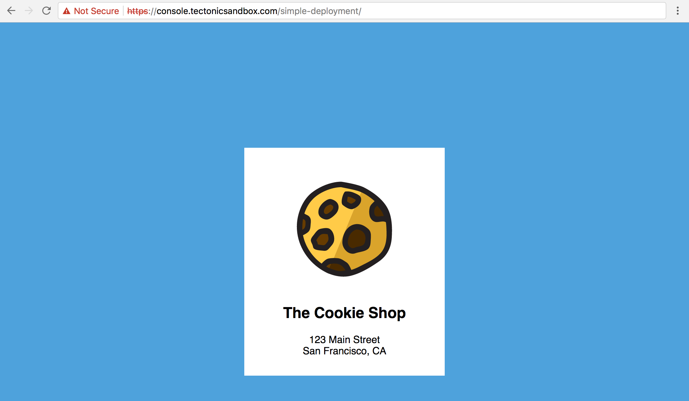
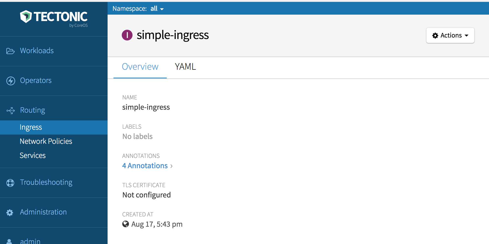
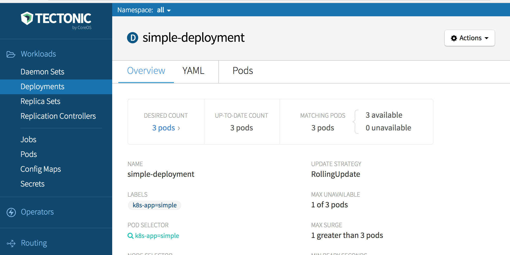

# Deploying an application on Tectonic

When Tectonic Sandbox [installation][installing] is complete, the terminal will display instructions for accessing Tectonic Console and `kubectl`. Log in to the Console, then use these instructions to deploy your first application.

This tutorial will:
* Deploy a simple application using Tectonic Console.
* Deploy the same application with `kubectl run`.
* Deploy the same application using YAML manifests.

Applications may be deployed on Tectonic clusters both by using Tectonic Console, and by passing a YAML manifest file to the `kubectl create` CLI tool. Once deployed, scale and monitor the application using Tectonic Console.

This tutorial will explore three useful Kubernetes concepts, `deployments`, `services`, and `ingress`.

* [**Deployments:**][k8s-deployment] run multiple copies of a container across multiple nodes.
* [**Services:**][k8s-service] provide an endpoint that load balances traffic to containers run by a deployment (usually internally).
* [**Ingress:**][k8s-ingress] provides an endpoint that load balances traffic to containers run by a deployment (usually internally).

## Configuring credentials

First, open Tectonic Console to download and configure `kubectl`.

Log in to Tectonic Console:

1. Open a browser and visit [console.tectonicsandbox.com/][console].
2. When prompted for a login, use "admin@example.com" and "sandbox" as the username and password.

Authenticate and initiate `kubectl` download:

1. From Tectonic Console, click *Tectonic Admin > My Account* on the bottom left of the page.
2. Click KUBECTL: *Download Configuration*, and follow the onscreen instructions to authenticate.
3. When the *Set Up kubectl* window opens, click *Verify Identity*.
4. Enter username: *admin@example.com* and password: *sandbox*, and click *Login*.
5. Copy the alphanumeric string on the *Login Successful* screen.
6. Switch back to Tectonic Console, enter the string in the field provided, and click *Generate Configuration* to open the *Download kubectl Configuration* window.

Download the `kubectl-config` and `kubectl` files:

1. From the *Download kubectl Configuration* window, click *Download Configuration* to download your `kubectl-config` file.
2. Click *Mac* or *Linux* to download the `kubectl` binary for your operating system.
3. Click *I’m Done* to exit the download window, and return to the console.

Move the downloaded `kubectl` file to `/usr/local/bin` (or any other directory in your PATH):

```sh
$ chmod +x kubectl
$ mv kubectl /usr/local/bin/kubectl
```

Make the downloaded `kubectl-config` file kubectl’s default by copying it to a `.kube` directory on your machine:

```sh
$ mkdir -p ~/.kube/ # create the directory
$ cp path/to/file/kubectl-config $HOME/.kube/config # rename the file and copy it into the directory
```

Configure `kubectl`:

1. Open a terminal.
2. Navigate to the *tectonic-sandbox* directory.
3. If on Mac or Linux, run the following command: `export KUBECONFIG=$PWD/provisioning/etc/kubernetes/kubeconfig`
4. If on Windows Powershell, run the following command: `$env:KUBECONFIG = "$PWD\provisioning\etc\kubernetes\kubeconfig"`

### Deploying an app with Tectonic Console

This tutorial will deploy a simple, stateless website for a local bakery called "The Cookie Shop."

To deploy using Tectonic Console, copy and paste YAML file content into Tectonic Console to create Deployments, Services, and Ingress.

First, deploy the sample app:
1. In the console, go to *Workloads > Deployments*, and click *Create Deployment*.
2. A pane will open, showing a default YAML deployment file.
3. Copy the contents of [simple-deployment.yaml](#simple-deployment), listed below, into the YAML pane, replacing its contents
4. Click *Create*.

The Console will create your deployment, and display its *Overview* window.

Then, add the service:
1. Go to *Routing > Services*, and click *Create Service*.
2. Copy the contents of [simple-service.yaml](#simple-service), listed below, into the pane, replacing the default content.
3. Click *Create*.

The Console will create the service, and display its *Overview* window.

Then, add the Ingress resource:
1. Go to *Routing > Ingress*, and click *Create Ingress*.
2. Copy the contents of [simple-ingress.yaml](#simple-ingress) into the pane, replacing the default content.
3. Click *Create*.

The Console will create the Ingress, and display its *Overview* window. Copy the *Host* and *Path* and combine them into a URL. [Visit the URL][check-work] to check your work.

## Deploying an application from kubectl

This example will use the simple app deployed above. To create an identical app, first delete the existing app using `kubectl delete`:

```sh
$ kubectl delete deploy/simple-deployment svc/simple-service ing/simple-ingress
deployment "simple-deployment" deleted
service "simple-service" deleted
ingress "simple-ingress" deleted
```

Use `kubectl run` to create both a Deployment and a Service object:

```sh
$ kubectl run simple-deployment --image=quay.io/coreos/example-app:v1.0 --port=80 --replicas=3 --labels="k8s-app=simple" --expose=true
$ kubectl get svc,deploy
NAME                    CLUSTER-IP    EXTERNAL-IP   PORT(S)   AGE
svc/kubernetes          10.3.0.1      <none>        443/TCP   2h
svc/simple-deployment   10.3.105.68   <none>        80/TCP    13s

NAME                       DESIRED   CURRENT   UP-TO-DATE   AVAILABLE   AGE
deploy/simple-deployment   3         3         3            3           13s
```

Use `kubectl get svc,deploy` to review the running services and deployments just created.

The app is now deployed, but not yet available to a browser interface. To expose the service, use the YAML manifests.

First, use `kubectl get` to view the deployment above as a manifest:

```sh
$ kubectl get deployment/simple-deployment -o yaml
```

The output YAML demonstrates that the `kubectl run` command created a resource in the cluster (which may be returned as YAML or JSON). These files may be used to create new resources, and may be stored in git, making them easily versionable.

Before moving on, remove the deployment just created using `kubectl delete`:

```sh
$ kubectl delete svc/simple-deployment deploy/simple-deployment
```

## Deploying an application from YAML

The same application may also be deployed using `kubectl create` and YAML files.

First, create three YAML files to define the Deployment, Service, and Ingress objects.

Create a file named `simple-deployment.yaml` using the YAML content listed below.

<a name="simple-deployment"></a>`simple-deployment.yaml`:

```yaml
apiVersion: extensions/v1beta1
kind: Deployment
metadata:
  name: simple-deployment
  namespace: default
  labels:
    k8s-app: simple
spec:
  replicas: 3
  template:
    metadata:
      labels:
        k8s-app: simple
    spec:
      containers:
        - name: nginx
          image: quay.io/coreos/example-app:v1.0
          ports:
            - name: http
              containerPort: 80
```

The parameter `replicas: 3`, will create 3 running copies. `Image: quay.io/coreos/example-app:v1.0` defines the container image to run, hosted on [Quay.io][quay-repo].

Copy the following into a file named `simple-service.yaml`. This file will be used to deploy the service.

<a name="simple-service"></a>`simple-service.yaml`:

```yaml
kind: Service
apiVersion: v1
metadata:
  name: simple-service
  namespace: default
spec:
  selector:
    k8s-app: simple
  ports:
  - protocol: TCP
    port: 80
  type: NodePort
```

To connect the service to the containers run by the deployment, the deployment `containerPort` and the service `port` must match.

Copy the following into a file named `simple-ingress.yaml`. This file will be used to create an Ingress resource to act as a local load balancer.

<a name="simple-ingress"></a>`simple-ingress.yaml`:

```yaml
apiVersion: extensions/v1beta1
kind: Ingress
metadata:
  name: simple-ingress
  namespace: default
  annotations:
    kubernetes.io/ingress.class: "tectonic"
    ingress.kubernetes.io/rewrite-target: /
    ingress.kubernetes.io/ssl-redirect: "true"
    ingress.kubernetes.io/use-port-in-redirects: "true"
spec:
  rules:
    - host: console.tectonicsandbox.com
      http:
        paths:
          - path: /simple-deployment
            backend:
              serviceName: simple-service
              servicePort: 80
```

To connect the Service to Ingress, the Service `metadata.name` and the Ingress `spec.rules.http.paths.backend.serviceName` must match.

Instantiate the cluster objects specified in the `simple-deployment.yaml`, `simple-service.yaml`, and `simple-ingress` manifests by passing the filepaths to `kubectl create`. Check that they were created successfully by listing out the objects afterwards:

```sh
$ kubectl create -f simple-deployment.yaml
deployment "simple-deployment" created
$ kubectl get deployments
NAME                          DESIRED   CURRENT   UP-TO-DATE   AVAILABLE   AGE
deploy/simple-deployment      3         3         3            3           7m
```

```sh
$ kubectl create -f simple-service.yaml
service "simple-service" created
$ kubectl get services -o wide
NAME              CLUSTER-IP   EXTERNAL-IP    PORT(S)        AGE    SELECTOR
simple-service    10.3.113.190 <pending>      80:30657/TCP   1d     k8s-app=simple
```

```sh
$ kubectl create -f simple-ingress.yaml
ingress "simple-deployment" created
$ kubectl get ingress
NAME                HOSTS                               ADDRESS   PORTS     AGE
simple-deployment   console.tectonicsandbox.com                   80        24s
```

This will deploy three replicas of the application. They'll be connected by a service, which is then exposed to the internet by the Ingress resource. Visit [console.tectonicsandbox.com/simple-deployment/][check-work] to confirm that the application is up and running.

<div class="row">
  <div class="col-lg-8 col-lg-offset-2 col-md-10 col-md-offset-1 col-sm-12 col-xs-12">
    
    <div class="co-m-screenshot-caption">Our simple Cookie Shop application up and running on Tectonic</div>
  </div>
</div>

## Monitoring your app using Tectonic Console

Use Tectonic Console to monitor the app’s public IP, Service, Deployment, and related Pods.

Go to *Routing > Services* to monitor the site’s services.

<div class="row">
  <div class="col-lg-8 col-lg-offset-2 col-md-10 col-md-offset-1 col-sm-12 col-xs-12 co-m-screenshot">
    
    <div class="co-m-screenshot-caption">Viewing the Service in the Console</div>
  </div>
</div>

Go to *Routing > Ingress* and click on the Ingress name to view the Ingress resource.

<div class="row">
  <div class="col-lg-8 col-lg-offset-2 col-md-10 col-md-offset-1 col-sm-12 col-xs-12 co-m-screenshot">
    
    <div class="co-m-screenshot-caption">Viewing the Ingress in the Console</div>
  </div>
</div>

Go to *Workloads > Deployments* and click on the Deployment name to monitor the deployment’s Pods.

<div class="row">
  <div class="col-lg-8 col-lg-offset-2 col-md-10 col-md-offset-1 col-sm-12 col-xs-12 co-m-screenshot">
    
    <div class="co-m-screenshot-caption">Viewing the Deployment in the Console</div>
  </div>
</div>

## Using your own container images

The examples above used container images that have been shared publicly. To generate and host your own container images, we suggest using [Quay.io][quay-io] or [Quay Enterprise][QE]. The Quay container registry offers sophisticated access controls, easily automated builds, and automated security scanning, free for public projects.

Substitute your custom image and version (known as a "tag") in the Deployment above, by changing:

```yaml
containers:
  - name: nginx
    image: quay.io/coreos/example-app:v1.0
```

[**NEXT:** Checking the logs for our app][check-app]

[QE]: https://coreos.com/quay-enterprise/
[check-app]: check-logs.md
[check-work]: https://console.tectonicsandbox.com/simple-deployment/
[edit-service]: ../img/walkthrough/edit-service.png
[installing]: installing-tectonic.md
[k8s-deployment]: https://kubernetes.io/docs/user-guide/deployments/
[k8s-ingress]: https://kubernetes.io/docs/concepts/services-networking/ingress/
[k8s-service]: https://kubernetes.io/docs/user-guide/services/
[quay-io]: https://quay.io
[quay-repo]: https://quay.io/repository/coreos/example-app
[registry-auth]: https://coreos.com/os/docs/latest/registry-authentication.html
[rolling-deployments]: rolling-deployments.md
[scale-app]: scale-app.md
[simple-app-a]: ../img/walkthrough/simple-app-a.png
[console]: https://console.tectonicsandbox.com
