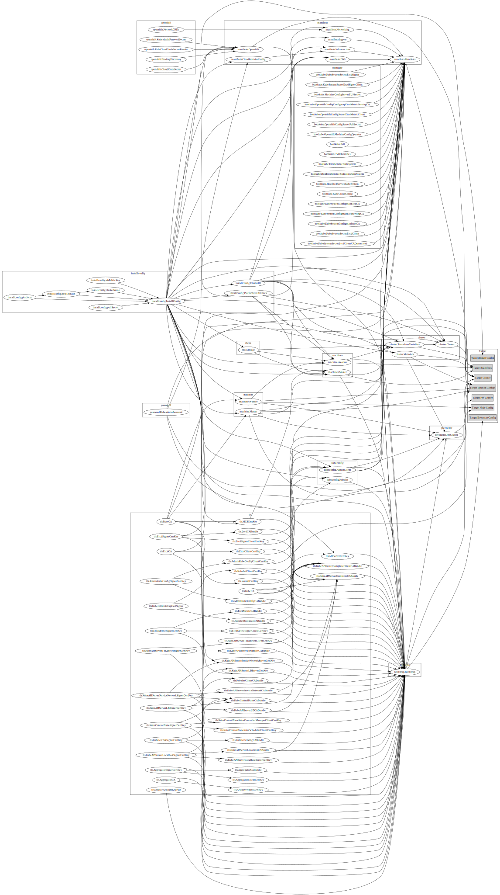

# Asset Generation

The installer internally uses a directed acyclic graph to represent all of the assets it creates as well as their dependencies. This process looks very similar to many build systems (e.g. Bazel, Make).

## Overview

The installer generates assets based on the [dependency graph](#dependency-graph). Each asset seperately defines how it can be generated as well as its dependencies. Targets represent a set of assets that should be generated and written to disk for the user's consumption. When a user invokes the installer for a particular target, each of the assets in the set is generated as well as any dependencies. This eventually results in the user being prompted for any missing information (e.g. administrator password, target platform).

The installer is also able to read assets from disk if they have been provided by the user. In the event that an asset exists on disk, the install won't generate the asset, but will instead consume the asset from disk (removing the file). This allows the installer to be run multiple times, using the assets generated by the previous invocation. It also allows a user to make modifications to the generated assets before continuing to the next target.

Each asset is individually responsible for declaring its dependencies. Each asset is also responsible resolving conflicts when combining its input from disk and its state from a previous run. The installer ensures all the dependencies for an asset is generated and provides the asset with latest state to generate its own output.

## Asset

An asset is the generic representation of work-item for installer that needs to be generated. Each asset defines all the other assets that are required for it to generate itself as dependencies.

The asset would usually follow these steps to generate its output:

1. Fetch its parent assets.

2. Generate the assets either by:
    *  Using the parent assets
    *  Loading from on-disk assets
    *  Loading from state file

3. If any of the parent assets are **dirty** (currently we think all on-disk assets are **dirty**), then use the parent assets to generate and return **dirty**.

4. If none of the parent assets are **dirty**, but the asset itself is on disk, then use the on-disk asset and return **dirty**.

5. If none of the parent assets or this asset is **dirty**, but the asset is found in the state file, then use the asset from state file and return **NOT dirty**.

6. If none of the parent assets are **dirty**, this asset is not **dirty**, and this asset is not found in the state file, then generate the asset using its parent assets and return **NOT dirty**.

An example of the Asset:

```go
type Asset interface {
    Dependencies() []Assets
    Generate(Parents) error
    Name() string
}
```

## Writable Asset

A writable asset is an asset that generates files to write to disk. These files could be for the user to consume as output from installer targets, such as install-config.yml from the InstallConfig asset. Or these files could be used internally by the installer, such as the cert/key files generated by TLS assets.
A writable asset can also be loaded from disk to construct.

```go
type WritableAsset interface{
    Asset
    Files() []File
    Load(FileFetcher) (found bool, err error)
}

type File struct {
    Filename string
    Data []byte
}

// FileFetcher is passed to every Loadable asset when implementing
// the Load() function. The FileFetcher enables the Loadable asset
// to read specific file(s) from disk.
type FileFetcher interface {
    // FetchByName returns the file with the given name.
    FetchByName(string) (*File, error)
    // FetchByPattern returns the files whose name match the given glob.
    FetchByPattern(*regexp.Regexp) ([]*File, error)
}
```
After being loaded and consumed by a children asset, the existing on-disk asset will be purged.
E.g.

```shell
$ openshift-install create install-config
# Generate install-config.yml

$ openshift-install create manifests
# Generate manifests/ and openshift/ dir, also remove install-config.yml
```

## Target generation

The installer uses depth-first traversal on the dependency graph, starting at the target nodes, generating all the dependencies of the asset before generating the asset itself. After all the target assets have been generated, the installer outputs the contents of the components of the targets to disk.

### Dirty detection

An asset generation reports **DIRTY** when it detects that the components have been modified from previous run. For now the asset is considered dirty when it's on-disk.

### Example


When generating targets **A5 and A6**

```
load state;

A5: (A3, A4)
    A3: (A1, A2)
        A1:
            A1.generate(state)
            update state
        A2:
            A2.generate(state)
            update state
        set dirty if one of A1/A2 is dirty
        A3.generate(state): pass dirty if set
        update state
    A4:
        A4.generate(state)
        update state
    set dirty if one of A3/A4 is dirty
    A5.generate(state): pass dirty if set
    update state
A6: (A1, A2)
    A1:
        reuse
    A2:
        reuse
    set dirty if one of A1/A2 is dirty
    A6.generate(state): pass dirty if set
    update state
Flush A5 and A6 to disk
```

## Dependency graph

The following graph shows the relationship between the various assets that the installer generates:



This graph is generated from the using the following command:

```sh
bin/openshift-install graph | dot -Tsvg >docs/design/resource_dep.svg
```
