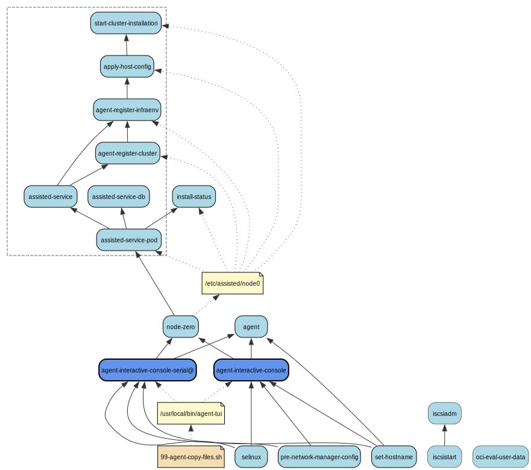
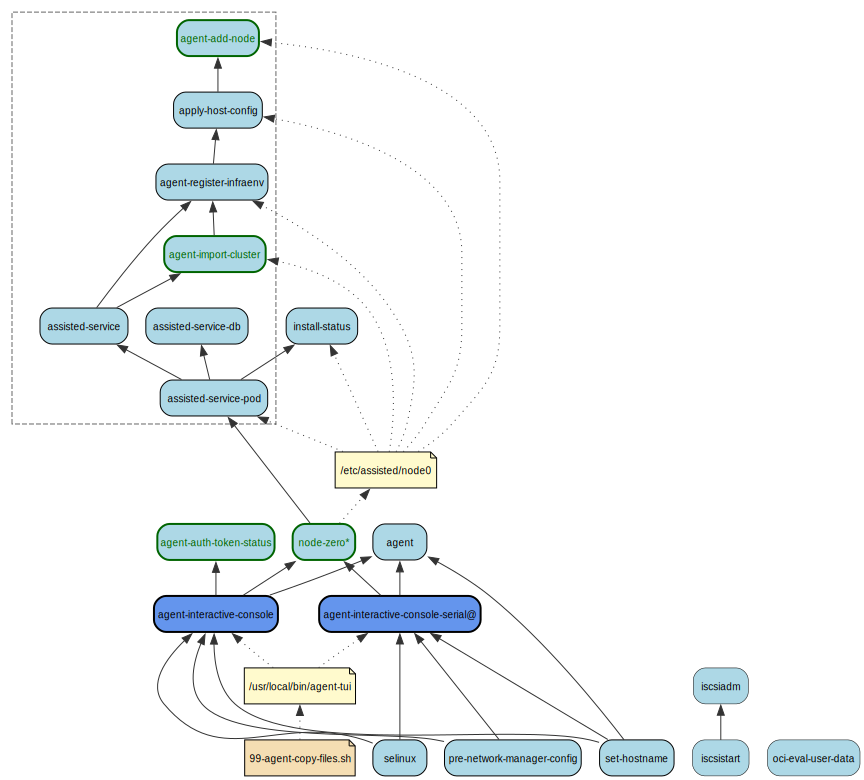

# Agent-based Installer Services

## Install workflow

In the install workflow, all information needed to configure a cluster is included in the agent ISO.
When the agent ISO is booted, agent-tui and nmstate libraries are copied to the host from initrd. This copy 
step is required because the agent-tui and nmstate libraries are too big to fit into the Ignition config.

* agent-interactive-console - checks the host has connectivity to the release image
* agent - takes host inventory and performs validations and reports results back to assisted-service
* selinux - updates the SELinux policy to allow chronyd access to container files and UNIX datagram socket 
* pre-network-manager-config - applies any network configs before NetworkManager is started
* set-hostname - sets the hostname if one was specified for the host in agent-config.yaml
* node-zero - determines if the current host is the rendezvous host or node zero
* assisted-service-pod - pod containing the assisted-service REST-API and database
* assisted-service - assisted-service REST-API
* assisted-service-db - postgresql database where assisted-service stores data
* agent-register-cluster - reads the ZTP manifests located at /etc/assisted/manifests and registers the cluster
* agent-register-infraenv - reads the ZTP manifests located at /etc/assisted/manifests and registers the infraenv
* install-status - determines the current install status and writes it out to /etc/issue.d/
* apply-host-config - applies root device hints and roles specified in agent-config.yaml
* start-cluster-installation - calls assisted-service REST-API to start cluster installation when all hosts are in ready state and have passed validations
* iscsistart - calls the iscsistart utility which allows an iSCSI session to be started for booting off an iSCSI target
* iscsiadm - calls the iscsiadm utility that will start iscsid to manage the iSCSI session needed to install the final rhcos image

## Add-nodes workflow

The add-nodes workflow is used to generate an ISO image for adding one or more nodes to a target cluster. It is very similar to the install workflow, with
the following exceptions (highlighted in green in the previous picture):

* agent-auth-token-status - checks if the auth tokens are expired or not, informing the user and blocking the installation
* node-zero - automatically configures the localhost as the rendezvous node
* agent-import-cluster - imports an already existing cluster in assisted-service
* agent-add-node - starts the installation on the current node for adding it to the target cluster

----

## Appliance workflow (unconfigured ignition and config image)

In the appliance workflow, most of the cluster deployment information is included in a config image that is mounted
onto the host running the unconfigured-ignition. The appliance flow does not include the agent-tui or the
agent-interactive-console service because the disk images generated in the factory contains the release payload
so no connectivity checks to the release image is needed.

* load-config-iso@ - detects the config image has been mounted and copies the cluster configuration files from the config image to the host. It also enables start-cluster-installation which is disabled by default in the unconfigured-ignition. The actual service is created when the config image is mounted as a device and its name will be load-config-iso@<dev-name>.service e.g load-config-iso@-dev-sr1.service
* agent-check-config-image - if the config image has not been mounted, it displays a message to the console asking for the config image to be mounted in order to start the cluster installation.

----

## Interactive workflow (unconfigured ignition --interactive)

The interactive workflow allows the user to install a cluster by using the assisted UI running on the rendezvous node. In this workflow
the agent-tui is also used interactively to configure which node will be the rendezvous host, and to configure accordingly the other nodes.

* agent-extract-tui - extracts agent-tui and nmstate libraries from the agent-installer-utils image during boot
* agent-ui - runs the assisted UI on the rendezvous node

