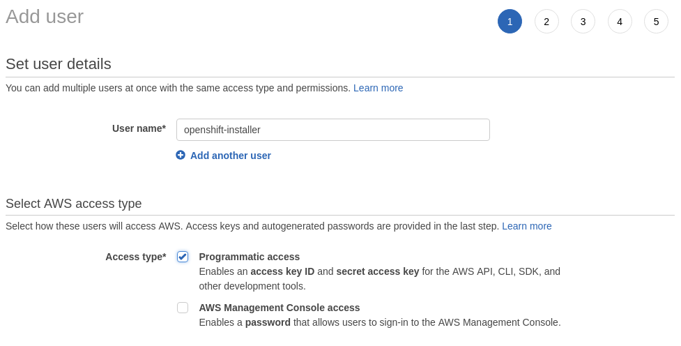
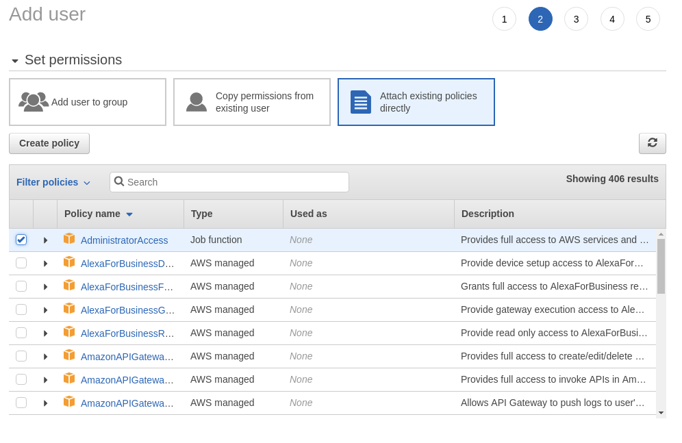
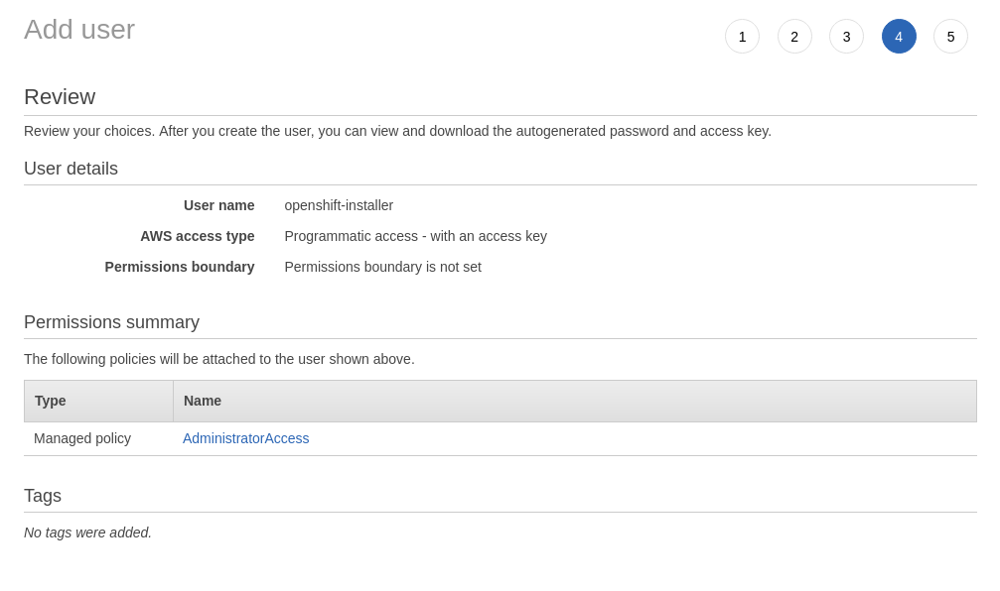
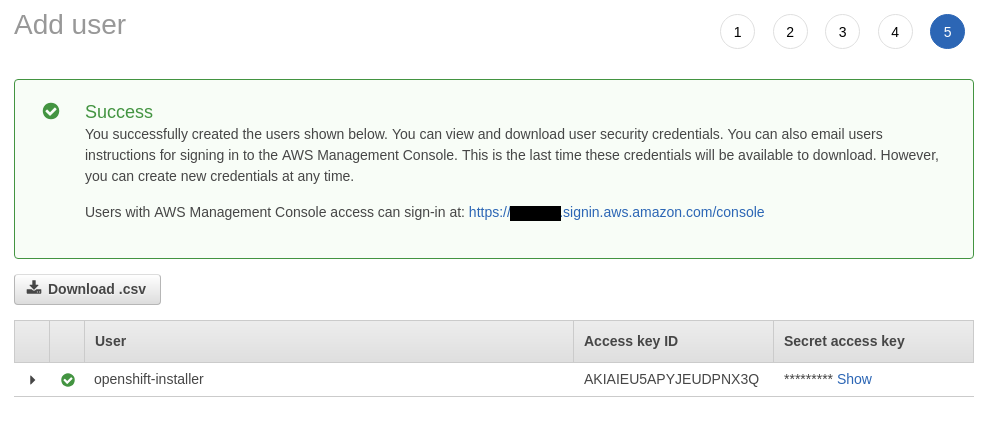

# IAM User

In a new AWS account, you are provided with a root user. This account is based on the email address which created
the account. This is a highly privileged account and not recommended for usage beyond configuring initial account and
billing settings, an initial set of users, and locking it down.

Before proceeding with the OpenShift install, you should create a secondary IAM administrative user following the steps
outlined here:

[AWS: Creating an IAM User in Your AWS Account][user-create]

## Step 1: Name User, Identify Programmatic Access

In this step, you identify the IAM user name. We require programmatic access to AWS (via generated access key), check
this box.

## Step 2: Attach Administrative Policy

Many permissions are required by the AWS installer. A specific set of policies and services will be identified at a
future date so a specific policy can be created and attached. Until then, attach the predefined "AdministratorAccess"
for the installation to use.

## Step 3: Optional, Skip

Step 3 is optional and we’ll skip it.

## Step 4: Review Settings

Step 4 allows us to review the settings we've selected. Make sure your screen reflects your chosen name and
AdministratorAccess

## Step 5: Acquire Access Key and Secret

In Step 5, you need to save the access key ID and secret access key values to configure your local machine to run
the installer. This step is your only opportunity to collect those values.

[user-create]: https://docs.aws.amazon.com/IAM/latest/UserGuide/id_users_create.html
