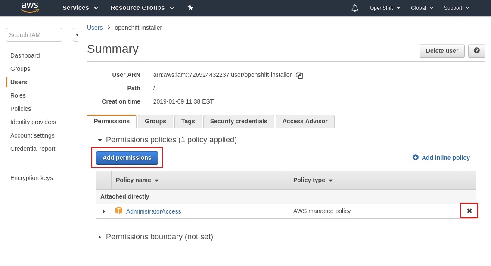
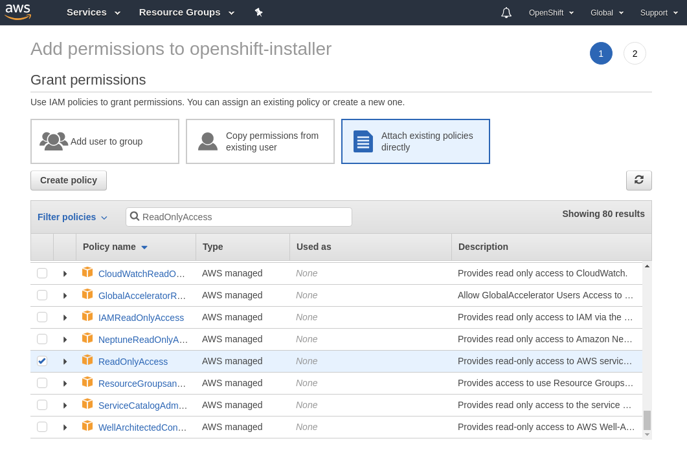

# IAM User: Revisited

Once OpenShift is installed, the installer account no longer requires the AdministratorAccess policy. This user account
may be deleted or have its access keys revoked (or disabled until needed later/again). You may also opt to remove the
AdministratorAccess policy in favor of ReadOnlyAccess. You perform all these steps by revisiting IAM and updating the
user created earlier.

## Example: Remove AdministratorAccess, Attach ReadOnlyAccess

