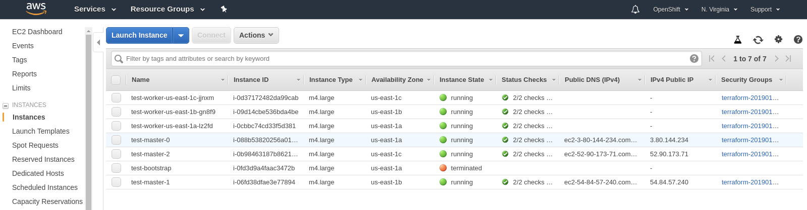
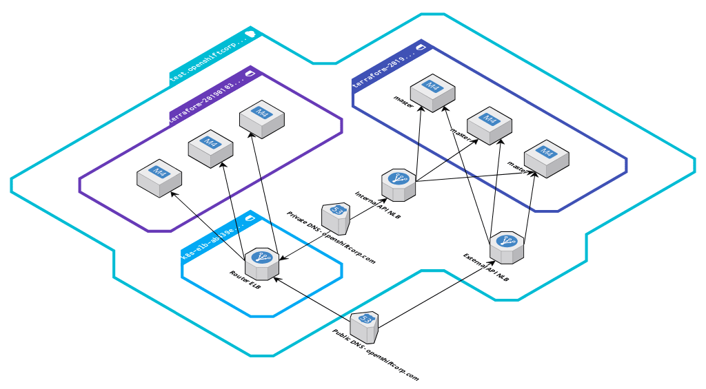

# Cluster Installation

At this point, you are ready to perform the OpenShift installation outlined [here][cloud-install] and begin at
Step 3: Download the Installer.

## Example

### Create Configuration

```console
[~]$ openshift-install-linux-amd64 create install-config
? SSH Public Key /home/user_id/.ssh/id_rsa.pub
? Platform aws
? Region us-east-1
? Base Domain example.com
? Cluster Name test
? Pull Secret [? for help]
```

### Create Cluster

```console
[~]$ openshift-install-linux-amd64 create cluster
INFO Waiting up to 30m0s for the Kubernetes API at https://api.test.example.com:6443...
INFO API v1.11.0+85a0623 up
INFO Waiting up to 30m0s for the bootstrap-complete event...
INFO Destroying the bootstrap resources...
INTO Waiting up to 30m0s for the cluster at https://api.test.example.com:6443 to initialize...
INFO Waiting up to 10m0s for the openshift-console route to be created...
INFO Install complete!
INFO Run 'export KUBECONFIG=/home/user/auth/kubeconfig' to manage the cluster with 'oc', the OpenShift CLI.
INFO The cluster is ready when 'oc login -u kubeadmin -p XXXX' succeeds (wait a few minutes).
INFO Access the OpenShift web-console here: https://console-openshift-console.apps.test.example.com
INFO Login to the console with user: kubeadmin, password: XXXX
```

This creates an encrypted AMI for the bootstrap and control-plane machines.
The encrypted AMI is [copied][encrypted-copy] from the AMI configured in the control-plane machine-API provider spec, which is RHCOS by default.
The encryption uses the default EBS key for your target account and region (`aws kms describe-key --key-id alias/aws/ebs`).
The encrypted AMI is deregistered by `destroy cluster`.

### Running Cluster

In Route53, there will be a new, private hosted zone (for internal lookups):


In EC2, there will be 6 running instances:



The relationship of the EC2 instances, elastic load balancers (ELBs) and Route53 hosted zones is as depicted:



The nodes within the VPC utilize the internal DNS and use the Router and Internal API load balancers. External/Internet
access to the cluster use the Router and External API load balancers. Nodes are spread equally across 3 availability
zones.

The OpenShift console is available via the kubeadmin login provided by the installer:


[cloud-install]: https://cloud.openshift.com/clusters/install
[encrypted-copy]: https://docs.aws.amazon.com/AWSEC2/latest/UserGuide/AMIEncryption.html#create-ami-encrypted-root-snapshot
