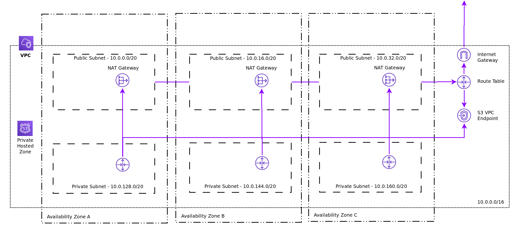

# Install: User Provided Infrastructure (UPI)

The steps for performing a UPI-based install are outlined here. Several [CloudFormation][cloudformation] templates are
provided to assist in completing these steps or to help model your own.  You are also free to create the required
resources through other methods; the CloudFormation templates are just an example.

## Create Ignition Configs

The machines will be started manually. Therefore, it is required to generate the bootstrap and machine Ignition configs
and store them for later steps.

```console
$ openshift-install-linux-amd64 create ignition-configs
? SSH Public Key /home/user_id/.ssh/id_rsa.pub
? Platform aws
? Region us-east-1
? Base Domain example.com
? Cluster Name openshift
? Pull Secret [? for help]
```

After running the command, several files will be available in the directory.

```console
$ tree
.
├── auth
│   └── kubeconfig
├── bootstrap.ign
├── master.ign
├── metadata.json
└── worker.ign
```

## Create/Identify the VPC to be Used

You may create a VPC with various desirable characteristics for your situation (VPN, route tables, etc.). The
VPC configuration and a CloudFormation template is provided [here](../../../upi/aws/cloudformation/01_vpc.yaml).

A created VPC via the template or manually should approximate a setup similar to this:



## Create DNS entries and Load Balancers for Control Plane Components

The DNS and load balancer configuration within a CloudFormation template is provided
[here](../../../upi/aws/cloudformation/02_cluster_infra.yaml). It uses a public hosted zone and creates a private hosted
zone similar to the IPI installation method. It also creates load balancers and listeners the same way as the IPI
installation method. This template can be run multiple times within a single VPC and in combination with the VPC
template provided above.

### Optional: Manually Create Load Balancer Configuration

It is needed to create a TCP load balancer for ports 6443 (the Kubernetes API and its extensions) and 22623 (Ignition
configurations for new machines).  The targets will be the master nodes.  Port 6443 must be accessible to both clients
external to the cluster and nodes within the cluster. Port 22623 must be accessible to nodes within the cluster.

### Optional: Manually Create Route53 Hosted Zones & Records

For the cluster name identified earlier in [Create Ignition Configs](#create-ignition-configs), you must create a DNS
entry which resolves to your created load balancer. The entry `api.$clustername.$domain` should point to the load balancer.

## Create Security Groups and IAM Roles

The security group and IAM configuration within a CloudFormation template is provided
[here](../../../upi/aws/cloudformation/03_cluster_security.yaml). Run this template to get the minimal and permanent
set of security groups and IAM roles needed for an operational cluster. It can also be inspected for the current
set of required rules to facilitate manual creation.

## Launch Temporary Bootstrap Resource

The bootstrap launch and other necessary, temporary security group plus IAM configuration and a CloudFormation
template is provided [here](../../../upi/aws/cloudformation/04_cluster_bootstrap.yaml). Upload your generated `bootstrap.ign`
file to an S3 bucket in your account and run this template to get a bootstrap node along with a predictable clean up of
the resources when complete. It can also be inspected for the set of required attributes via manual creation.

## Launch Permanent Master Nodes

The master launch and other necessary DNS entries for etcd are provided within a CloudFormation
template [here](../../../upi/aws/cloudformation/05_cluster_master_nodes.yaml). Run this template to get three master
nodes. It can also be inspected for the set of required attributes needed for manual creation of the nodes, DNS entries
and load balancer configuration.

## Monitor for `bootstrap-complete` and Initialization

```console
$ bin/openshift-install wait-for bootstrap-complete
INFO Waiting up to 30m0s for the Kubernetes API at https://api.test.example.com:6443...
INFO API v1.12.4+c53f462 up
INFO Waiting up to 30m0s for the bootstrap-complete event...
```

## Destroy Bootstrap Resources

At this point, you should delete the bootstrap resources. If using the CloudFormation template, you would [delete the
stack][delete-stack] created for the bootstrap to clean up all the temporary resources.

## Cleanup Machine API Resources

By querying the Machine API, you'll notice the cluster is attempting to reconcile the predefined
Machine and MachineSet definitions. We will begin to correct that here. In this step, we delete
the pre-defined master nodes. Our masters are not controlled by the Machine API.

### Example: Deleting Master Machine Definitions

```console
$ export KUBECONFIG=auth/kubeconfig
$ oc get machines --namespace openshift-machine-api
NAME                                    INSTANCE   STATE     TYPE        REGION      ZONE         AGE
test-tkh7l-master-0                                       m4.xlarge   us-east-2   us-east-2a   9m22s
test-tkh7l-master-1                                       m4.xlarge   us-east-2   us-east-2b   9m22s
test-tkh7l-master-2                                       m4.xlarge   us-east-2   us-east-2c   9m21s
test-tkh7l-worker-us-east-2a-qjcxq                        m4.large    us-east-2   us-east-2a   8m6s
test-tkh7l-worker-us-east-2b-nq8zs                        m4.large    us-east-2   us-east-2b   8m6s
test-tkh7l-worker-us-east-2c-ww6c6                        m4.large    us-east-2   us-east-2c   8m7s
$ oc delete machine --namespace openshift-machine-api test-tkh7l-master-0
machine.machine.openshift.io "test-tkh7l-master-0" deleted
$ oc delete machine --namespace openshift-machine-api test-tkh7l-master-1
machine.machine.openshift.io "test-tkh7l-master-1" deleted
$ oc delete machine --namespace openshift-machine-api test-tkh7l-master-2
machine.machine.openshift.io "test-tkh7l-master-2" deleted
```

## Launch Additional Worker Nodes

To launch workers, you are able to launch individual EC2 instances discretely or by automated processes outside the
cluster (e.g. Auto Scaling Groups). However, you are also able to take advantage of the built in cluster scaling mechanisms
and the machine API in OCP.

### Option 1: Dynamic Compute using Machine API

By default, MachineSets are created and will have failed to launch. We can correct the desired subnet filter,
target security group, RHEL CoreOS AMI and EC2 instance profile.

```console
$ oc get machinesets --namespace openshift-machine-api
NAME                           DESIRED   CURRENT   READY     AVAILABLE   AGE
test-tkh7l-worker-us-east-2a   1         1                               11m
test-tkh7l-worker-us-east-2b   1         1                               11m
test-tkh7l-worker-us-east-2c   1         1                               11m
```

```console
$ oc get machineset --namespace openshift-machine-api test-tkh7l-worker-us-east-2a -o yaml
apiVersion: machine.openshift.io/v1beta1
kind: MachineSet
metadata:
  creationTimestamp: 2019-03-14T14:03:03Z
  generation: 1
  labels:
    machine.openshift.io/cluster-api-cluster: test-tkh7l
    machine.openshift.io/cluster-api-machine-role: worker
    machine.openshift.io/cluster-api-machine-type: worker
  name: test-tkh7l-worker-us-east-2a
  namespace: openshift-machine-api
  resourceVersion: "2350"
  selfLink: /apis/machine.openshift.io/v1beta1/namespaces/openshift-machine-api/machinesets/test-tkh7l-worker-us-east-2a
  uid: e2a6c8a6-4661-11e9-a9b0-0296069fd3a2
spec:
  replicas: 1
  selector:
    matchLabels:
      machine.openshift.io/cluster-api-cluster: test-tkh7l
      machine.openshift.io/cluster-api-machineset: test-tkh7l-worker-us-east-2a
  template:
    metadata:
      creationTimestamp: null
      labels:
        machine.openshift.io/cluster-api-cluster: test-tkh7l
        machine.openshift.io/cluster-api-machine-role: worker
        machine.openshift.io/cluster-api-machine-type: worker
        machine.openshift.io/cluster-api-machineset: test-tkh7l-worker-us-east-2a
    spec:
      metadata:
        creationTimestamp: null
      providerSpec:
        value:
          ami:
            id: ami-0eecbb884c8b35b1e
          apiVersion: awsproviderconfig.openshift.io/v1beta1
          blockDevices:
          - ebs:
              iops: 0
              volumeSize: 120
              volumeType: gp2
          credentialsSecret:
            name: aws-cloud-credentials
          deviceIndex: 0
          iamInstanceProfile:
            id: test-tkh7l-worker-profile
          instanceType: m4.large
          kind: AWSMachineProviderConfig
          metadata:
            creationTimestamp: null
          placement:
            availabilityZone: us-east-2a
            region: us-east-2
          publicIp: null
          securityGroups:
          - filters:
            - name: tag:Name
              values:
              - test-tkh7l-worker-sg
          subnet:
            filters:
            - name: tag:Name
              values:
              - test-tkh7l-private-us-east-2a
          tags:
          - name: kubernetes.io/cluster/test-tkh7l
            value: owned
          userDataSecret:
            name: worker-user-data
      versions:
        kubelet: ""
status:
  fullyLabeledReplicas: 1
  observedGeneration: 1
  replicas: 1
```

At this point, you'd edit the YAML to update the relevant values to match your UPI installation.

```console
$ oc edit machineset --namespace openshift-machine-api test-tkh7l-worker-us-east-2a
machineset.machine.openshift.io/test-tkh7l-worker-us-east-2a edited
```

Once the Machine API has a chance to reconcile and begin launching hosts with the correct attributes, you
should start to see new output in your EC2 console and oc commands.

```console
$ oc get machines --namespace openshift-machine-api
NAME                                 INSTANCE              STATE     TYPE         REGION      ZONE         AGE
test-tkh7l-worker-us-east-2a-hxlqn   i-0e7f3a52b2919471e   pending   m4.4xlarge   us-east-2   us-east-2a   3s
```

### Option 2: Manually Launching Worker Instances

The worker launch is provided within a CloudFormation template [here](../../../upi/aws/cloudformation/06_cluster_worker_node.yaml).
You can launch a CloudFormation stack to manage each individual worker. A similar launch configuration could be used by
outside automation or AWS auto scaling groups.

## Configure Router for UPI DNS

TODO: Identify changes needed to Router or Ingress for DNS `*.apps` registration or LoadBalancer creation.

## Monitor for Cluster Completion

```console
$ bin/openshift-install wait-for install-complete
INFO Waiting up to 30m0s for the cluster to initialize...
```

Also, you can observe the running state of your cluster pods:

```console
$ oc get pods --all-namespaces
NAMESPACE                                               NAME                                                                READY     STATUS      RESTARTS   AGE
kube-system                                             etcd-member-ip-10-0-3-111.us-east-2.compute.internal                1/1       Running     0          35m
kube-system                                             etcd-member-ip-10-0-3-239.us-east-2.compute.internal                1/1       Running     0          37m
kube-system                                             etcd-member-ip-10-0-3-24.us-east-2.compute.internal                 1/1       Running     0          35m
openshift-apiserver-operator                            openshift-apiserver-operator-6d6674f4f4-h7t2t                       1/1       Running     1          37m
openshift-apiserver                                     apiserver-fm48r                                                     1/1       Running     0          30m
openshift-apiserver                                     apiserver-fxkvv                                                     1/1       Running     0          29m
openshift-apiserver                                     apiserver-q85nm                                                     1/1       Running     0          29m
...
openshift-service-ca-operator                           openshift-service-ca-operator-66ff6dc6cd-9r257                      1/1       Running     0          37m
openshift-service-ca                                    apiservice-cabundle-injector-695b6bcbc-cl5hm                        1/1       Running     0          35m
openshift-service-ca                                    configmap-cabundle-injector-8498544d7-25qn6                         1/1       Running     0          35m
openshift-service-ca                                    service-serving-cert-signer-6445fc9c6-wqdqn                         1/1       Running     0          35m
openshift-service-catalog-apiserver-operator            openshift-service-catalog-apiserver-operator-549f44668b-b5q2w       1/1       Running     0          32m
openshift-service-catalog-controller-manager-operator   openshift-service-catalog-controller-manager-operator-b78cr2lnm     1/1       Running     0          31m
```

[cloudformation]: https://docs.aws.amazon.com/AWSCloudFormation/latest/UserGuide/Welcome.html
[delete-stack]: https://docs.aws.amazon.com/AWSCloudFormation/latest/UserGuide/cfn-console-delete-stack.html
