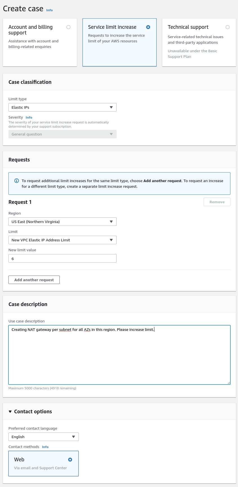

# Limits

You can find a comprehensive list of the default AWS service limits published here:

[AWS Service Limits][service-limits]

Below, we'll identify OpenShift cluster needs and how those impact some of those limits.

## S3

There is a default limit of 100 S3 buckets per account. The installation creates a bucket temporarily. Also, the
registry component creates a permanent bucket. This will limit the number of clusters per account to 99 initially. To
support additional clusters, you must open a support case with AWS.

## VPC

Each cluster creates its own VPC. The default limit of VPCs per region is 5 and will allow 5 clusters. To have more
than 5 clusters, you will need to increase this limit.

## Elastic Network Interfaces (ENI)

The default installation creates 21 + the number of availability zones of ENIs (e.g. us-east-1 = 21 + 6 = 27 ENIs).
The default limit per region is 350. Additional ENIs are created for additional machines and elastic load balancers
created by cluster usage and deployed workloads. A service limit increase here may be required to satisfy the needs of
additional clusters and deployed workloads.

## Elastic IP (EIP)

For a single, default cluster, your account will have the needed capacity limits required. There is one exception,
"EC2-VPC Elastic IPs". The installer creates a public and private subnet for each
[availability zone within a region][availability-zones] to provision the cluster in a highly available configuration. In
each private subnet, a separate [NAT Gateway][nat-gateways] is created and requires a separate [elastic IP][elastic-ip].
The default limit of 5 is sufficient for most regions and a single cluster. For the us-east-1 region, a higher limit is
required. For multiple clusters, a higher limit is required. Please see [this map][az-map] for a current region map with
availability zone count. We recommend selecting regions with 3 or more availability zones.

### Example: Using N. Virginia (us-east-1)

To use N. Virginia (us-east-1) for a new cluster, please submit a limit increase for VPC Elastic IPs similar to the
following in the support dashboard (to create more than one cluster, a higher limit will be necessary):

## NAT Gateway

The default limit for NAT Gateways is 5 per availability zone. This is sufficient for up to 5 clusters in a dedicated
account. If you intend to create more than 5 clusters, you will need to request an increase to this limit.

## VPC Gateway

The default limit of VPC Gateways (for S3 access) is 20. Each cluster will create a single S3 gateway endpoint within
the new VPC. If you intend to create more than 20 clusters, you will need to request an increase to this limit.

## Security Groups

Each cluster creates 10 distinct security groups. The default limit of 2,500 for new accounts allows for many clusters
to be created.

## Instance Limits

By default, a cluster will create 6 nodes (3 masters and 3 workers). Currently, these are m4.large and within a new
account's default limit. If you intend to start with a higher number of workers, enable autoscaling and large workloads
or a different instance type, please ensure you have the necessary remaining instance count within the instance type's
limit to satisfy the need. If not, please ask AWS to increase the limit via a support case.

## Elastic Load Balancing (ELB/NLB)

By default, each cluster will create 2 network load balancers for the master API server (1 internal, 1 external) and a
single classic elastic load balancer for the router. Additional Kubernetes LoadBalancer Service objects will create
additional [load balancers][load-balancing]

[service-limits]: https://docs.aws.amazon.com/general/latest/gr/aws_service_limits.html
[load-balancing]: https://aws.amazon.com/elasticloadbalancing/
[availability-zones]: https://docs.aws.amazon.com/AWSEC2/latest/UserGuide/using-regions-availability-zones.html
[nat-gateways]: https://docs.aws.amazon.com/vpc/latest/userguide/vpc-nat-gateway.html
[elastic-ip]: https://docs.aws.amazon.com/AWSEC2/latest/UserGuide/elastic-ip-addresses-eip.html
[az-map]: https://aws.amazon.com/about-aws/global-infrastructure/
