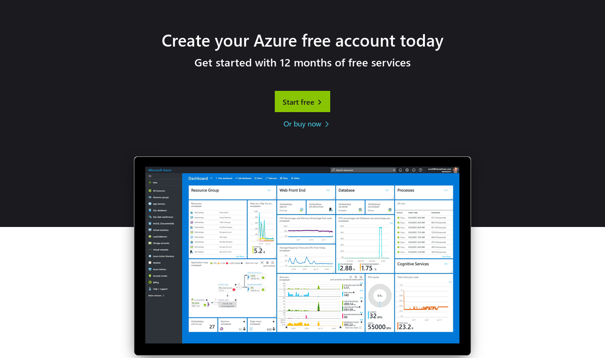
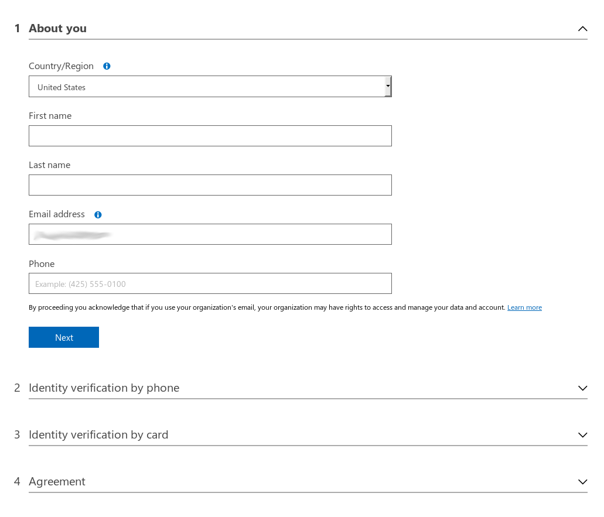
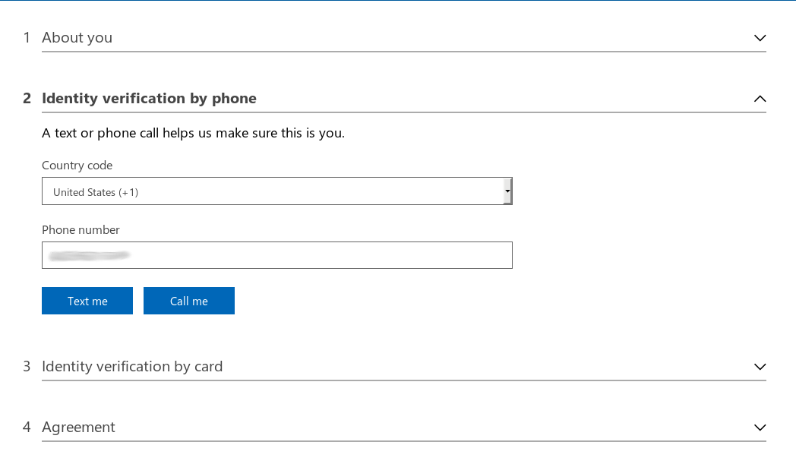
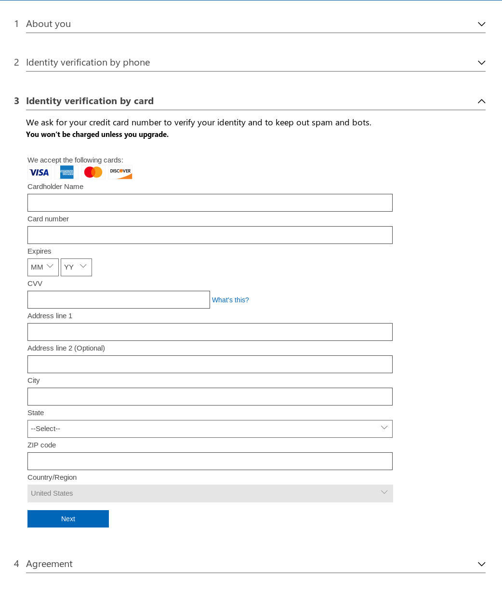
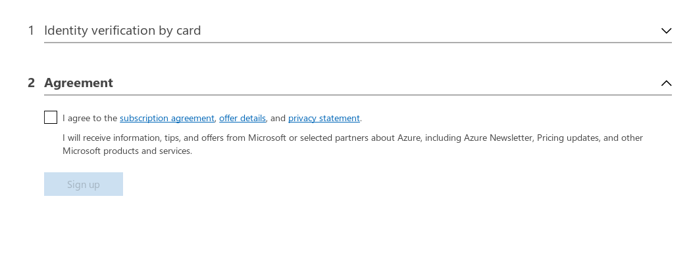
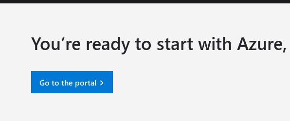
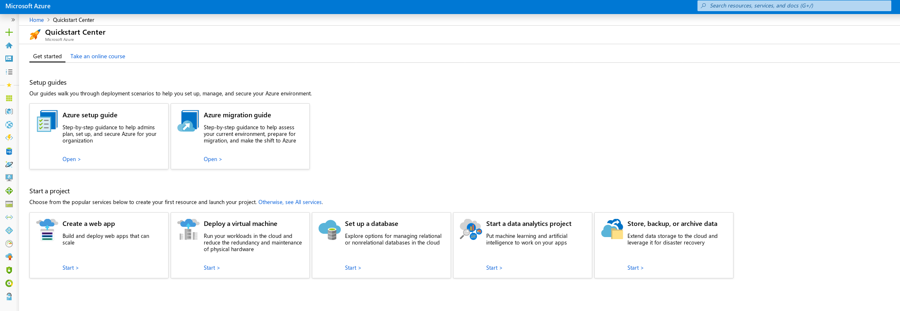

# Create an Azure account

You can sign up for an Azure account here: 

[Azure: Create your Azure free account today][user-create]

This is the welcome screen. You can create a free account or you can purchase services.

Once you've opted to create an account, you must fill out information about yourself. All fields are required. 

You will need to verify your identity once you've filled out your information. You can either bet called or sent an SMS message.

Once your identity has been verified, you must provide a credit card. If you are creating a free account, this will not be charged.

After everything is filled out, you must agree to the terms and conditions. 

Now that everything is filled out, you can go to the Azure portal.

This is what the Azure portal looks like. 

[user-create]: https://azure.microsoft.com/en-us/free/
[install-cli]: https://docs.microsoft.com/en-us/cli/azure/install-azure-cli-yum?view=azure-cli-latest
