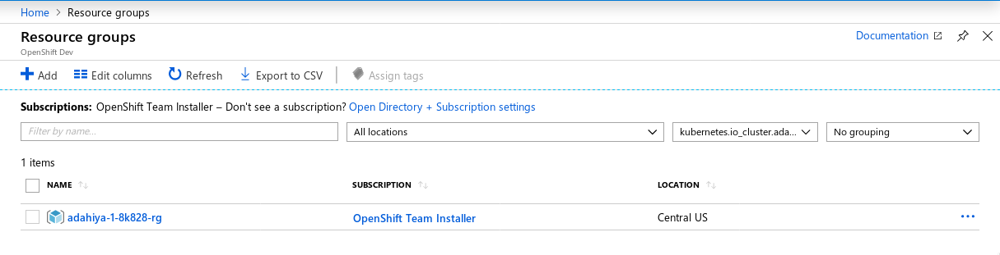
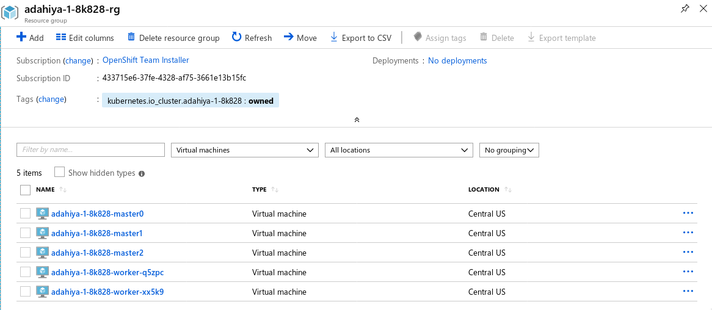

# Cluster Installation

At this point, you are ready to perform the OpenShift installation. See below for an example of an
IPI install.

## Example: Installer-Provided Infrastructure (IPI)

The steps for performing an IPI-based install are outlined [here][cloud-install]. Following this guide you may begin at
Step 3: Download the Installer.

### Create Configuration

```console
[~]$ openshift-install create install-config
? SSH Public Key /home/user_id/.ssh/id_rsa.pub
? Platform azure
? azure subscription id xxxxxxxx-xxxx-xxxx-xxxx-xxxxxxxxxxxx
? azure tenant id xxxxxxxx-xxxx-xxxx-xxxx-xxxxxxxxxxxx
? azure service principal client id xxxxxxxx-xxxx-xxxx-xxxx-xxxxxxxxxxxx
? azure service principal client secret xxxxxxxx-xxxx-xxxx-xxxx-xxxxxxxxxxxx
INFO Saving user credentials to "/home/user_id/.azure/osServicePrincipal.json"
? Region centralus
? Base Domain example.com
? Cluster Name test
? Pull Secret [? for help]
```

### Create Cluster

```console
[~]$ openshift-install create cluster
INFO Waiting up to 30m0s for the Kubernetes API at https://api.test.example.com:6443...
INFO API v1.11.0+85a0623 up
INFO Waiting up to 30m0s for the bootstrap-complete event...
INFO Destroying the bootstrap resources...
INTO Waiting up to 30m0s for the cluster at https://api.test.example.com:6443 to initialize...
INFO Waiting up to 10m0s for the openshift-console route to be created...
INFO Install complete!
INFO To access the cluster as the system:admin user when using 'oc', run
    export KUBECONFIG=/home/user/auth/kubeconfig
INFO Access the OpenShift web-console here: https://console-openshift-console.apps.test.example.com
INFO Login to the console with user: kubeadmin, password: 5char-5char-5char-5char
```

### Running Cluster

In your subscription, there will be a new Resource Group for your cluster:



There will be six running Virtual Machines in the Resource Group.



The nodes within the Virtual Network utilize the internal DNS and use the Router and Internal API load balancers. External/Internet
access to the cluster use the Router and External API load balancers.

The OpenShift console is available via the kubeadmin login provided by the installer:


[cloud-install]: https://console.redhat.com/openshift/create
[rhcos]: https://github.com/openshift/os
