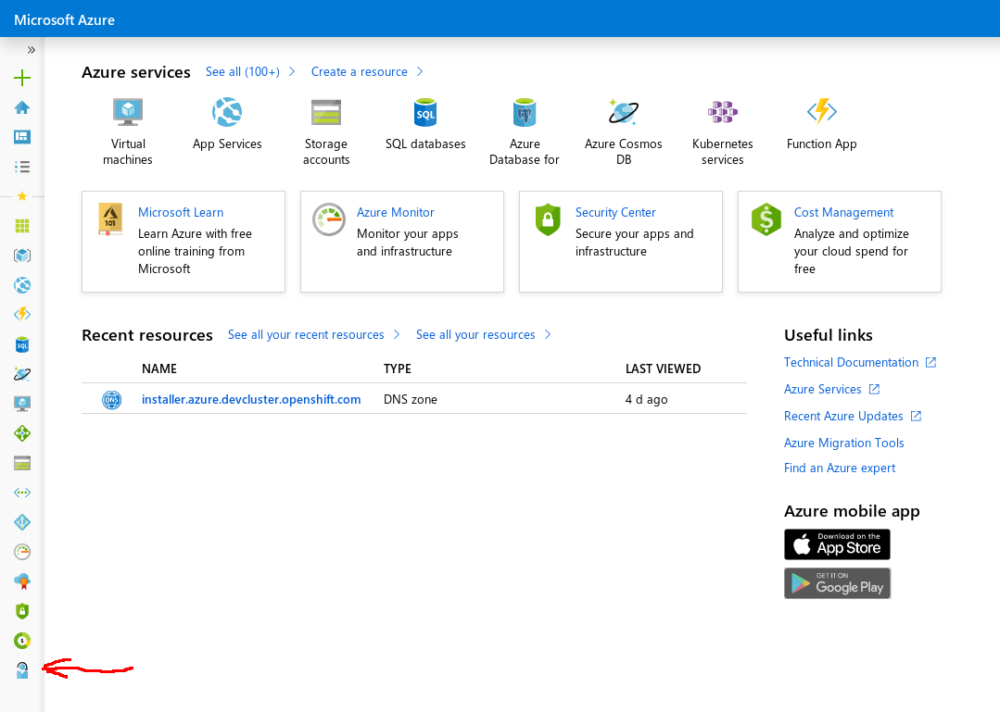
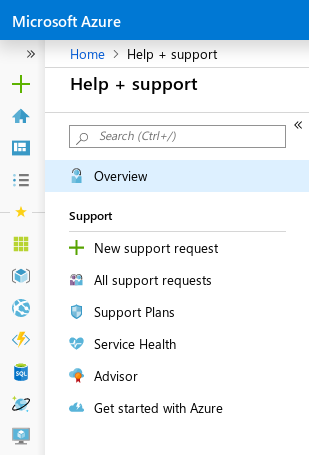
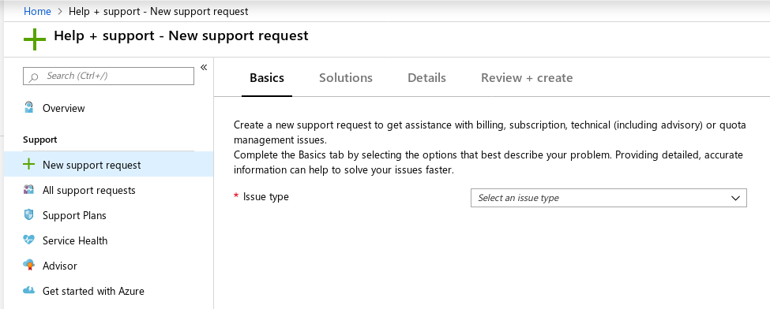
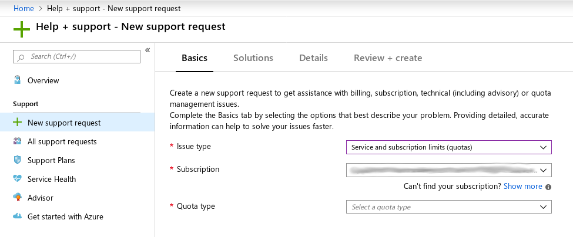
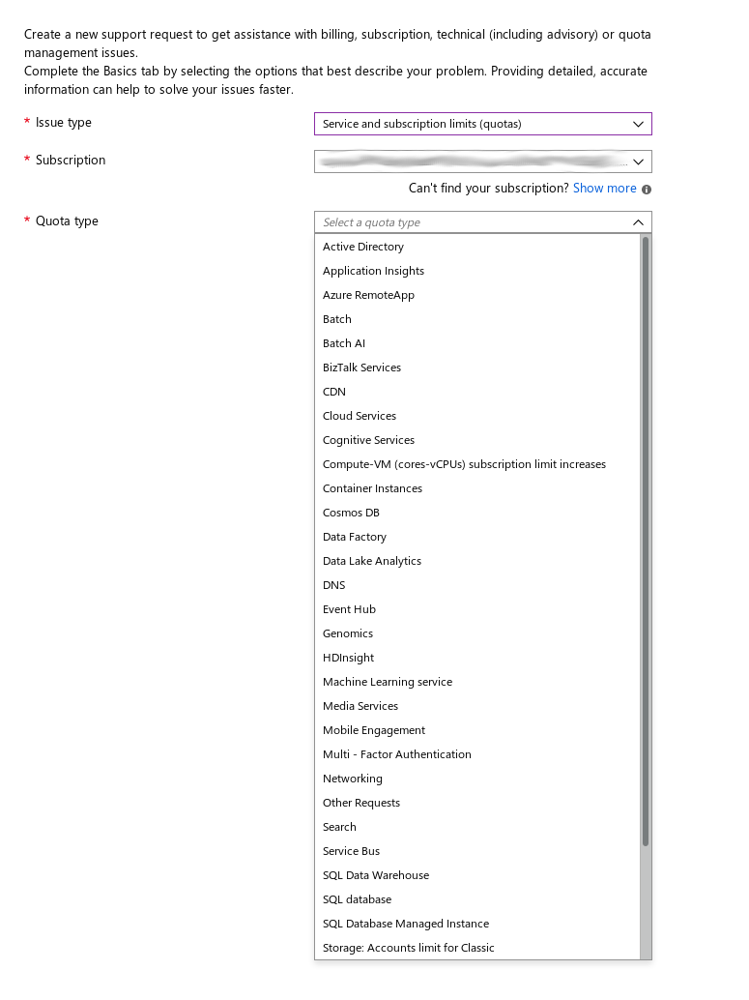
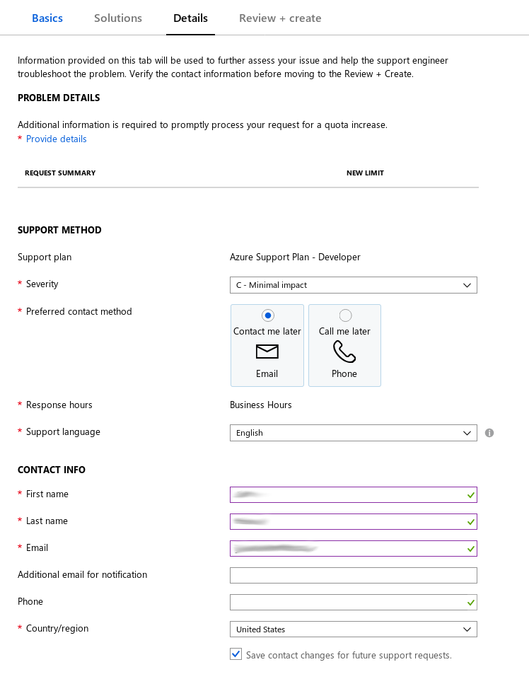
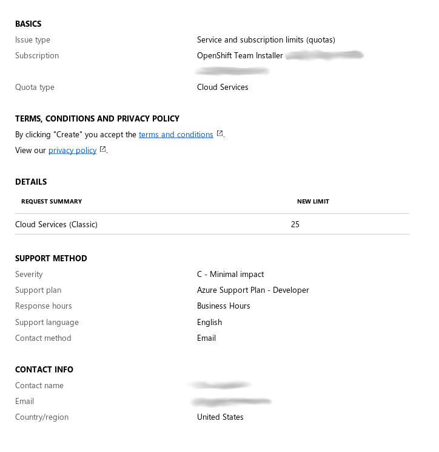

# Limits

You can find a comprehensive list of the default Azure service limits published here:

[Azure Service Limits][service-limits]

Below, we'll identify OpenShift cluster needs and how those impact some of those limits.

## VNet

Each cluster creates its own VNet. The default limit of VNets per regions is 1000 and will allow 1000 clusters. To 
have more than 1000 clusters, you will need to increase this limit. The default installation creates a single VNet.

## Network Interfaces

The default installation creates 6 network interfaces. The default limit per region is 65536. Additional network interfaces are
created for additional machines and load balancers created by cluster usage and deployed workloads.

## Public and Private IP Addresses

By default, the installer distributes control-plane and compute machines across [all availability zones within a region][availability-zones] to provision the cluster in a highly available configuration.
Please see [this map][az-map] for a current region map with availability zone count.
We recommend selecting regions with 3 or more availability zones.
You can [provide an install-config](../overview.md#multiple-invocations) to [configure](customization.md) the installer to use specific zones to override the defaults.

The installer creates two external load balancers and one internal load balancer. The external load balancers each have a public IP address while the internal load balancer has a private IP address. Two subnets are created within the VNet. One of the subnets is for the control-plane nodes while the other subnet is for the compute nodes. A description of what each load balancer does is [here](#load-balancing).

Each VM gets a private IP address. The default install creates 6 VM's for a total of 6 private addresses. The internal load balancer has a private IP address while the external load balancers have public IP addresses. This sums up to 7 private IP addresses and 2 public IP addresses.

A public IP address is also created for the bootstrap machine during installation. This is so that it is available via SSH should anything go wrong during the install. The bootstrap machine and public IP address are destroyed once installation is complete.

## Network Security Groups

Each cluster creates network security groups for every subnet within the VNet. The default install creates network
security groups for the control plane and for the compute node subnets. The default limit of 5000 for new accounts
allows for many clusters to be created. The network security groups which exist after the default install are:

1. controlplane
   * This allows the control-plane to be reached on port 6443 from anywhere
2. node
   * This allows worker nodes to be reached from the internet on ports 80 and 443

## Instance Limits

By default, an x86 cluster will create:

* One Standard_D4s_v3 bootstrap machine (removed after install)
* Three Standard_D8s_v3 master nodes.
* Three Standard_D2s_v3 worker nodes.

The specs for the VM sizes (Dsv3-series) are as follows:

* Standard_D8s_v3
   * 8 vCPU's, 32GiB ram
   * IOPs / Throughput (Mbps): (cached) 16000 / 128
   * IOPs / Throughput (Mbps): (uncached) 12800 / 192
   * NICs / Bandwidth (Mbps): 4 / 4000
   * 64 GiB temp storage (SSD)
   * 16 data disks max

* Standard_D4s_v3
   * 4 vCPU's, 16GiB ram
   * IOPs / Throughput (Mbps): (cached) 8000 / 512
   * IOPs / Throughput (Mbps): (uncached) 6400 / 1152
   * NICs / Bandwidth (Mbps): 2 / 2000
   * NICs / Bandwidth (Mbps): 2 / 1000
   * 32 GiB temp storage (SSD)
   * 8 data disks max

* Standard_D2s_v3
   * 2 vCPU's, 8GiB ram
   * IOPs / Throughput (Mbps): (cached) 4000 / 256
   * IOPs / Throughput (Mbps): (uncached) 3200 / 384
   * NICs / Bandwidth (Mbps): 2 / 1000
   * 16 GiB temp storage (SSD)
   * 4 data disks max

More details on VM sizes can be found [here][sizes-general].

By default, an arm64 cluster will create:

* One Standard_D8ps_v5 bootstrap machine (removed after install)
* Three Standard_D8ps_v5 master nodes.
* Three Standard_D4ps_v5 worker nodes.

The specs for the VM sizes (Dpsv5-series) are as follows:

* Standard_D8ps_v5
   * 8 vCPU's, 32GiB ram
   * IOPs / Throughput (Mbps): (uncached burst) 20000 / 1200
   * IOPs / Throughput (Mbps): (uncached) 12800 / 290
   * NICs / Bandwidth (Mbps): 4 / 12500
   * 16 data disks max
   * Remote Storage Only

* Standard_D4ps_v5
   * 4 vCPU's, 16GiB ram
   * IOPs / Throughput (Mbps): (uncached burst) 20000 / 1200
   * IOPs / Throughput (Mbps): (uncached) 6400 / 145
   * NICs / Bandwidth (Mbps): 2 / 12500
   * 8 data disks max
   * Remote Storage Only

More details on VM sizes can be found [here][sizes-arm64]. All VMs are Gen2 only.

The default subscription only allows for 20 vCPU's and will need to be [increased](#increasing-limits) to at least 22.
If you intend to start with a higher number of workers, enable autoscaling and large workloads
or a different instance type, please ensure you have the necessary remaining instance count within the instance type's
limit to satisfy the need. If not, please ask Azure to increase the limit via a support case.

## Load Balancing

By default, each cluster will create 3 network load balancers. The default limit per region is 1000. The following load balancers are created:

1. default 
  * Public IP address that load balances requests to ports 80 and 443 across worker nodes
2. internal
  * Private IP address that load balances requests to ports 6443 and 22623 across control-plane nodes
3. external
  * Public IP address that load balances requests to port 6443 across control-plane nodes

Additional Kubernetes LoadBalancer Service objects will create additional [load balancers][load-balancing]. 

## Increasing limits

To increase a limit beyond the maximum, a support request will need to be filed.

First, click on "help + support". It is located on the bottom left menu.

Next, click on "New support request"

From here, you'll want to specify the issue type of "Service and subscription limits (quotas)"

Pick the subscription you'll be updating as well as the quota type.

Once you've specified the subscription and quota type, you'll need to fill out your contact information.

You will then review and submit your request.

[availability-zones]: https://azure.microsoft.com/en-us/global-infrastructure/availability-zones/
[az-map]: https://azure.microsoft.com/en-us/global-infrastructure/regions/

[network-ip]: https://docs.microsoft.com/en-us/azure/virtual-network/virtual-network-ip-addresses-overview-arm

[load-balancing]: https://docs.microsoft.com/en-us/azure/load-balancer/load-balancer-overview
[service-limits]: https://docs.microsoft.com/en-us/azure/azure-subscription-service-limits
[sizes-general]: https://docs.microsoft.com/en-us/azure/virtual-machines/windows/sizes-general
[sizes-arm64]: https://docs.microsoft.com/en-us/azure/virtual-machines/dpsv5-dpdsv5-series
