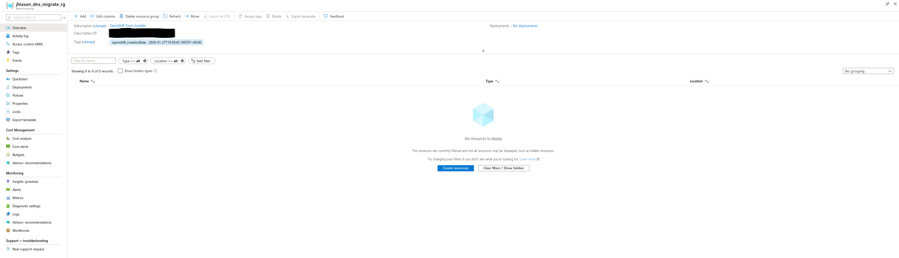
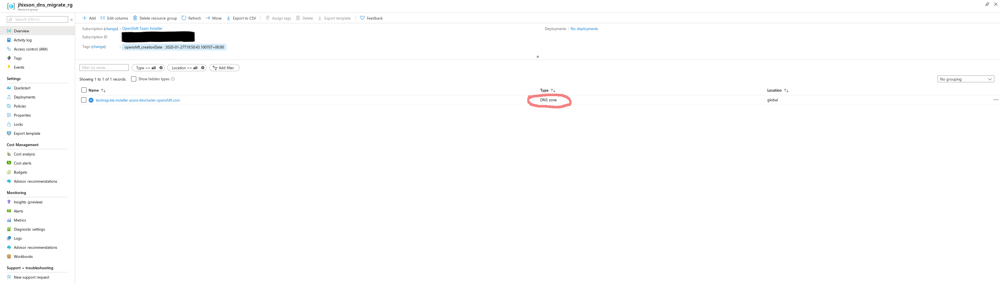
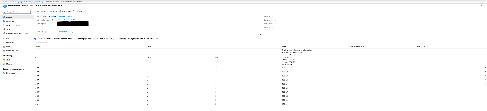
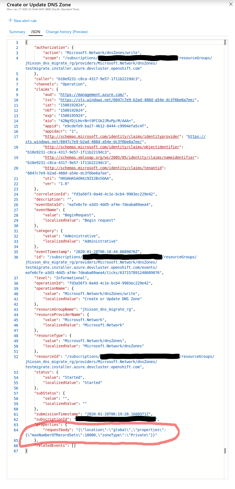
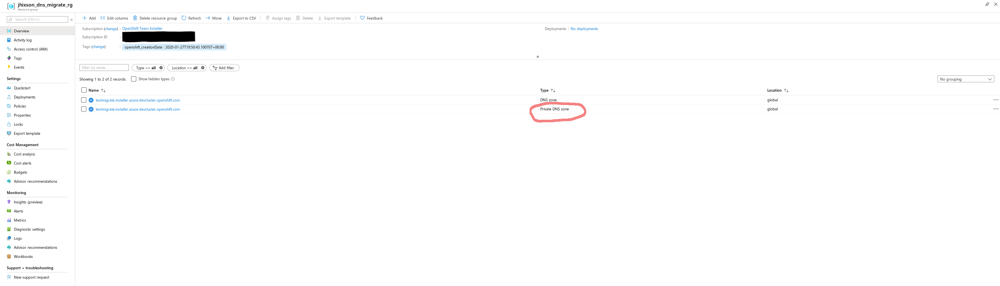
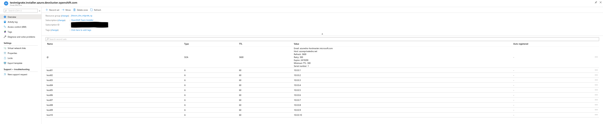
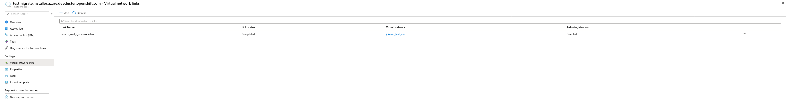

## Migrating legacy Azure DNS zones

"openshift-install migrate azure-privatedns" is a command for migrating Azure legacy private DNS zones to next generation private zones
"openshift-install migrate azure-privatedns-eligible" is a command for listing legacy Azure zones that are eligible to be migrated

## Usage

Arguments:

    # Show legacy zones that are eligible to be migrated
    openshift-install migrate azure-privatedns-eligible

    # migrate a zone
    openshift-install migrate azure-privatedns

        # The zone we want to migrate (required)
        --zone=example.com

        # The resource group to create the private zone in (required)
        --resource-group=rg

        # The virtual network to create the private zone in (optional)
        --virtual-network=vnet

        # The resource group the virtual network is in (optional)
        # Required if specifying a virtual network
        --virtual-network-resource-group=vrg

        # Link the newly created private zone to the virtual network for DNS (optional)
        --link=vnet

Examples:

    # This will show legacy zones that can be migrated to private zones
    openshift-install migrate azure-privatedns-eligible

    # This will migrate a legacy zone to a private zone
    # Without specifying -link, a virtual network link from the new zone to the vnet will not be created
    openshift-install migrate azure-privatedns --resource-group=rg --zone=example.com --virtual-network-resource-group=rg --virtual-network=myvnet --link

## Workflow for migrating a legacy private zone to a new private zone
- list zones eligible for migration or know which ones to migrate
- gather details (resource groups, virtual networks, etc)
- perform the migration

## Example migration:

We start off with the empty resource group "jhixson_dns_migration_rg"



Next, We create a legacy private zone with mock records

Verify the legacy zone was created:



Verify the records have been created: 



Verify this is in fact, a legacy zone:



Now, list zones that are eligible for migrating:

```
[jhixson@redlap test]$ ./openshift-install migrate azure-privatedns-eligible
INFO Credentials loaded from file "/home/jhixson/.azure/osServicePrincipal.json" 
INFO legacy zone=testmigrate.installer.azure.devcluster.openshift.com resourceGroup=jhixson_dns_migrate_rg 
```

Everything looks good, so we can migrate this zone:

```
[jhixson@redlap test]$ ./openshift-install migrate azure-privatedns --resource-group=jhixson_dns_migrate_rg --zone=testmigrate.installer.azure.devcluster.openshift.com --virtual-network=jhixson_test_vnet --virtual-network-resource-group=jhixson_vnet_rg --link
INFO Credentials loaded from file "/home/jhixson/.azure/osServicePrincipal.json" 
INFO zone: testmigrate.installer.azure.devcluster.openshift.com ...  
INFO ok.                                          
INFO record: SOA @ ...                            
INFO ok.                                          
INFO record: A host01 ...                         
INFO ok.                                          
INFO record: A host02 ...                         
INFO ok.                                          
INFO record: A host03 ...                         
INFO ok.                                          
INFO record: A host04 ...                         
INFO ok.                                          
INFO record: A host05 ...                         
INFO ok.                                          
INFO record: A host06 ...                         
INFO ok.                                          
INFO record: A host07 ...                         
INFO ok.                                          
INFO record: A host08 ...                         
INFO ok.                                          
INFO record: A host09 ...                         
INFO ok.                                          
INFO record: A host10 ...                         
INFO ok.                                          
INFO link: jhixson_vnet_rg-network-link ...       
INFO ok.                                          
```

Verify from the the web UI that zone has been created:



Verify the records have been migrated:



Verify the virtual network link was created:



That is how a migration is done. This can be scripted very easily. 
