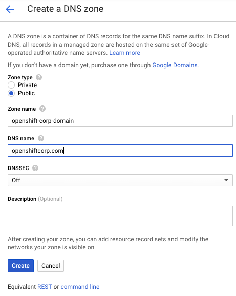
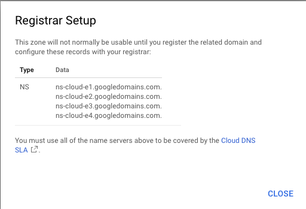

# DNS Setup

Google's Cloud DNS service is used by the OpenShift installer to configure cluster DNS resolution and provide name lookup
for the cluster to the outside world. To use OpenShift, you must have created a public zone in Google Cloud DNS in
the same project as your OpenShift cluster. You must also ensure the zone is "authoritative" for the domain. There are
two ways to do this outlined below: root domain and subdomain. A root domain is `example.com`. A subdomain is of
the form `clusters.example.com`.

The below sections identify how to ensure your DNS zone is authoritative for a domain.

## Step 1: Acquire/Identify Domain

You may skip this step if using an existing domain and registrar. You will move the authoritative DNS to Google Cloud DNS or
submit a delegation request for a subdomain in a later step.

You can use [Google Domains](https://domains.google.com) to purchase a domain or use your preferred registrar.

## Step 2: Create Public Zone

Whether using a root domain or a subdomain, you must create a public DNS zone.

[GCP: Creating a Public DNS Zone][create-dns-zone]

To use the root domain, you'd create the DNS zone with the value `example.com`. To use a subdomain, you'd
create a zone with the value `clusters.example.com`. (Use appropriate domain values for your situation.)

### Example: Root Domain

## Step 3: Get Public Nameservers of the DNS Zone

For either a root domain `example.com` or a subdomain `clusters.example.com`, you must extract the new
authoritative nameservers from the DNS zone records.

[GCP: Getting the Name Servers for a Public DNS Zone][lookup-name-servers]

### Example: Root Domain

## Step 4a: Root Domain - Update Registrar

Each registrar requires a slightly different procedure. Using the four nameserver values from the previous step,
you will update the registrar records to the Google Cloud DNS nameservers.

If you are migrating your root domain to Google Cloud DNS, you should migrate existing DNS records:

[GCP: Migrating to Cloud DNS][migrate]

## Step 4b: Subdomain - Perform DNS Delegation

For a subdomain of example.com (e.g. clusters.example.com), you must add delegation records to the parent/root domain. This may require a request to your company's IT department or the division which controls the root domain and DNS services for your company.

[create-dns-zone]: https://cloud.google.com/dns/docs/quickstart
[lookup-name-servers]: https://cloud.google.com/dns/docs/update-name-servers#look_up_your_name_servers
[migrate]: https://cloud.google.com/dns/docs/migrating
