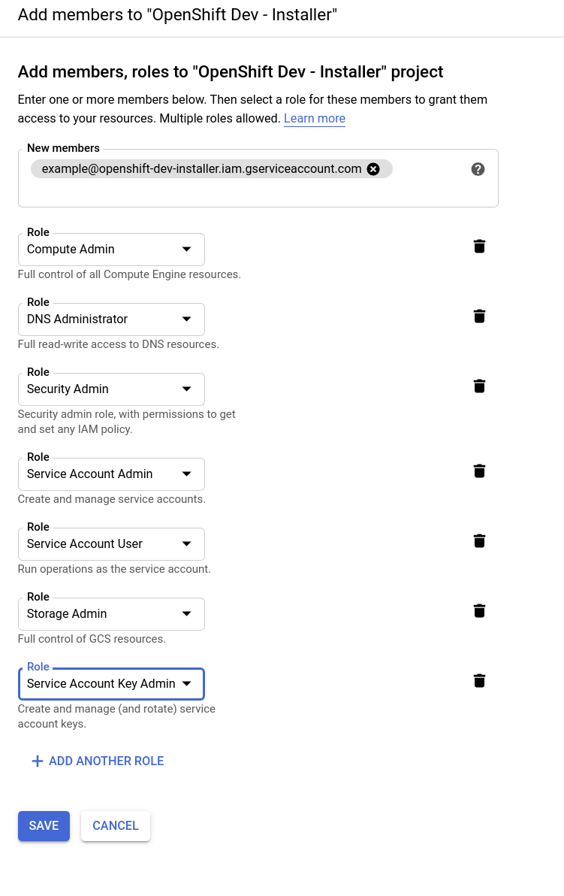

# GCP Service Account
To install OpenShift to your GCP project, the installer requires a service account, which provides authentication and authorization to access data in the Google APIs. You can use an existing IAM service account that contains the required roles or create one by following these steps:

## Step 1: Create a Service Account

Create a GCP service account using the console or the CLI

[GCP: Creating a service account][sa-create]

## Step 2: Assign Project Roles to your Service Account

A service account needs to be granted permission for specific APIs in order to access the services used to created a cluster. You can assign the proper roles during or after the creation of a service account. The simplest approach to assigning roles would be to make the service account an Owner of the project, but that service account would then have complete control over the project, which would be a decided risk. Note that service accounts with these roles are only required for installation (and destruction); the [post-install docs](postinstall.md) outline optional steps for removing the roles granted here.

The minimum set of [roles][gcp-roles] you can assign the service account are the following:
- Compute Admin
- DNS Administrator
- Security Admin
- Service Account Admin
- Service Account User
- Storage Admin

If you want the OpenShift cluster to create new limited credentials for its own operators, you also need the following
role:
- Service Account Key Admin

To assign roles to your service account you may use the console or the CLI:

[GCP: Assign service account roles][sa-assign]

## Step 3: Create and save a Service Account Key

You will need to create and save a service account key for your service account so you can use it with the OpenShift Installer. You should create the key in JSON format.

[GCP: Creating a service account key][sa-key]

[sa-create]: https://cloud.google.com/iam/docs/creating-managing-service-accounts#creating_a_service_account
[gcp-roles]: https://cloud.google.com/iam/docs/understanding-roles#predefined_roles
[sa-assign]: https://cloud.google.com/iam/docs/granting-roles-to-service-accounts#granting_access_to_a_service_account_for_a_resource
[sa-key]: https://cloud.google.com/iam/docs/creating-managing-service-account-keys#creating_service_account_keys
