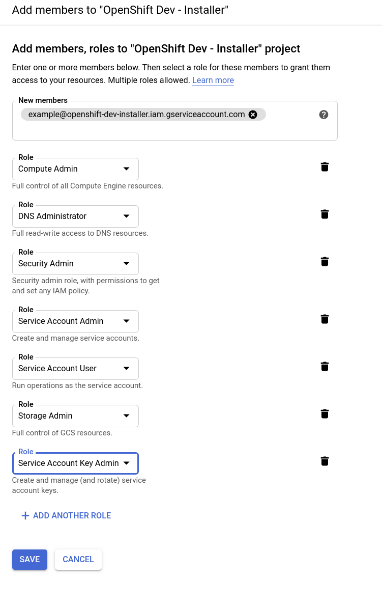

# GCP Service Account
To install OpenShift to your GCP project, the installer requires a service account, which provides authentication and authorization to access data in the Google APIs. You can use an existing IAM service account that contains the required roles or create one by following these steps:

## Step 1: Create a Service Account

Create a GCP service account using the console or the CLI

[GCP: Creating a service account][sa-create]

## Step 2: Assign Project Roles to your Service Account

A service account needs to be granted permission for specific APIs in order to access the services used to created a cluster. You can assign the proper roles during or after the creation of a service account. The simplest approach to assigning roles would be to make the service account an Owner of the project, but that service account would then have complete control over the project, which would be a decided risk. Note that service accounts with these roles are only required for installation (and destruction); the [post-install docs](postinstall.md) outline optional steps for removing the roles granted here.

The minimum set of [roles][gcp-roles] you can assign the service account are the following:
- Compute Admin
- DNS Administrator
- Security Admin
- Service Account Admin
- Service Account User
- Storage Admin

If you want the OpenShift cluster to create new limited credentials for its own operators, you also need the following
role:
- Service Account Key Admin

To assign roles to your service account you may use the console or the CLI:

[GCP: Assign service account roles][sa-assign]

### Additional Permissions for Customer-Managed KMS Encryption

If you configure customer-managed KMS (Cloud Key Management Service) encryption keys for storage buckets or OS disks in your install-config, the installer service account needs additional permissions to manage KMS key IAM policies. These permissions are **only required if you use KMS encryption** via the `encryptionKey.kmsKey` fields described in the [customization documentation](customization.md).

#### When KMS Permissions Are Required

KMS IAM policy management permissions are needed when you configure customer-managed encryption keys in your install-config:
- `platform.gcp.defaultMachinePlatform.osDisk.encryptionKey.kmsKey` - encrypts OS disks, ignition bucket, and registry bucket
- `controlPlane.platform.gcp.osDisk.encryptionKey.kmsKey` - control plane OS disk encryption (overrides defaultMachinePlatform)
- `compute[].platform.gcp.osDisk.encryptionKey.kmsKey` - compute node OS disk encryption (overrides defaultMachinePlatform)

#### Required Installer Service Account Permissions

Your installer service account must have these permissions on each KMS key you reference:
- `cloudkms.cryptoKeys.getIamPolicy` - Read the current IAM policy on the KMS key
- `cloudkms.cryptoKeys.setIamPolicy` - Update the IAM policy on the KMS key

The simplest way to grant these permissions is to assign the `roles/cloudkms.admin` role on the specific KMS keys (not project-wide). Alternatively, you can create a custom role with just these two permissions.

**Why these permissions are needed**: The installer automatically grants Google-managed service accounts (Cloud Storage and Compute Engine) permission to use your KMS keys for encryption/decryption. Without these permissions, the installer cannot configure the necessary IAM policies and installation will fail.

#### What the Installer Automatically Grants

During installation, the installer will automatically grant `roles/cloudkms.cryptoKeyEncrypterDecrypter` to:

1. **Cloud Storage Service Account** (`service-{PROJECT_NUMBER}@gs-project-accounts.iam.gserviceaccount.com`) - for bootstrap ignition and registry storage buckets
2. **Compute Engine Service Account** (`service-{PROJECT_NUMBER}@compute-system.iam.gserviceaccount.com`) - for OS disk encryption
3. **Master Node Service Account** (`{INFRA_ID}-m@{PROJECT_ID}.iam.gserviceaccount.com`) - for bootstrap and registry operator access to encrypted buckets

These grants happen automatically in the PreProvision phase. You do not need to configure them manually.

**Note**: Storage encryption (for both ignition and registry buckets) uses the same KMS key as OS disk encryption, configured via `platform.gcp.defaultMachinePlatform.osDisk.encryptionKey.kmsKey`. See the [customization documentation](customization.md#machine-pools) for configuration details.

## Step 3: Create and save a Service Account Key

You will need to create and save a service account key for your service account so you can use it with the OpenShift Installer. You should create the key in JSON format.

[GCP: Creating a service account key][sa-key]

[sa-create]: https://cloud.google.com/iam/docs/creating-managing-service-accounts#creating_a_service_account
[gcp-roles]: https://cloud.google.com/iam/docs/understanding-roles#predefined_roles
[sa-assign]: https://cloud.google.com/iam/docs/granting-roles-to-service-accounts#granting_access_to_a_service_account_for_a_resource
[sa-key]: https://cloud.google.com/iam/docs/creating-managing-service-account-keys#creating_service_account_keys
