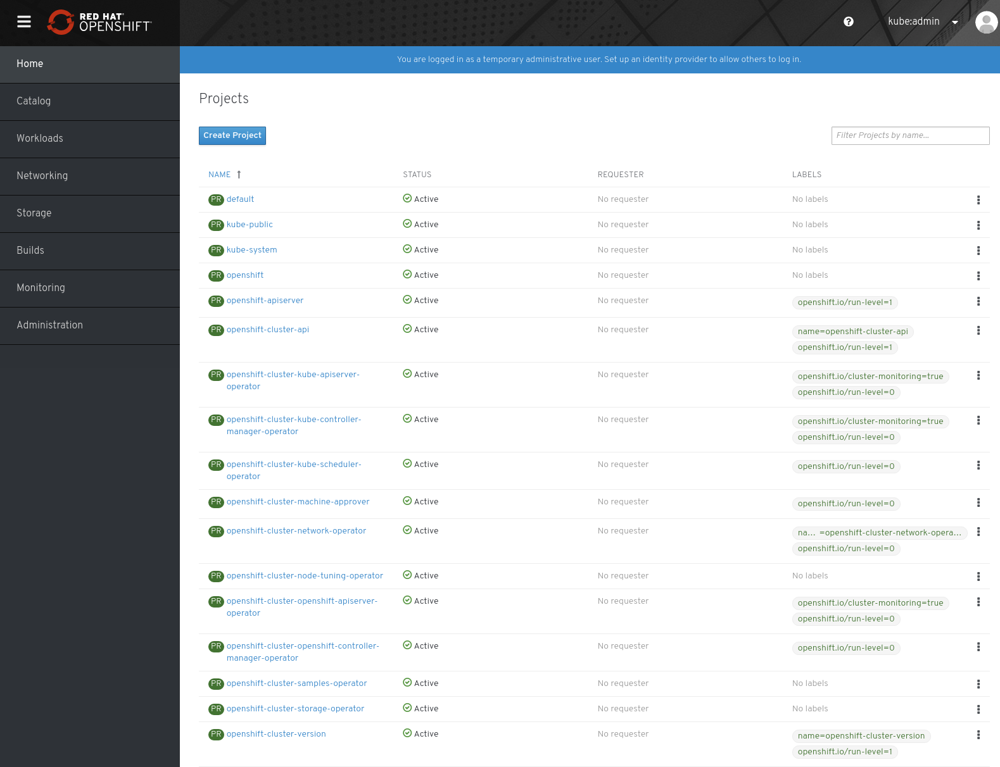

# Cluster Installation

At this point, you are ready to perform the OpenShift installation.
You have two choices for installing your cluster on GCP, installer-provided infrastructure or user-provided infrastructure.
See below for an example of an installer-provided infrastructure install.

To see a guided example of a user-provided infrastructure install, please see [Install: User-Provided Infrastructure](install_upi.md)

## Example: Installer-Provided Infrastructure

The steps for performing an IPI-based install are outlined [here][cloud-install]. Following this guide you may begin at
Step 3: Download the Installer.

### Create Configuration

```console
[~]$ openshift-install create install-config
? SSH Public Key /home/user_id/.ssh/id_rsa.pub
? Platform gcp
? Project ID my_gcp_project
? Region us-east1
? Base Domain example.com
? Cluster Name mycluster
? Pull Secret [? for help] **********************************************************
```

### Create Cluster

```console
[~]$ openshift-install create cluster

INFO Consuming Install Config from target directory
INFO Creating infrastructure resources...
INFO Waiting up to 30m0s for the Kubernetes API at https://api.mycluster.example.com:6443...
INFO API v1.14.0+37982ca up
INFO Waiting up to 30m0s for bootstrapping to complete...
INFO Destroying the bootstrap resources...
INFO Waiting up to 30m0s for the cluster at https://api.mycluster.example.com:6443 to initialize...
INFO Waiting up to 10m0s for the openshift-console route to be created...
INFO Install complete!
INFO To access the cluster as the system:admin user when using 'oc', run
    export KUBECONFIG=/home/user/auth/kubeconfig
INFO Access the OpenShift web-console here: https://console-openshift-console.apps.mycluster.example.com
INFO Login to the console with user: kubeadmin, password: 5char-5char-5char-5char
```

### Running Cluster

In your GCP project, there will be a new private DNS zone (for internal lookups)

There will be six running VM instances in the Project.

The nodes within the Virtual Network utilize the internal DNS and use the Router and External API load balancers. External/Internet
access to the cluster use the Router and External API load balancers. Compute instances are spread equally across all running availability
zones for the region.

The OpenShift console is available via the kubeadmin login provided by the installer.



[cloud-install]: https://console.redhat.com/openshift/create
