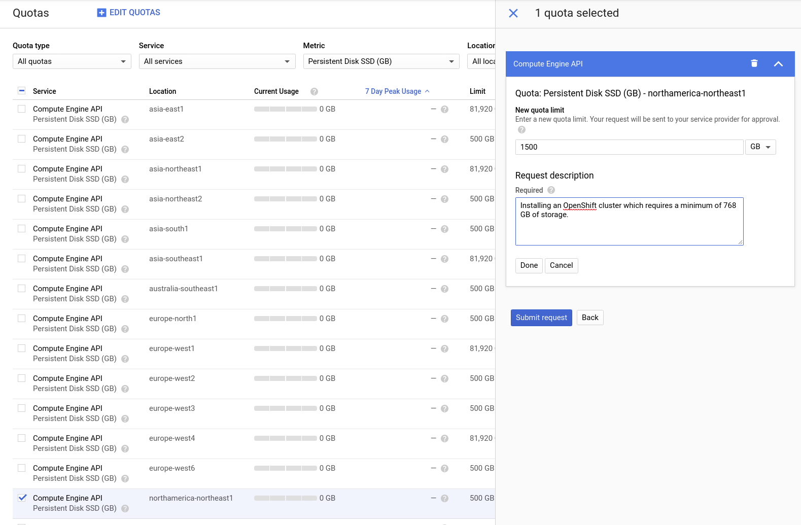

# Handling quota on GCP
Quota limits vary by region, project and account. You can view the limits for your project here:

[GCP: IAM & Admin > Quotas][gcp-console-quota]

## Significant Resource Usage & Quotas
These resources seem to be the most likely to encounter quota limit issues when installing a cluster on GCP. If you encounter a quota issue with a resource not on this list, please [let us know](https://github.com/openshift/installer/issues/new).

### Storage
A standard OpenShift installation utilizes 768 GB of storage (Persistent Disk SSD). Several regions have a default storage quota of 500 GB, which would cause a minimal installation to fail due to exceeding quotas. 

Regions with a default limit of 500 GB are:
* asia-east2
* asia-northeast2
* asia-south1
* australia-southeast1
* europe-north1
* europe-west2
* europe-west3
* europe-west6
* northamerica-northeast1
* southamerica-east1
* us-west2 

If you must install to one of these regions and cannot install to a region with a higher quota, you will need to request a quota increase, as described in [the example below](#increasing-limits).

### Firewall Rules
An OpenShift cluster utilizes ~10 firewall rules. Some projects may have a quota as low as 200 firewall rules. You can [check the firewall quota for your project here](https://console.cloud.google.com/iam-admin/quotas?service=compute.googleapis.com&metric=Firewall%20rules&_ga=2.10895548.-966099186.1563042928).

### Compute
A standard OpenShift installation uses 24 CPUs: each machine (both control-plane and compute) is allotted 4 CPUs. 

Many regions have a default CPU quota limit of 24:
* asia-east2
* asia-northeast2
* asia-south1
* australia-southeast1
* europe-north1
* europe-west2
* europe-west3
* europe-west6
* northamerica-northeast1
* southamerica-east1
* us-west2

With these limits, a project can deploy only a single cluster with six total nodes (no further scaling) in these regions. If you need to do more than that in one of these regions with your project, you will need to [increase the limit](#increasing-limits).

Note that these limits are for plain CPUs. All N2 machine-types have a limit of 24 CPUs for [all the regions in which they are available](https://cloud.google.com/compute/docs/regions-zones/#available).

## Other Resource Usage
### Forwarding Rules
A standard OpenShift installation creates 2 forwarding rules.

### IP Addresses
A standard OpenShift installation creates 3 in-use global IP addresses.  

### Networks
A standard OpenShift installation creates 2 networks.

### Routers
A standard OpenShift installation creates 1 router.

### Routes
A standard OpenShift installation creates 2 routes.

### Subnetworks
A standard OpenShift installation creates 2 subnetworks.

## Increasing limits
To adjust quotas visit the [GCP Console][gcp-console-quota], select the quotas you wish to edit, and click Edit Quotas. A form will ask for your contact info and the new quota limits. Documentation states most requests are handled within 24 to 48 hours, but it is best to plan ahead and submit these requests as early as possible. Note that requests can only be made through the GCP Console--and not the CLI.

[GCP: Resource Quotas][gcp-docs-quota].

[gcp-console-quota]: https://console.cloud.google.com/iam-admin/quotas
[gcp-docs-quota]: https://cloud.google.com/compute/quotas

### Example: Using Montréal (northamerica-northeast1)
The Montréal region is listed above as one of the regions with a storage quota of 500 GB. Attempting to run an OpenShift install on a standard account will result in the error: 

>Error: Error waiting for instance to create: Quota 'SSD_TOTAL_GB' exceeded.  Limit: 500.0 in region northamerica-northeast1. 

In order to install to this region it would be necessary to edit the quota and request an increase. 

Please note that this request description is only an example and cannot guarantee your request will be granted.
