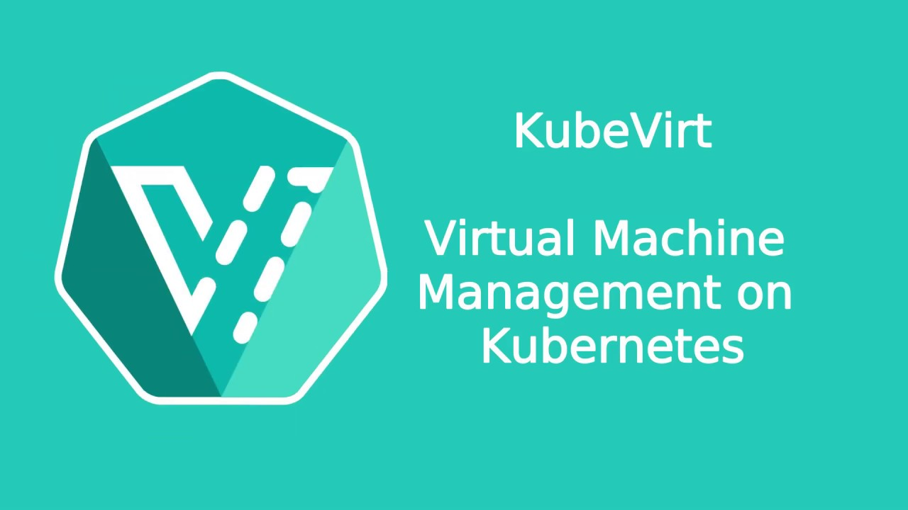

**Table of Contents**

- [Install using KubeVirt platform provider](#install-using-kubevirt-platform-provider)
  * [Overview](#overview)
  * [Prerequisite](#prerequisite)
  * [Minimum resources](#minimum-resources)
  * [Install](#install)
    + [Minimum permission for installation](#minimum-permission-for-installation)
    + [kubevirt-credentials](#kubevirt-credentials)
    + [Bootstrap VM](#bootstrap-vm)
    + [Install using the wizard](#install-using-the-wizard)
    + [Install using Install Config yaml](#install-using-install-config-yaml)
    + [Run the installer](#run-the-installer)
    + [After installation is done](#after-installation-is-done)

# Install using KubeVirt platform provider 

## Overview

This provider enables the OpenShift Installer to provision VM resources on
a Kubernetes platform which includes KubeVirt, that will be used as workers and masters of the installed cluster.
As part of the installation process, it will also create the bootstrap machine.

## Prerequisite

1. Installed Infra cluster, using [Kubernetes](https://kubernetes.io/) or [OpenShift](https://www.openshift.com/)<br/>
   Prerequisite for Kubernetes:
   - [KubeVirt](https://kubevirt.io/) installed in the cluster
   - [Multus-cni](https://01.org/kubernetes/building-blocks/multus-cni) plugin installed in the cluster<br/>

   prerequisite for OpenShift:
   - [OpenShift Virtualization](https://www.openshift.com/learn/topics/virtualization/)

2. Create a Namespace/Project, where the tenant cluster resources will be created in<br/>
   Make sure that the following instructions are fulfilled:
   - Enable support for KubeMacPool feature for the namespace (virtual machine NICs in that namespace are allocated MAC addresses from a MAC address pool. This ensures that  virtual machine instances created from that virtual machine retain the assigned MAC address across reboots).<br/>
   In order to do that, add the KubeMacPool label to the namespace:<br/>
   `oc label namespace <namespace> mutatevirtualmachines.kubemacpool.io=allocate`<br/>
   For more information, refer to [OpenShift docs](https://docs.openshift.com/container-platform/4.6/virt/virtual_machines/vm_networking/virt-using-mac-address-pool-for-vms.html)
   - Make sure that the user running the installer has the [minimum rules](./role.yaml) inside the namespace

3. Create the network that would be used by the tenant cluster:
   - Create a bridge on the infra cluster nodes
   - Create multus network (Network Attachment Definition) on the bridge

4. Allocate 2 IPs within the cluster network:
    - IP for the internal kubernetes api, that all components will interact with 
    - IP for the Ingress, the load balancer in front of the cluster apps 

    To work with this provider, one must provide 2 IPs that are not reserved to any MAC address in the environment, where the cluster will run. These 2 IPs will be used and monitored by keepalived, initially on the bootstrap machine, and then on the masters (after a fail-over, when the bootstrap is killed). 

5. Name resolution of `api_vip` from your installation machine 
The installer must resolve the `api_vip` during the installation, to follow the cluster installation progress.


## Minimal resources

The default master/worker:
- 4 CPUs
- 16 RAM
- 120 GB disk

For 3 masters/3 workers, the target Cluster **must have at least**:
- 96RAM
- 24vCPUs
- 720GiB storage

> Worker count can be reduced to 2 in `install-config.yaml` in case needed.

The installer will create by default 1 bootstrap, 3 masters, and 3 workers machines. 
By the time the first worker is up the bootstrap VM should be destroyed, and this is included in the minimum resources calculation.


## Install 

### Minimum permission for installation

In order to be able to complete full installation process, the user running the installer must have minimum permission.<br/>
Please refer the the [Role yaml](./role.yml) to view the list of the required permissions.<br/>
This role can be added to the cluster, and then binded to the user which running the installer, it can be done using the following ways:
- Create RoleBinding which bind the role to the user in the specific namespace
- If using Openshift as InfraCluster, run:<br/>
`oc adm policy add-role-to-user <role> <user> -n <namespace>`


### kubevirt-credentials

Before you start the tenant cluster installation, make sure to login to the infra cluster.<br/>
For configuration, kubectl looks for a file named config in the $HOME/.kube directory. You can specify other kubeconfig files by setting the KUBECONFIG environment variable or by setting the --kubeconfig flag.<br/>
Make sure to use kubeconfig credentials without expiration date, as those credentials are going to be used by the
tenantcluster for the infrastructure management.


### Install using the wizard 

At this stage, as the Kubevirt provider defined a dev preview, the installer can't be started using the wizard, please refer to [Install using Install Config yaml](#instal-using-install-config-yaml)


### Install using Install Config yaml

- Copy the example [install-config.yaml](./install-config.yaml) file to `install_dir`
- Change the following values
>- [baseDomain](./install-config.yaml#L2) - Enter the base domain that would be used for this cluster
>- Update the machines resources (cpu, memory and storage size), in case you want to override the defaults (optional fields)<br/>
>>> Should be following to this structure (remove `{}`):<br/>
>>> ```console
>>>     kubevirt:
>>>       cpu: 4
>>>       memory: 16G
>>>       storageSize: 120Gi
>>> ``` 
>>> Set different values for compute machines (workers) and for control plan machines (masters):
>>>- [workers](./install-config.yaml#L7)
>>>- [masters](./install-config.yaml#L13)
>- Change the [workerReplicas](./install-config.yaml#L8) - to customize the number of workers
>- Change the [masterReplicas](./install-config.yaml#L14) - to customize the number of masters
>- Change the [Machine Network CIDR](./install-config.yaml#L23) to the network range defined in the Network Attachment Definition
>- Set the [Platform](./install-config.yaml#L27) values, according to the values in the Infra cluster
>>> Should be following to this structure:<br/>
>>> ```console
>>>     kubevirt:
>>>       apiVIP: x.x.x.y
>>>       ingressVIP: x.x.x.z
>>>       namespace: tenantcluster namespace
>>> ```
>>> |Value name                  |Value type                    |Required|Description   |
>>> |---                         |---                           |---     |---|
>>> |namespace                   |string                        |Yes     |The namespace in the infra cluster, where the control plane (master vms) and the compute (worker vms) will be created in   |
>>> |storageClass                |string                        |No      |The Storage Class used in the infra cluster   |
>>> |networkName                 |string                        |Yes     |The target network of all the network interfaces of the nodes   |
>>> |networkType                 |string                        |No      |The type of the network interfaces of the nodes of the tenantcluster ("Bridge" or "SRIOV"). Default: "Bridge".
>>> |apiVIP                      |IPV4                          |Yes     |The virtual IP address for the api endpoint   |
>>> |ingressVIP                  |IPV4                          |Yes     |An external IP which routes to the default ingress controller   |
>>> |persistentVolumeAccessMode  |[ReadWriteMany,ReadWriteOnce] |No      |The access mode should be use with the persistent volumes   |
>- Set the [pullSecret](./install-config.yaml#L35), You can get this secret from https://cloud.redhat.com/openshift/install/pull-secret
>- Set the [sshKey](./install-config.yaml#L36) (content of ~/.ssh/id_rsa.pub)

### Run the installer 

Start the installation using the install-config created in the folder `install_dir`

```console
$ openshift-install create cluster --dir=install_dir
``` 
### After installation is done

After the installation is done, to access the cluster as the system:admin user: 

```console
$ export KUBECONFIG=$PWD/install_dir/auth/kubeconfig
$ oc get nodes
```
