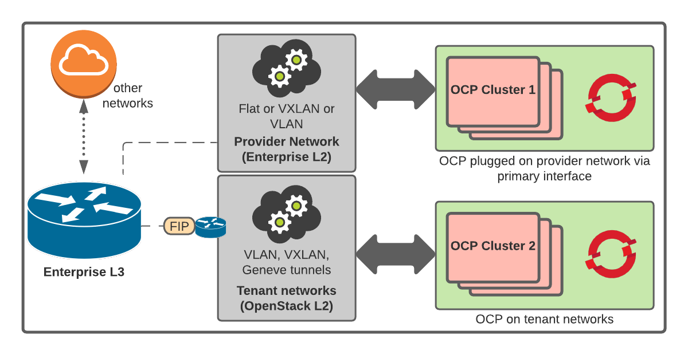

# Provider Networks

## Table of Contents

- [Provider Networks](#provider-networks)
  - [Table of Contents](#table-of-contents)
  - [Introduction](#introduction)
  - [Common prerequisites](#common-prerequisites)
  - [Considerations when creating provider networks](#considerations-when-creating-provider-networks)
  - [Deploying cluster with primary interface on a provider network with IPI](#deploying-cluster-with-primary-interface-on-a-provider-network-with-ipi)
  - [Known issues](#known-issues)

## Introduction

Provider networks map directly to a physical network in a data center.
Example provider network types include flat (untagged), VLAN (802.1Q tagged) and VXLAN.
OpenShift clusters that are installed on provider networks do not require tenant networks or floating IP addresses (FIPs).
Therefore, the OpenShift installer does not create these resources during installation.

[Learn more about provider networks][1].

Here is a basic architecture of one OCP cluster running on a provider network and another one
on a tenant network:

## Prerequisites

- The [networking service (Neutron)][2] is enabled and accessible by using the [OpenStack Networking API][3].
- The Neutron is configured with the [port-security and allowed-address-pairs][4] extensions.
  - These extensions are required for the installer to add allowed address pairs to ports.
- The provider network that you want to use is shared with other tenants.
  - To share the network, use the following command: `openstack network create --share ...`
  - To secure the network, [create RBAC rules][6] that restrict access to a specific project.
- The project that you use to install OpenShift must own the provider network and subnet.
  - If the provider network and subnet are not owned by that project, you must run the installer as an administrator to create ports on them.
  - If the provider network and subnet are not owned by that project, Terraform will fail to create ports.
  - To [create the network and subnet][7], use the `openstack network create --project` and `openstack subnet create --project` commands.
- The provider network must be able to reach the Metadata service's IP address, which is 169.254.169.254 by default. 
  -- Depending on the OpenStack SDN and Neutron configuration, you might have to provide this route when you create the subnet. For example, by using the OpenStack CLI:

      openstack subnet create --dhcp --host-route destination=169.254.169.254/32,gateway=$ROUTER_IP" (...)

## Deploying a cluster that has a primary interface on a provider network with IPI

- Create the `install-config.yaml` file.

- In the `install-config.yaml` file:
  - Set `platform.openstack.apiVIP` to the IP address for the API VIP.
  - Set `platform.openstack.ingressVIP` to the IP address for the Ingress VIP.
  - Set `platform.openstack.machinesSubnet` to the subnet ID of the provider network subnet.
  - Set `networking.machineNetwork.cidr` to the CIDR of the provider network subnet.

**Note:**

You must set `platform.openstack.apiVIP` and `platform.openstack.ingressVIP` to unassigned IP addresses in `networking.machineNetwork.cidr`.

    Example:

        (...)
        platform:
          openstack:
            apiVIP: <IP address in the provider network reserved for the API VIP>
            ingressVIP: <IP address in the provider network reserved for the Ingress VIP>
            machinesSubnet: <provider network subnet ID>
            (...)
        networking:
          machineNetwork:
          - cidr: <provider network subnet CIDR>

- Run the OpenShift installer:

      ./openshift-install create cluster --log-level debug

- Wait for installation to complete.

[1]: <https://docs.openstack.org/neutron/latest/admin/archives/adv-features.html#provider-networks>
[2]: <https://docs.openstack.org/neutron>
[3]: <https://docs.openstack.org/api-ref/network>
[4]: <https://docs.openstack.org/api-ref/network/v2/#allowed-address-pairs>
[5]: <https://bugzilla.redhat.com/show_bug.cgi?id=1933047>
[6]: <https://docs.openstack.org/neutron/latest/admin/config-rbac.html>
[7]: <https://access.redhat.com/documentation/en-us/red_hat_openstack_platform/16.1/html/networking_guide/sec-networking-concepts#provider-networks>