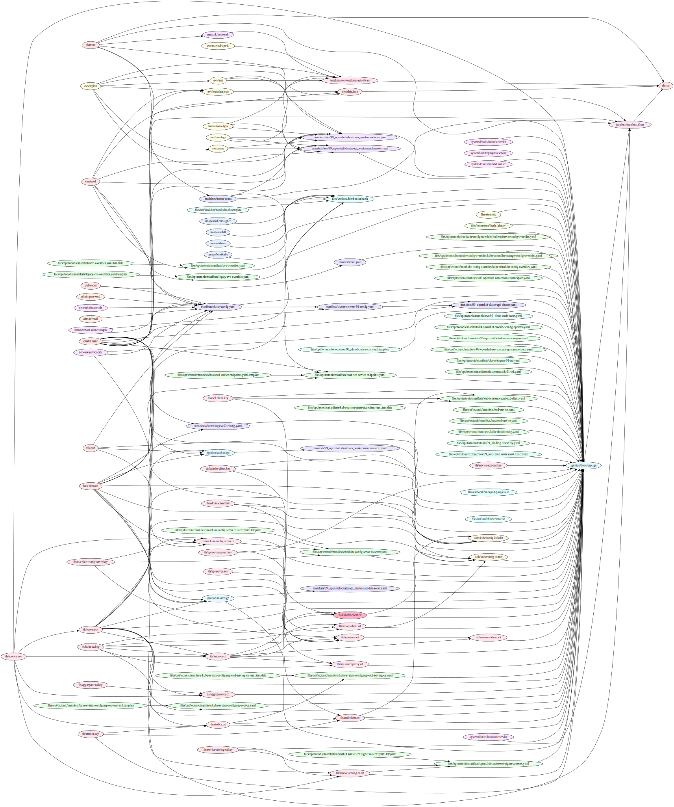

# Installer Overview

The OpenShift Installer is designed to help users, ranging from novices to experts, create OpenShift clusters in various environments. By default, the installer acts as an installation wizard, prompting the user for values that it cannot determine on its own and providing reasonable defaults for everything else. For more advanced users, the installer provides facilities for varying levels of customization.

In [supported environments](#supported-environments), the installer is also capable of provisioning the underlying infrastructure for the cluster. It is recommended that most users make use of this functionality in order to avoid having to provision their own infrastructure. In unsupported environments or scenarios in which installer-created infrastructure would be incompatible, the installer can stop short of creating the infrastructure, and allow the user to provision their own infrastructure using the cluster assets generated by the installer.

## Lifecycle

### Asset Generation

The first installation phase is completely local, as the installer generates the assets that will be used to create the cluster resources.
The installer maintains an asset graph tracking dependency relations between assets.



This graph is generated with:

```sh
openshift-install graph | dot -Tsvg >docs/user/assets.svg
```

This is similar to other tools which operate on a dependency graph (e.g. `make` and `systemd`).
The root target is `cluster`, and once that target is built, there is enough information to move on to [installation](#installation).

Running:

```sh
openshift-install --dir example create assets
```

will render the asset graph into the `example` directory.
The installer will pick reasonable defaults where possible, and prompt the user for assets where we cannot find a reasonable default for all users.
To avoid being prompted, you can pass your choices into the installer using [environment variables](environment-variables.md).

Each asset is represented by two files, one in the asset directory itself, and another in its `.state` subdirectory.
The entry in the `.state` subdirectory holds the rendered JSON `Asset` structure, containing the asset's raw data along with associated metadata (parent references, etc.).
The entry in the asset directory holds the asset's raw data without the associated metadata.

The installer uses the JSON state files to preserve asset information between invocations, but editing the JSON payload is an awkward way to make manual adjustments.
The raw data files are provided as a more convenient avenue for user adjustments.

To adjust a particular asset, you can edit the raw data file and rerun `openshift-install ... create assets`.
For example:

```sh
openshift-install --dir example create assets
sed -i 's|^\(OPENSHIFT_HYPERSHIFT_IMAGE\)=.*|\1=quay.io/your/hypershift:123|' example/bootkube.sh
openshift-install --dir example create assets
```

will rebuild the asset graph using your custom HyperShift image in `bootkube.sh`.

You can continue to edit and run `openshift-install ... create assets` as many times as you like.
To return to the installer's built-in logic for an asset, remove its `.state/{slugged-asset-name}` file (it doesn't matter if you also remove the associated raw data file or not).
When you are satisfied with the asset store, move on to installation.

### Installation

OpenShift is unique in that its management extends all the way down to the operating system itself. Every machine boots with a configuration which references resources hosted in the cluster its joining. This allows the cluster to manage itself as updates are applied. A downside to this approach, however, is that new clusters have no way of starting without external help - every machine in the to-be-created cluster is waiting on the to-be-created cluster.

OpenShift breaks this dependency loop using a temporary bootstrap machine. This bootstrap machine is booted with a concrete [Ignition Config][ignition] which describes how to create the cluster. This machine acts as a temporary control plane whose sole purpose is launching the rest of the cluster.

The main assets generated by the installer are the Ignition Configs for the bootstrap, master, and worker machines. Given these three configs (and correctly configured infrastructure), it is possible to start an OpenShift cluster. The process for bootstrapping a cluster looks like the following:

  1. The bootstrap machine boots and starts hosting the remote resources required for the master machines to boot.
  2. The master machines fetch the remote resources from the bootstrap machine and finish booting.
  3. The master machines use the bootstrap node to form an etcd cluster.
  4. The bootstrap node starts a temporary Kubernetes control plane using the newly-created etcd cluster.
  5. The temporary control plane schedules the production control plane to the master machines.
  6. The temporary control plane shuts down, yielding to the production control plane.
  7. The bootstrap node injects OpenShift-specific components into the newly formed control plane.
  8. The installer then tears down the bootstrap node.

The result of this bootstrapping process is a fully running OpenShift cluster. The cluster will then download and configure remaining components needed for the day-to-day operation, including the creation of worker machines in supported environments.

[ignition]: https://github.com/coreos/ignition/blob/master/doc/getting-started.md

### Teardown

You can manually remove the bootstrap infrastructure with:

```sh
openshift-install ... destroy bootstrap
```

And you can remove the entire cluster with:

```sh
openshift-install ... destroy cluster
```

## Supported Environments

  - AWS
