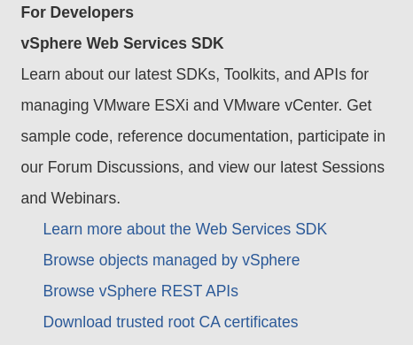

# Cluster Installation

At this point, you are ready to perform the OpenShift installation. You have two choices for installing your cluster on
vSphere, Installer-Provided Infrastructure (IPI) or User-Provided Infrastructure (UPI). See below for an example of an
IPI install.

To see a guided example of a UPI install, see [Install: User-Provided Infrastructure](install_upi.md)

## Example: Installer-Provided Infrastructure (IPI)

The steps for performing an IPI-based install are outlined [here][cloud-install]. Following this guide you may begin at
the Download step.

### Trust vCenter API
The installer requires access to the vCenter API. The vCenter's root CA certificates must be added to the system trust before connecting to the API. The certs can be downloaded from the vCenter's homepage:



In general, the certs are located at `<vCenter>/certs/download.zip`. Once downloaded and unzipped, the certs folder contains certs for Linux, MacOS, and Windows:

```console
$ tree certs
certs
├── lin
│   ├── 108f4d17.0
│   ├── 108f4d17.r1
│   ├── 7e757f6a.0
│   ├── 8e4f8471.0
│   └── 8e4f8471.r0
├── mac
│   ├── 108f4d17.0
│   ├── 108f4d17.r1
│   ├── 7e757f6a.0
│   ├── 8e4f8471.0
│   └── 8e4f8471.r0
└── win
    ├── 108f4d17.0.crt
    ├── 108f4d17.r1.crl
    ├── 7e757f6a.0.crt
    ├── 8e4f8471.0.crt
    └── 8e4f8471.r0.crl

3 directories, 15 files
```

Add the certs appropriate for your OS to your system trust. For Fedora:

```console
sudo cp certs/lin/* /etc/pki/ca-trust/source/anchors
sudo update-ca-trust extract
```
### Create Configuration

```console
$ openshift-install create install-config
? SSH Public Key /home/user_id/.ssh/id_rsa.pub
? Platform vsphere
? vCenter vcsa.vmware.devcluster.openshift.com
? Username user@e2e.local
? Password [? for help] ********************
INFO Connecting to vCenter vcsa.vmware.devcluster.openshift.com 
? Datacenter example-datacenter
? Cluster example-cluster  
? Default Datastore example-datastore
? Network example-network
? Virtual IP Address for API 123.123.12.1
? Virtual IP Address for Ingress 123.123.12.2
? Base Domain example.com
? Cluster Name mycluster
? Pull Secret [? for help] **********************************************************
```

### Create Cluster

```console
$ openshift-install create cluster
INFO Consuming Install Config from target directory
INFO Creating infrastructure resources...
INFO Waiting up to 30m0s for the Kubernetes API at https://api.mycluster.example.com:6443...
INFO API v1.18.2 up
INFO Waiting up to 30m0s for bootstrapping to complete...
INFO Destroying the bootstrap resources...
INFO Waiting up to 30m0s for the cluster at https://api.mycluster.example.com:6443 to initialize...
INFO Waiting up to 10m0s for the openshift-console route to be created...
INFO Install complete!
INFO To access the cluster as the system:admin user when using 'oc', run 'export KUBECONFIG=/home/user/auth/kubeconfig'
INFO Access the OpenShift web-console here: https://console-openshift-console.apps.mycluster.example.com
INFO Login to the console with user: kubeadmin, password: 5char-5char-5char-5char
```

### Running Cluster

There will be six running VM instances and a template in the Folder used for installation.


The nodes within the Virtual Network utilize internal DNS to access the API. External/Internet
access to the cluster uses an Haproxy load balancer for the provided virtual IPs. 

The OpenShift console is available via the kubeadmin login provided by the installer.


[cloud-install]: https://cloud.openshift.com/clusters/install

[cloud-install]: https://cloud.openshift.com/clusters/install
