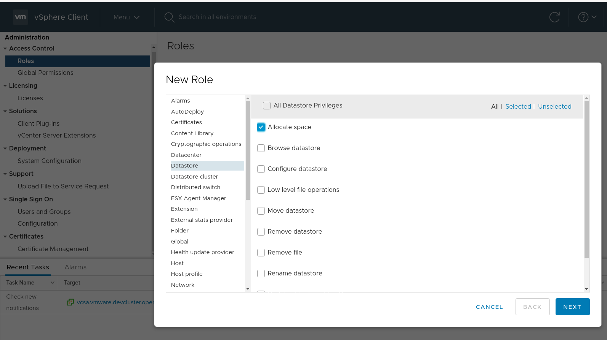
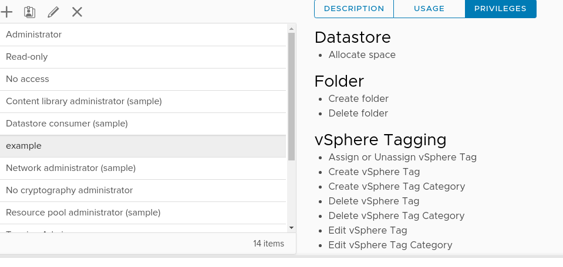
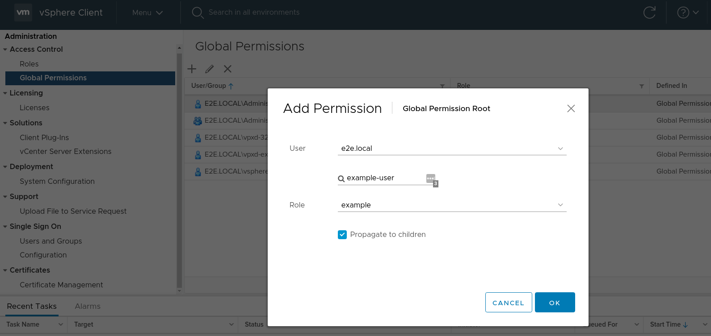

# Required Privileges
In order to install an OpenShift cluster to a vCenter, the user provided to the installer needs privileges to read and create the necessary resources. The easiest way to achieve this level of permission and ensure success is to install with a user who has administrative privileges.

If the provided user has admin privileges, no action is required and you can skip to the next step. Otherwise, the rest of this document can be used as a resource to create a user with more fine-grained privileges.

## Privileges
In order to create an OpenShift cluster, a user needs permissions for the following categories: _Datastore_, _Folder_, _Host_, _vSphere Tagging_, _Network_, _Resource_, _Profile-driven storage_, _vApp_, and _Virtual machine_.

Here is an example summary of privileges that could be used to install a cluster:

- __Datastore__
  - _Allocate space_
- __Folder__
  - _Create folder_
  - _Delete folder_
- __vSphere Tagging__
  - All privileges
- __Network__
  - _Assign network_
- __Resource__
  - _Assign virtual machine to resource pool_
- __Profile-driven storage__
  - All privileges
- __vApp__
  - All privileges
- __Virtual machine__
  - All privileges

It may be possible to further refine the categories where _All privileges_ have been granted.

## Walkthrough: Creating and Assigning Global Roles
The following is a visual walkthrough of creating and assigning global roles in the vSphere 6 web client. Roles can be similarly created for specific clusters. For more information, refer to the [vSphere docs][vsphere-docs].

### Creating a new role
Roles can be created and edited in __Administration > Access Control > Roles__.

When creating a new role, first assign permissions (using the list above for guidance):

Once you save your role, the new privileges will be visible:

### Assigning a role
Roles can be assigned in __Administration > Access Control > Global Permissions__.
The newly created role can be assigned to a group or directly to a user.

To assign the newly created role, click the `+` for Add Permission:

[vsphere-docs]: https://docs.vmware.com/en/VMware-vSphere/7.0/com.vmware.vsphere.security.doc/GUID-5372F580-5C23-4E9C-8A4E-EF1B4DD9033E.html